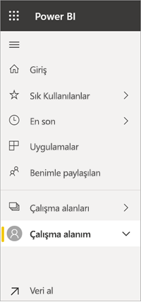

# Gezinme: Power BI hizmetinde içerik arama, bulma ve sıralama
Power BI hizmetindeki içeriğinizde gezinmek için kullanabileceğiniz birçok farklı yöntem vardır. Çalışma alanınızdaki içerik türe göre düzenlenmiştir: panolar ve raporlar.  İçerik ayrıca kullanıma göre de düzenlenmiştir: sık kullanılanlar, son görüntülenenler, benimle paylaşılanlar ve öne çıkan. Power BI *Giriş* sayfası bir sayfadaki tüm içeriği tek bir noktadan düzenlemenizi sağlar. İçeriğinize ulaştıran bu farklı yollarla Power BI hizmetinde aradığınızı kolayca bulabilirsiniz.  

## Çalışma alanlarında gezinme

Power BI *tüketicileri* genellikle tek bir çalışma alanına sahiptir: **Çalışma alanım**. **Çalışma alanım** yalnızca Microsoft örneklerini indirdiyseniz ya da kendi panolarınızı, raporlarınızı ve uygulamalarınızı oluşturduysanız veya indirdiyseniz içerikle dolu olur.  

Power BI hizmeti, **Çalışma alanım** sayfasındaki içeriği türe göre ayırmıştır: panolar, raporlar, çalışma kitapları ve veri kümeleri. Bir çalışma alanını seçtiğinizde bu düzenle karşılaşırsınız. Bu örnekte **Çalışma alanım** sayfasında bir pano, bir rapor, bir veri kümesi vardır ve çalışma kitabı yoktur.

________________________________________
## Arama alanını kullanarak gezinme
İçeriğinizi aramak, filtrelemek ve sıralamak için **Çalışma alanım** içerik görünümünü kullanın. Arama alanına pano, rapor, çalışma kitabı veya sahip adının tamamını veya bir bölümünü yazın.  

Yalnızca birkaç parça içeriğiniz varsa arama ve sıralama gerekli değildir.  Ama panolar ve raporlardan oluşan uzun listeleriniz olduğunda, arama ve sıralamayı son derece yararlı bulacaksınız. Örneğin aşağıdaki rapor listesinde 83 öğe vardır. 

Ayrıca içeriği adına veya sahibine göre de sıralayabilirsiniz. **Ad** alanının sağ tarafındaki yukarı oka dikkat edin. Şu anda 83 öğeyi ada göre ve artan düzende sıralıyoruz. Sıralama düzenini azalan olarak değiştirmek için **Ad**'ı seçin. Yukarı ok, aşağı oka döner.

Her sütun sıralanamaz. Sıralanabilecek sütunları bulmak için sütun başlığına gidin.

___________________________________________________________________
## Sol gezinti çubuğunu kullanarak gezinme
Sol gezinti çubuğu, aradıklarınızı daha hızlı bulmanıza yardımcı olacak şekilde içeriğinizi sınıflandırır.  

- Sizinle paylaşılan içerikler **Benimle paylaşılan** bölümünde bulunur.
- Son görüntülediğiniz içerikler **Son görüntülenen** bölümünde bulunur. 
- **Uygulamalar**'ı seçerek uygulamalarınıza ulaşabilirsiniz.
- **Giriş**, en önemli içeriğin yanı sıra önerilen içeriğin ve öğrenme kaynaklarının bulunduğu tek sayfalık bir görünümdür.

Ayrıca içerikleri [sık kullanılan](end-user-favorite.md) ve [öne çıkan](end-user-featured.md) olarak etiketleyebilirsiniz. En sık görüntülemeyi planladığınız panoyu veya raporu seçip *öne çıkan* içeriğiniz olarak ayarlayabilirsiniz. Power BI hizmetini her açtığınızda ilk olarak öne çıkan panonuz görüntülenir. Sık ziyaret ettiğiniz panolar ve uygulamalar mı var? Bu öğeleri sık kullanılanlara ekleyerek, her zaman sol gezinti çubuğunda kalmalarını sağlayabilirsiniz.

geçin.

## Önemli noktalar ve sorun giderme
* Veri kümelerinde **Sıralama ölçütü**, belge sahipleri tarafından kullanılamaz.

## Sonraki adımlar
[Raporlardaki görselleri sıralama](end-user-change-sort.md)

Başka bir sorunuz mu var? [Power BI Topluluğu'na başvurun](http://community.powerbi.com/)
