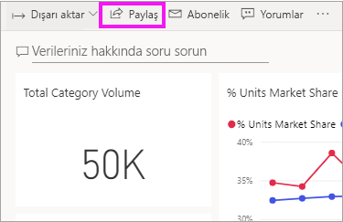
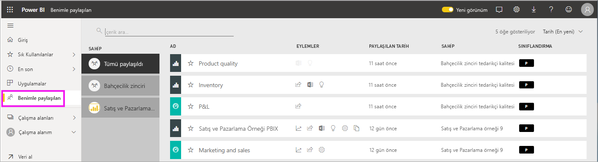
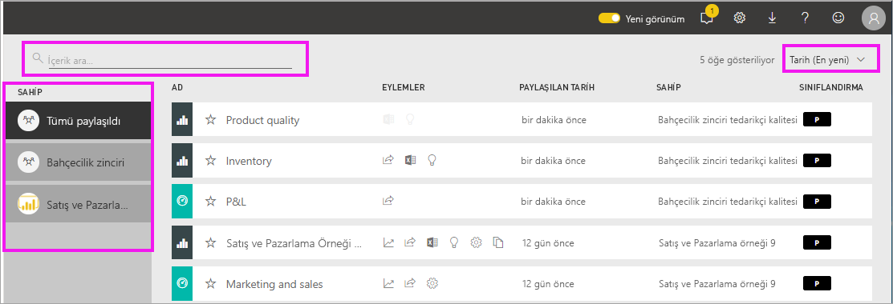

# Sizinle paylaşılan panoları ve raporları görüntüleme

[!INCLUDE[consumer-appliesto-ynny](../includes/consumer-appliesto-ynny.md)]

[!INCLUDE [power-bi-service-new-look-include](../includes/power-bi-service-new-look-include.md)]

İş arkadaşlarınızdan **Paylaş** düğmesini kullanarak sizinle bir içerik paylaştığında ilgili içerik **Benimle paylaşılan** kapsayıcınızda görünür. Bu panoya veya rapora yalnızca **Benimle paylaşılan** listesinden ulaşabilirsiniz, **Uygulamalar** listesinden ulaşamazsınız.

**Benimle paylaşılan** içerik listesini açıklamanın yanı sıra listede gezinmeyi ve listeyi filtrelemeyi gösterirken Amanda'ya eşlik edin. Ardından, videonun altında yer alan adım adım yönergeleri izleyerek bu işlemi kendiniz deneyin. Sizinle paylaşılan panoları görüntülemek için Power BI Pro lisansına sahip olmanız gerekir. Ayrıntılar için [Hangi lisansa sahibim?](end-user-license.md) konusunu okuyun.
    

> [!NOTE]
> Bu videoda Power BI hizmetinin eski bir sürümü kullanılmaktadır.
    

<iframe width="560" height="315" src="https://www.youtube.com/embed/G26dr2PsEpk" frameborder="0" allowfullscreen></iframe>

## Paylaşılan içerikle etkileşimde bulunma

*Tasarımcının* size verdiği izinlere bağlı olarak paylaşılan panolar ve raporlarla etkileşim kurmak için birçok seçeneğe sahip olursunuz. Bu seçenekler arasında panonun kopyalarını oluşturmak, raporu [Okuma görünümünde](end-user-reading-view.md) açmak ve diğer iş arkadaşlarınızla paylaşmak olabilir.

### **Benimle paylaşılan** kapsayıcısından gerçekleştirilebilecek eylemler
Yapabileceğiniz işlemler, içerik *tasarımcısı* tarafından atanan ayarlara bağlıdır. Bazı seçenekleriniz şunlar olabilir:
* Yıldız simgesini seçerek [Panoyu veya raporu sık kullanılanlara ekleyebilirsiniz](end-user-favorite.md) .
* Pano veya raporu kaldırma  .
* Bazı panolar ve raporlar yeniden paylaşılabilir  .
* [Raporu Excel’de açın](end-user-export.md)  
* Power BI’ın verilerde bulduğu [içgörüleri görüntüleyin](end-user-insights.md).
  
  > [!NOTE]
  > EGRC sınıflandırmaları hakkında bilgi için **Sınıflandırma** düğmesini seçin veya [Pano veri sınıflandırması](../service-data-classification.md) sayfasını ziyaret edin.
  > 

## Paylaşılan pano arama ve sıralama
İçerik listeniz uzuyorsa ihtiyacınız olanı bulmak için birkaç seçeneğiniz vardır. Arama alanını kullanabilir, tarihe göre sıralayabilir veya **Sahip** sütunundan seçebilirsiniz.    

