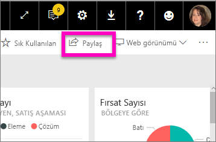
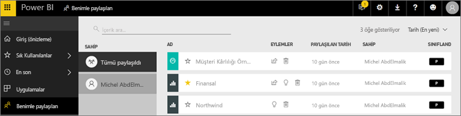
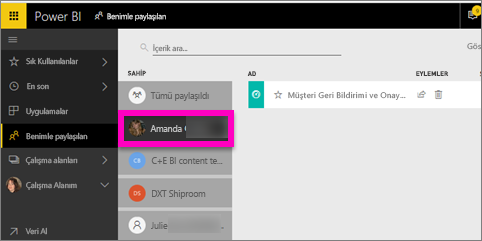

# Sizinle paylaşılan panoları ve raporları görüntüleme
## Benimle paylaşılan

İş arkadaşlarınızdan **Paylaş** düğmesini kullanarak sizinle bir içerik paylaştığında ilgili içerik **Benimle paylaşılan** kapsayıcınızda görünür. Bu panoya veya rapora yalnızca **Benimle paylaşılan** listesinden ulaşabilirsiniz, **Uygulamalar** listesinden ulaşamazsınız.

**Benimle paylaşılan** içerik listesini açıklamanın yanı sıra listede gezinmeyi ve listeyi filtrelemeyi gösterirken Amanda'ya eşlik edin. Ardından kendiniz denemek için videonun altındaki adım adım yönergeleri uygulayın. Sizinle paylaşılan panoları görüntülemek için Power BI Pro lisansına sahip olmanız gerekir. Ayrıntılar için [Power BI Premium nedir?](../service-premium.md) makalesini okuyun.

<iframe width="560" height="315" src="https://www.youtube.com/embed/G26dr2PsEpk" frameborder="0" allowfullscreen></iframe>

Tasarımcının size verdiği izinlere bağlı olarak panoyla ve raporlarla etkileşim kurmak için birçok seçeneğe sahip olursunuz. Bu seçenekler arasında panonun kopyalarını oluşturmak, raporu [Okuma görünümünde](end-user-reading-view.md) açmak ve diğer iş arkadaşlarınızla paylaşmak olabilir.

## **Benimle paylaşılan** kapsayıcısından gerçekleştirilebilecek eylemler
* Yıldız simgesini seçerek [Panoyu veya raporu sık kullanılanlara ekleyebilirsiniz](end-user-favorite.md).
* Pano veya raporu kaldırma  
* Bazı panolar ve raporlar yeniden paylaşılabilir  
* Ayrıca listeniz uzarsa [arama alanını ve sıralama özelliğini kullanarak, aradığınızı bulabilirsiniz](end-user-search-sort.md).
  
  > [!NOTE]
  > EGRC sınıflandırmaları hakkında bilgi için sınıflandırma düğmesini seçin veya [Pano veri sınıflandırması sayfasını ziyaret edin](../service-data-classification.md).
  > 
  > 
* Açmak ve araştırmak için bir panonun adını seçin. Paylaşılan panoyu açtıktan sonra Soru-Cevap kutusunu kullanarak, temel alınan veriler hakkında soru sorabilir veya kutucuklardan birini seçip açarak raporla Okuma görünümünde etkileşim kurabilirsiniz.

## Panoları sahibine göre filtreleme
**Benimle paylaşılan** ekranındaki içerik, sahibine göre filtrelenebilir. Örneğin **Amanda**'yı seçersem yalnızca Amanda'nın benimle paylaştığı raporlar görüntülenir.

