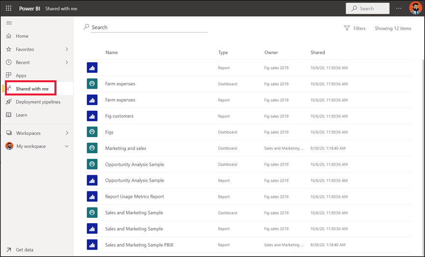

# Sizinle paylaşılan panoları ve raporları görüntüleme

[!INCLUDE[consumer-appliesto-yyny](../includes/consumer-appliesto-yyny.md)]

[!INCLUDE [power-bi-service-new-look-include](../includes/power-bi-service-new-look-include.md)]

İş arkadaşlarınızdan biri sizinle bir pano veya rapor paylaştığında ilgili içerik **Benimle paylaşılan** kapsayıcınızda görünür. İş arkadaşlarınızın sizinle paylaştığı uygulamalar, **Uygulamalar** kapsayıcısında görünür. Uygulamanın raporları ve panoları ise **Benimle paylaşılan** kapsayıcısında görünür.   

**Benimle paylaşılan** içerik listesini açıklamanın yanı sıra listede gezinmeyi ve listeyi filtrelemeyi gösterirken Amanda'ya eşlik edin. Ardından, videonun altında yer alan adım adım yönergeleri izleyerek bu işlemi kendiniz deneyin. Sizinle paylaşılan panoları görüntülemek için Power BI Pro lisansına sahip olmanız gerekir. Ayrıntılar için [Power BI Premium nedir?](../admin/service-premium-what-is.md) makalesini okuyun.
    

> [!NOTE]
> Bu videoda Power BI hizmetinin eski bir sürümü kullanılmaktadır.
    

<iframe width="560" height="315" src="https://www.youtube.com/embed/G26dr2PsEpk" frameborder="0" allowfullscreen></iframe>

## Paylaşılan içerikle etkileşimde bulunma

*Tasarımcının* size verdiği izinlere bağlı olarak paylaşılan panolar ve raporlarla etkileşim kurmak için birçok seçeneğe sahip olursunuz. Bu seçenekler arasında panonun kopyalarını oluşturmak, abone olmak, raporu [Okuma görünümünde](end-user-reading-view.md) açmak ve diğer iş arkadaşlarınızla paylaşmak olabilir. Açmak için bir pano veya rapor seçin.

## Paylaşılan panoları ve raporları arama ve sıralama
**Benimle paylaşılan** içerik listeniz uzuyorsa ihtiyacınız olanı bulmak için birkaç seçeneğiniz vardır. Arama alanını kullanabilir (1), sütunlardan birine göre sıralama yapabilir (2) veya Filtreler bölmesini kullanabilirsiniz. Filtreler bölmesini açmak için sağ üst köşeden **Filtreler**'i seçin.    

