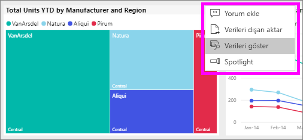
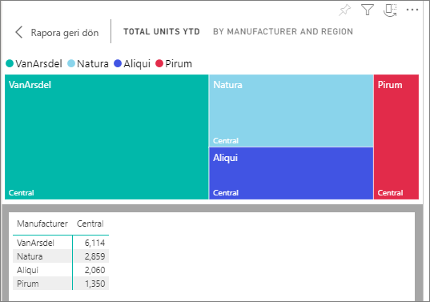
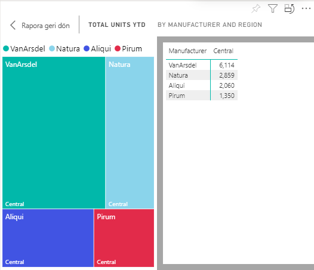

# Görsel oluşturmak için kullanılan verileri gösterme

Power BI görseli, temel alınan veri kümelerindeki verileri kullanarak oluşturulur. Verilerin kaynağını merak ediyorsanız Power BI, görseli oluşturmak için kullanılan verileri *görüntülemenizi* sağlar. Seçtiğinizde, **verilerini Göster**, Power BI, verileri aşağıda (veya yanında) görüntüler görsel.

1. Power BI hizmetinde [bir rapor açın](end-user-report-open.md) ve bir görsel seçin.  
2. Görselde kullanılan verileri görüntülemek için üç noktayı (...) ve ardından **Verileri göster**'i seçin.
   
   
3. Veriler varsayılan olarak görselin altında gösterilir.
   
   

4. Yönü değiştirmek için, görselleştirmenin sağ üst köşesinde dikey düzeni  seçin.
   
   

## Sonraki adımlar
[Power BI raporlarındaki görsel](../visuals/power-bi-report-visualizations.md)    
[Power BI raporları](end-user-reports.md)    
