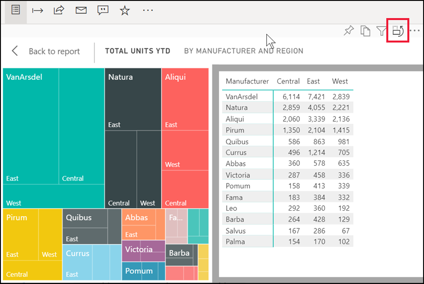
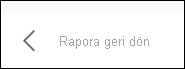

# Power BI ile verileri görüntüleme

[!INCLUDE[consumer-appliesto-yyny](../includes/consumer-appliesto-yyny.md)]

Power BI görseli, temel alınan veri kümelerindeki veriler kullanılarak oluşturulur. Verilerin kaynağını merak ediyorsanız Power BI hizmeti bir raporda görsel oluşturmak için kullanılan verileri *görüntülemenizi* sağlar. Power BI, **Tablo olarak göster**’i seçtiğinizde verileri görselin altında (veya yanında) gösterir.

Bir panoda, temel alınan verileri görmek için [Excel’e Aktar](end-user-export.md)’ı kullanın

## Bir rapor görseli oluşturmak için kullanılan verileri görüntüleme
1. Power BI hizmetinde [bir raporu açın](end-user-report-open.md) ve görsel seçin.  
2. Görselin ardındaki verileri görüntülemek için **Diğer seçenekler**’i (...) ve **Tablo olarak göster**’i seçin.
   
   
3. Veriler varsayılan olarak görselin altında gösterilir.
   
   

4. Yönü değiştirmek için, görselleştirmenin sağ üst köşesinde dikey düzeni  seçin.
   
   

Rapora geri dönmek sol üst köşeden **Rapora geri dön**'ü seçin. 

   

## Sonraki adımlar
[Power BI raporlarındaki görseller](../visuals/power-bi-report-visualizations.md)    
[Power BI raporları](end-user-reports.md)    
