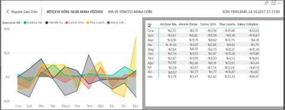
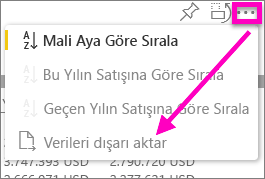

# Görselleştirmeyi oluşturmak için kullanılan verileri gösterme
## Verileri Göster
Power BI görselleştirmeleri, veri kümelerinizdeki veriler kullanılarak oluşturulur. Verilerin kaynağını merak ediyorsanız Power BI, görseli oluşturmak için kullanılan verileri *görüntülemenizi* sağlar. **Verileri Göster**'i seçtiğinizde, Power BI ilgili verileri görselleştirmenin altında (veya yanında) görüntüler.

İsterseniz görselleştirmeyi oluşturmak için kullanılan verileri .xlsx veya .csv biçiminde dışarı aktarıp Excel'de görüntüleyebilirsiniz. Daha fazla bilgi için bkz. [Power BI görselleştirmelerindeki verileri dışarı aktarma](end-user-export-data.md).

> [!NOTE]
> *Verileri Göster* ve *Verileri Dışarı Aktar* seçenekleri hem Power BI hizmetinde hem de Power BI Desktop uygulamasında kullanılabilir. Ancak Power BI Desktop uygulaması ek bir ayrıntı katmanı daha sunar. [*Kayıtları Göster* seçeneği veri kümesindeki satırları görüntüler](../desktop-see-data-see-records.md).
> 
> 

## Power BI hizmetinde *Verileri Göster* işlevini kullanma
1. Power BI hizmetinde bir raporu [Okuma görünümü veya Düzenleme görünümü](end-user-reading-view.md)'nde açın ve bir görsel seçin.  Power BI Desktop'ta Rapor görünümünü açın.
2. Görselde kullanılan verileri görüntülemek için **Araştır** > **Verileri göster**'i seçin.
   
   
3. Veriler varsayılan olarak görselin altında gösterilir.
   
   
4. Verilerin yönünü değiştirmek için görselleştirmenin sağ üst köşesinden dikey düzeni  seçin.
   
   
5. Verileri .csv biçiminde dışarı aktarmak için üç noktayı ve ardından **Verileri dışarı aktar**'ı seçin.
   
    
   
    Verileri Excel'e aktarma hakkında daha fazla bilgi için bkz. [Power BI görselleştirmelerindeki verileri dışarı aktarma](end-user-export-data.md).
6. Verileri gizlemek için **Araştır** > **verileri göster** seçimini kaldırın.

### Sonraki adımlar
[Power BI görselleştirmelerindeki verileri dışarı aktarma](end-user-export-data.md)    
[Power BI raporlarındaki görselleştirmeler](../visuals/power-bi-report-visualizations.md)    
[Power BI raporları](end-user-reports.md)    
[Power BI - Temel Kavramlar](end-user-basic-concepts.md)    
Başka bir sorunuz mu var? [Power BI Topluluğu'na başvurun](http://community.powerbi.com/)

