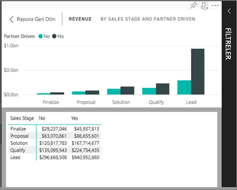

# Görselleştirmeyi oluşturmak için kullanılan verileri gösterme
## Verileri Okuma görünümünde gösterme
Power BI görselleştirmeleri, bağlı veri kümelerindeki veriler kullanılarak oluşturulur. Verilerin kaynağını merak ediyorsanız Power BI, görseli oluşturmak için kullanılan verileri *görüntülemenizi* sağlar. **Verileri Göster**'i seçtiğinizde, Power BI ilgili verileri görselleştirmenin altında (veya yanında) görüntüler.

## Power BI hizmetinin Okuma görünümünde *Verileri Göster* işlevini kullanma
1. Power BI hizmetinde raporu (Okuma görünümünde) açın ve bir görsel seçin.  
2. Görselde kullanılan verileri görüntülemek için üç noktayı (...) ve ardından **Verileri göster**'i seçin.
   
   
3. Veriler varsayılan olarak görselin altında gösterilir.
   
   

4. Yönü değiştirmek için, görselleştirmenin sağ üst köşesinde dikey düzeni  seçin.
   
   

## Sonraki adımlar
[Power BI raporlarındaki görselleştirmeler](../visuals/power-bi-report-visualizations.md)    
[Power BI raporları](end-user-reports.md)    
