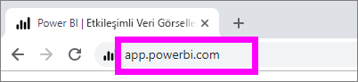
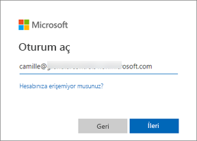
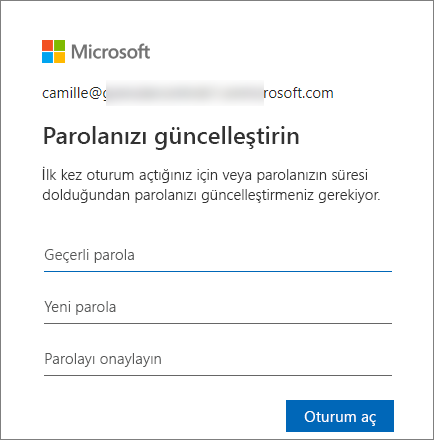
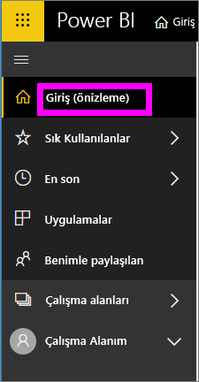
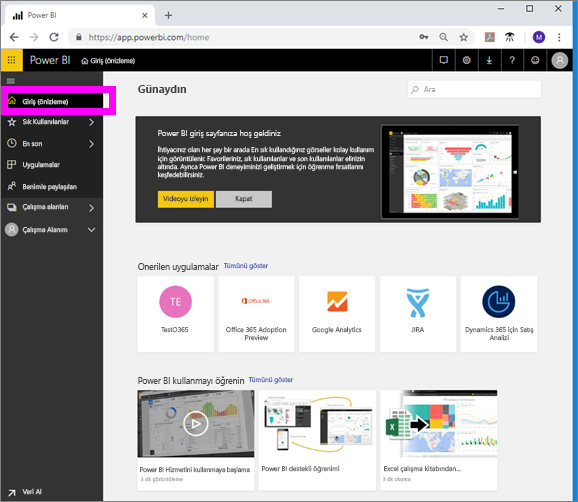
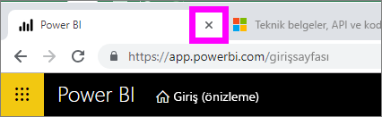
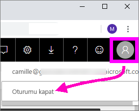

# Power BI hizmetinde oturum açma

## Power BI hesapları
Power BI’da oturum açabilmeniz için önce hesabınız olması gerekir. Power BI hesabı almanın iki yolu vardır. İlk yolu, şirketinizin çalışanları için Power BI lisansları satın almasıdır. İkinci yoluysa, bireylerin ücretsiz denemelere veya kişiler lisanslara kaydolmasıdır. Bu makalede ilk senaryo ele alınır.

## İlk kez oturum açma

### Birinci adım: tarayıcıyı açma
Power BI hizmeti tarayıcı üzerinden çalışır.  Bu nedenle birinci adım olarak tercih ettiğiniz tarayıcıyı açın ve **app.powerbi.com** yazın.

### İkinci adım: e-posta adresinizi yazma
İlk kez oturum açtığınızda e-posta adresiniz istenir.  Bu, Power BI’a kaydolurken kullanılan iş veya okul e-posta adresidir.  

Gelen Kutunuzda Power BI yöneticinizden gelen e-postayı bulun. Yöneticileri çoğu geçici parolanızı içeren bir hoş geldin e-postası gönderecektir. Oturum açarken bu e-posta adresini kullanın. 

 
### Üçüncü adım: yeni parola oluşturma
Power BI yöneticiniz size geçici bir parola gönderdiyse, bunu **Geçerli parola** alanına girin. E-postayla bu parolayı almadıysanız, Power BI yöneticinize başvurun.

Power BI kimlik bilgilerinizi anımsar ve bir sonraki oturum açışınızda kullanıcı adınızı (e-posta adresi) girmeniz gerekmez. 

### Dördüncü adım: Giriş sayfanızı gözden geçirme
İlk ziyaretinizde Power BI **Giriş** sayfanızı açar. **Giriş** sayfanız açılmıyorsa sol gezinti bölmesinden bu sayfayı seçin. 

Giriş sayfasında kullanma iznine sahip olduğunuz tüm içeriği görürsünüz. İlk başta Giriş sayfanızda çok fazla içerik bulunmayabilir ama endişelenmeyin, Power BI’ı iş arkadaşlarınızla kullanmaya başladıkça bu değişecektir. 

Power BI’ın Giriş sayfanızı açmasını istemiyorsanız [bunun yerine **Öne çıkan** bir panonun veya raporun açılmasını ayarlayabilirsiniz](end-user-featured.md). 

## İçerikle güvenli etkileşim kurma
Bir ***tüketici*** olarak, diğer kişiler sizinle içerik paylaşır ve siz de bu içerikle etkileşimli çalışarak verileri inceler ve iş kararları alırsınız.  Filtreme, dilimleme, abone olma, dışarı aktarma ve yeniden boyutlandırma işlemleri yaparken endişelenmeyin; yaptığınız işlemler temel alınan veri kümesini veya paylaşılan özgün içeriği (pano ve raporlar) etkilemez. Power BI keşfedip denemeniz için güvenli bir alandır. Bu, değişikliklerinizi kaydedemeyeceğiniz anlamına gelmez; kaydedebilirsiniz. Ancak bu değişiklikler yalnızca **sizin** içeriği nasıl göreceğinizi etkiler. Varsayılan özgün görünüme geri dönmek de bir düğmeye tıklamak kadar kolaydır.

## Power BI hizmetinde oturumu kapatma
Power BI’ı kapattığınızda veya oturumu kapattığınızda değişiklikleriniz kaydedilir, bu sayede bıraktığınız yerden devam edebilirsiniz.

Power BI’ı kapatmak için üzerinde çalıştığınız tarayıcı sekmesini kapatın. 

 

Bilgisayarınızı paylaşıyorsanız Power BI’ı her kapattığınızda oturumu kapatmanızı öneririz.  Oturumu kapatmak için, sağ üst köşeden Profil resminizi ve **Oturumu kapat**’ı seçin. Aksi takdirde, işiniz bittiğinde yalnızca tarayıcı sekmesini kapatın.

 

## Sorun giderme ve önemli noktalar
- Power BI’a bireysel olarak kaydolduysanız, kaydolurken kullandığınız e-posta adresi ile oturum açın.

- Power BI'ı birden fazla hesapla kullanırsanız, oturum açarken listeden bir hesap seçmeniz ve parola girmeniz istenir. 

## Sonraki adımlar
[Power BI uygulamasını görüntüleme](end-user-app-view.md)
