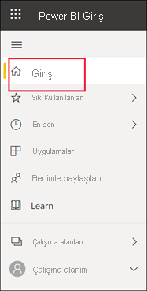
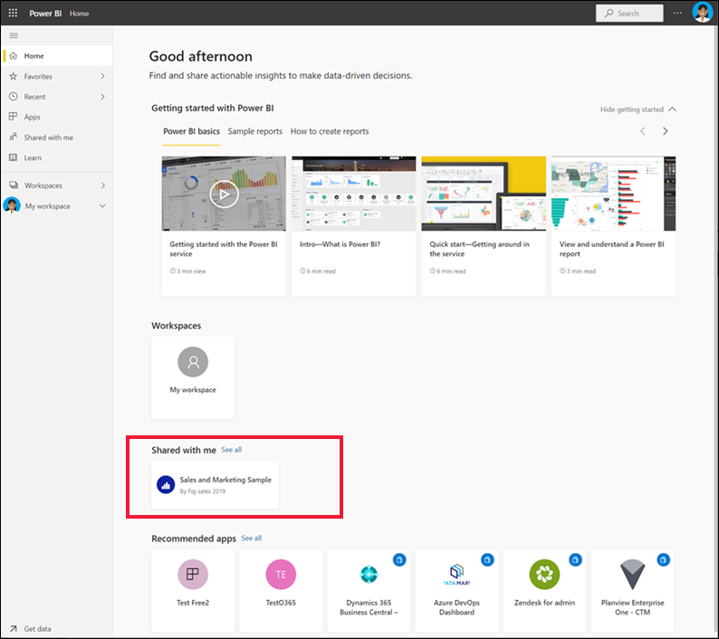
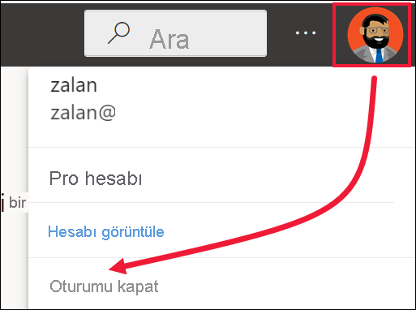

# Power BI hizmetinde oturum açma

[!INCLUDE[consumer-appliesto-yynn](../includes/consumer-appliesto-yynn.md)]

## Power BI hesapları
Power BI’da oturum açabilmeniz için önce hesabınız olması gerekir. Power BI hesabı almanın iki yolu vardır. İlk yolu, kuruluşunuzun çalışanları için Power BI lisansları satın almasıdır. İkinci yoluysa, [bireylerin ücretsiz denemelere veya kişisel lisanslara kaydolmasıdır](../fundamentals/service-self-service-signup-for-power-bi.md). Bu makalede ilk senaryo ele alınır.

## İlk kez oturum açma

### 1\. Adım: Power BI hizmetini açın
Power BI hizmeti, tarayıcı üzerinden çalışır. 

- İş arkadaşınızdan bir pano veya raporun bağlantısını içeren bir e-posta aldıysanız, **Bu raporu açma** veya **Bu panoyu açma** bağlantısını seçin.

        

- Aksi takdirde tercih ettiğiniz tarayıcıyı açın ve **app.powerbi.com** yazın.

        

### 2\. Adım: E-posta adresinizi girin
İlk kez oturum açtığınızda Microsoft zaten bir Microsoft 365 hesabınız olup olmadığını denetler. Aşağıdaki örnekte Pradtanna’nın diğer Microsoft hizmetleri için zaten lisansı vardır. 

Parolanızı girin. Bu Microsoft 365 hesabınızın parolasıdır. Outlook ve Office gibi diğer Microsoft ürünlerinde kullandığınız e-posta ve parolanın aynısıdır.  Hesabınızın nasıl ayarlandığına bağlı olarak, e-postanıza veya mobil cihazınıza gönderilen bir kodu girmeniz de istenebilir.   

Bazen genel yöneticiniz size bir lisans atar ve bu bilgiyi içeren bir e-posta gönderir. Gelen Kutunuzda hoş geldiniz e-postasını bulun ve ilk kez oturum açmak için yönergeleri izleyin. Oturum açarken yine bu e-posta hesabını kullanın. 
 
### 3\. Adım: Hüküm ve koşulları gözden geçirin
Hüküm ve koşulları gözden geçirin, kabul ediyorsanız ilgili onay kutusunu seçin ve sonra da **Başlat**’ı seçin.

### 4\. Adım: Giriş sayfanızı gözden geçirin
İlk ziyaretinizde Power BI, **Giriş** sayfanızı açar. **Giriş** sayfası açılmazsa gezinti bölmesinden bunu seçin. 

Giriş sayfasında, kullanma iznine sahip olduğunuz tüm içerikleri görürsünüz. İlk başta çok fazla içerik bulunmayabilir, ancak endişelenmeyin, Power BI’ı iş arkadaşlarınızla kullanmaya başladıkça bu değişecektir. İş arkadaşınızın sizinle e-posta yoluyla paylaştığı raporu anımsıyor musunuz? Bu rapor Giriş sayfanızda, **Benimle paylaşılan** başlığı altında yer alır.

Power BI’ın Giriş sayfanızda açılmasını istemiyorsanız [bunun yerine **Öne çıkan** bir panonun veya raporun açılmasını ayarlayabilirsiniz](end-user-featured.md). 

## İçerikle güvenli etkileşim kurma
Bir ***işletme kullanıcısı*** olarak, diğer kişiler sizinle içerik paylaşır ve siz de bu içerikle etkileşimli çalışarak verileri inceler ve iş kararları alırsınız.  Filtreme, dilimleme, abone olma, dışarı aktarma ve yeniden boyutlandırma işlemleri yaparken endişelenmeyin; yaptığınız işlemler temel alınan veri kümesini veya paylaşılan özgün içeriği (pano ve raporlar) etkilemez. Power BI keşfedip denemeniz için güvenli bir alandır. Bu, değişikliklerinizi kaydedemeyeceğiniz anlamına gelmez; kaydedebilirsiniz. Ancak bu değişiklikler yalnızca **sizin** içeriği nasıl göreceğinizi etkiler. Varsayılan özgün görünüme geri dönmek de bir düğmeye tıklamak kadar kolaydır.

## Power BI hizmetinde oturumu kapatma
Power BI hizmetini kapattığınızda veya oturumu kapattığınızda değişiklikleriniz kaydedilir, bu sayede bıraktığınız yerden devam edebilirsiniz.

Power BI’ı kapatmak için üzerinde çalıştığınız tarayıcı sekmesini kapatın. 

 

Bilgisayarınızı paylaşıyorsanız Power BI’ı her kapattığınızda oturumu kapatmanızı öneririz.  Oturumu kapatmak için, sağ üst köşeden Profil resminizi ve **Oturumu kapat**’ı seçin.  

 

## Sorun giderme ve önemli noktalar
- Power BI’a bireysel olarak kaydolduysanız, kaydolurken kullandığınız e-posta adresi ile oturum açın.

- Bazı kişiler Power BI’ı birden fazla hesapla kullanır. Bu durumda, oturum açarken bir listeden hesap seçmeniz istenir. 

## Sonraki adımlar
[Power BI uygulamasını görüntüleme](end-user-app-view.md)
