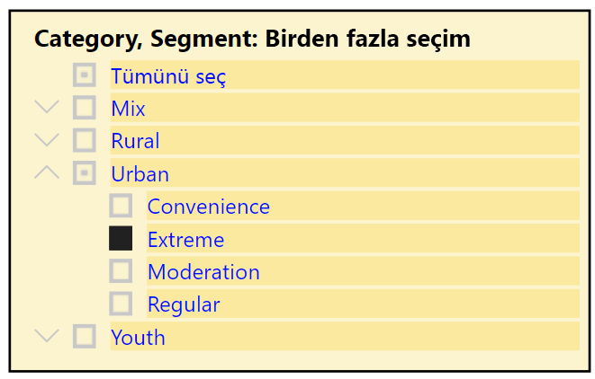

# Power BI hizmetindeki dilimleyiciler

[!INCLUDE[consumer-appliesto-ynnn](../includes/consumer-appliesto-yynn.md)]

Dilimleyici, rapor sayfasındaki diğer görselleri filtreleyen bir görsel türüdür. Power BI raporlarını kullanırken birçok dilimleyici türü keşfedeceksiniz. Yukarıdaki resimde aynı dilimleyici farklı seçimlerle gösterilir. Her seçimin sayfadaki diğer görselleri nasıl filtrelediğine dikkat edin.  

## Dilimleyicileri kullanma
Raporları oluştururken *tasarımcılar* bir hikayenin anlatılmasına yardımcı olmak ve verilerinizi keşfederken kullanabileceğiniz araçlar sağlamak için dilimleyiciler ekler.

### Sayısal aralık dilimleyici
 Sayısal aralık dilimleyicisi coğrafyaya, stoktaki birim sayısına ve sipariş tarihine göre toplam satışlar gibi nicel verileri incelemenize yardımcı olur. Aralığı seçmek için tutamaçları kullanın. 

### Temel dikey onay kutusu dilimleyicisi

Temel onay kutusu dilimleyicisinde, bir veya birden çok onay kutusunu seçerek sayfada yer alan diğer görseller üzerindeki etkisine bakın. Birden fazla seçim yapmak için CTRL tuşunu basılı tutarak seçin. Bazen rapor *tasarımcısı* bir kerede tek bir değer seçmenize izin vermek için dilimleyiciyi ayarlar. 

### Resim ve şekil dilimleyicileri
Dilimleyici seçenekleri resimler ve şekiller olduğunda, seçimlerinizi onay kutularını kullanmaya benzer şekilde yaparsınız. Dilimleyiciyi sayfadaki diğer görsellere uygulamak için bir veya birden fazla resim veya şekil seçebilirsiniz. 

    

    

### Hiyerarşi dilimleyicisi

Hiyerarşisi olan bir dilimleyiciyle, hiyerarşiyi genişletmek ve daraltmak için köşeli çift ayraçları kullanın. Üst bilgi seçimlerinizi gösterecek şekilde güncelleştirilir.

### Göreli zaman dilimleyicisi
Yeni ortaya çıkan hızlı yenileme senaryolarında, daha kısa bir zaman aralığına filtreleme becerisi son derece yararlı olabilir.
Göreli zaman dilimleyicisini kullanarak raporunuzdaki tüm tarih ve saat verilerine zamana dayalı filtreler uygulayabilirsiniz. Örneğin göreli zaman dilimleyicisini kullanarak yalnızca son 2 gün, saat, hatta dakika içindeki video görünümlerini gösterebilirsiniz. 

## Dilimleyiciyi devre dışı bırakma
Dilimleyiciyi devre dışı bırakmak için silgi simgesini seçin.

## Sonraki adımlar
Daha fazla bilgi için aşağıdaki makalelere bakın:

[Power BI'daki görselleştirme türleri](end-user-visualizations.md)

