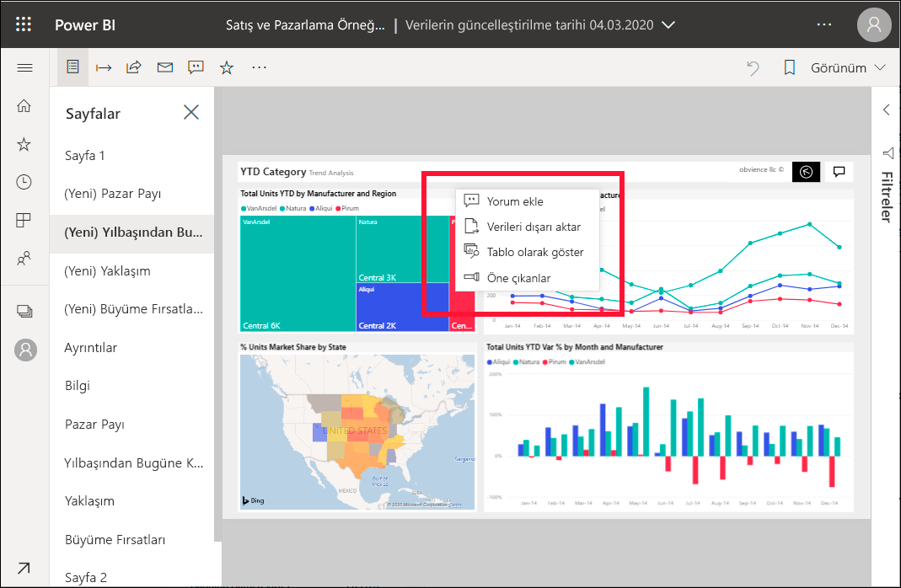

# Power BI raporlarına spot ışıkları ekleme

[!INCLUDE[consumer-appliesto-yyny](../includes/consumer-appliesto-yyny.md)]

Spot ışığıyla rapor sayfasındaki belirli bir görsele dikkat çekebilirsiniz.  Spot ışığı modu seçildiyse, yer işareti eklendiğinizde bu mod yer işaretinde de korunur.

## Spot ışığı ekleme

1. Power BI hizmetinde [bir raporu açın](end-user-report-open.md).

2. Rapor sayfasında hangi görseli vurgulamak istediğinize karar verin. **Diğer eylemler (...)** açılır listesini seçin.  

    

3. **Spotlight** seçeneğini belirtin. Seçilen görsel vurgulanır ve bu sayfadaki diğer tüm görsellerin soluklaşıp neredeyse saydam hale gelmesine neden olur. 

    

## Sonraki adımlar

* [Bir pano kutucuğunu veya rapor görselini odak modunda görüntüleme](end-user-focus.md)

