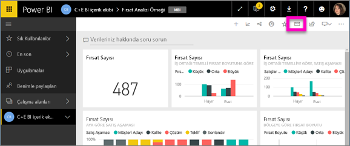
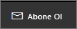
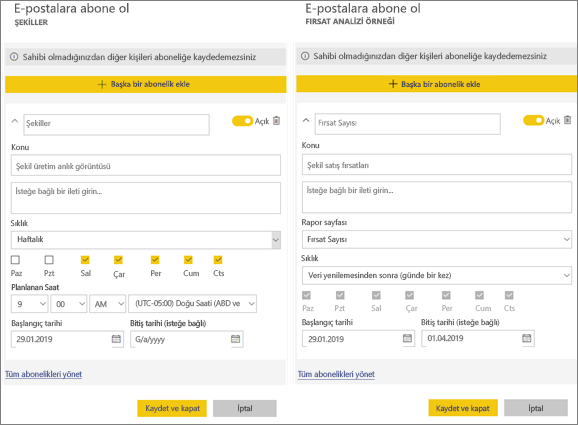
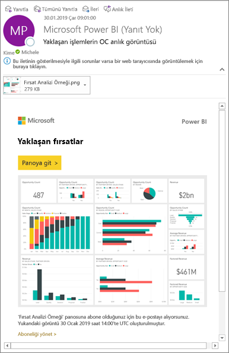
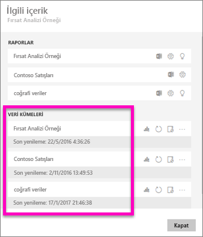
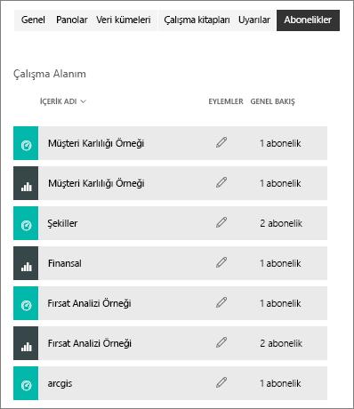

# Power BI hizmetinde bir rapora veya panoya abone olma 
En önemli panolarınıza ve raporlarınıza ilişkin en güncel verilere sahip olmak hiç bu kadar kolay olmamıştı. Sizin için en fazla önem taşıyan rapor sayfalarına ve panolara abone olduğunuzda Power BI, gelen kutunuza e-posta yoluyla bir anlık görüntü gönderir. Power BI'da e-postaları hangi sıklıkla almak istediğinizi seçebilirsiniz: günlük, haftalık veya veriler yenilendiğinde. Power BI'ın e-postaları göndermesi için belirli bir zaman bile ayarlayabilirsiniz.  

E-posta ve anlık görüntü, Power BI ayarlarında belirtilen dil ayarını kullanır (bkz. [Power BI için desteklenen diller ve ülkeler/bölgeler](../supported-languages-countries-regions.md)). Dil tanımlanmazsa, Power BI geçerli tarayıcınızın yerel ayarına göre seçilen dili kullanır. Dil tercihinizi görmek veya belirlemek için sırasıyla dişli simgesini  > **Ayarlar > Genel > Dil** seçeneklerini belirleyin. 

Aldığınız e-postanın "rapora veya panoya git" bağlantısı içerdiğini görürsünüz. Power BI uygulamalarının yüklü olduğu mobil cihazlarda bu bağlantı seçildiğinde uygulama başlatılır (Power BI web sitesinde varsayılan olarak gerçekleştirilen, raporu veya panoyu açma işleminin aksine).

## Gereksinimler
Abonelik **oluşturma** bir Power BI Pro özelliğidir.   

## Bir panoya veya rapor sayfasına abone olma
Panoya ve rapora abone olma süreçleri birbirine benzerdir. Aynı düğmeyi kullanarak Power BI hizmet panolarına ve raporlarına abone olabilirsiniz.
 
geçin.

1. Panoyu veya raporu açın.
2. Üstteki menü çubuğundan **Abone ol** seçeneğini belirleyin veya zarf simgesini  seçin.
   
   

   
    
    Sol taraftaki ekran, bir panoda aldığınızda ve **Abone ol**'u seçtiğinizde gösterilir. Sağ taraftaki ekran, bir rapor sayfasında aldığınızda ve **Abone ol**'u seçtiğinizde gösterilir. Bir rapordaki birden çok sayfaya abone olmak için **Başka bir abonelik ekle**’yi seçip farklı bir sayfa seçin. 

3. Aboneliği açıp kapatmak için sarı kaydırıcıyı kullanın.  Kaydırıcı Kapalı olarak ayarlandığında abonelik silinmez. Aboneliği silmek için çöp kutusu simgesini seçin.

4. İsterseniz e-posta iletisinin ayrıntıları doldurun. 

5. Aboneliğiniz için **Sıklık** seçin.  Günlük, Haftalık veya Veri yenilemesinden sonra (Günlük) seçeneğini belirtebilirsiniz.  Abonelik e-postasını yalnızca belirli günlerde almak için, **Haftalık** seçin ve hangi günler almak istediğinizi belirtin.  Örneğin, abonelik e-postasını yalnızca iş günleri almak istiyorsanız, sıklık olarak **Haftalık** seçin ve Cts ile Paz kutularının işaretini kaldırın.   

6. Sıklığınız için Günlük veya Haftalık'ı seçerek ve abonelik için **Zamanlanan** **Saat**'i girerek, e-postanın gönderilme zamanını ayarlayın.   

7. Tarih alanlarına tarih girerek başlangıç ve bitiş tarihlerini zamanlayın. Varsayılan olarak, aboneliğinizin başlangıç zamanı bu aboneliği oluşturduğunuz tarih ve bitiş zamanı da bir yıl sonrası olur. Abonelik bitiş tarihine ulaşıldığında, siz yeniden etkinleştirene kadar abonelik durdurulur.  Zamanlanan bitiş tarihinden önce, süreyi uzatmayı isteyip istemediğinizi soran bildirimler alırsınız.     

5. Aboneliği kaydetmek için **Kaydet ve kapat** seçeneğini belirleyin. Ayarladığınız zamanlamaya göre bir e-posta ve pano veya raporun anlık görüntüsünü alırsınız. Sıklığı **Veri yenilemesinden sonra** olarak ayarlanan tüm aboneliklerde, yalnızca söz konusu günde yapılan ilk zamanlanmış yenilemeden sonra e-posta gönderilir.
   
   
   
    Rapor sayfasını yenilediğinizde veri kümesi yenilenmez. Yalnızca veri kümesi sahibi bir veri kümesini el ile yenileyebilir. Bağlı veri kümelerinin adlarını görmek için üst menü çubuğundan **İlişkilileri görüntüle**'yi seçin.
   
    

## Aboneliklerinizi yönetme
Aboneliklerinizi yalnızca kendiniz yönetebilirsiniz. Tekrar **Abone ol**'u ve ardından sol alt köşedeki **Tüm abonelikleri yönet**'i seçin (yukarıdaki ekran görüntülerine bakın). 

Pro lisansının süresi dolarsa, pano veya rapor sahibi tarafından silinirse veya aboneliğin oluşturulması için kullanılan kullanıcı hesabı silinirse abonelik sona erer.

## Önemli noktalar ve sorun giderme
* Pano e-posta abonelikleri için, satır düzeyi güvenlik (RLS) uygulanan kutucuklar varsa bunlar görüntülenmez.  Rapor e-posta abonelikleri için, veri kümesi RLS kullanıyorsa bir abonelik oluşturamazsınız.
* Rapor sayfası abonelikleri rapor sayfasının adıyla ilişkilidir. Bir rapor sayfasına abone olduktan sonra sayfa yeniden adlandırılırsa aboneliğinizi yeniden oluşturmanız gerekir.
* Abonelik özelliğini kullanamıyorsanız sistem yöneticinize başvurun. Kuruluşunuz, kimlik doğrulaması için veya başka nedenlerle bu özelliği devre dışı bırakmış olabilir.  
* E-posta abonelikleri çoğu [özel görseli](../power-bi-custom-visuals.md) desteklemez.  Bu konudaki istisna, [sertifikalı](../power-bi-custom-visuals-certified.md) özel görsellerdir.  
* E-posta abonelikleri şu anda R tarafından desteklenen özel görselleri desteklemiyor.  
* Özellikle pano abonelikleri için belirli kutucuk türleri henüz desteklenmemektedir.  Bu kutucuk türleri şunlardır: akış kutucukları, video kutucukları ve özel web içeriği kutucukları.     
* E-posta boyutu sınırları nedeniyle, çok büyük resimler içeren panolarda veya raporlarda abonelikler başarısız olabilir.    
* Power BI, iki aydan daha uzun bir süredir ziyaret edilmemiş panolar ve raporlar ile ilişkili veri kümelerinde yenilemeyi otomatik olarak duraklatır.  Ancak bir panoya veya rapora abonelik eklerseniz bu abonelik ziyaret edilmese bile duraklatılmaz.    

## Sonraki adımlar
* Başka bir sorunuz mu var? [Power BI Topluluğu'na sorun](http://community.powerbi.com/)    
* [Blog gönderisini okuyun](https://powerbi.microsoft.com/blog/introducing-dashboard-email-subscriptions-a-360-degree-view-of-your-business-in-your-inbox-every-day/)

