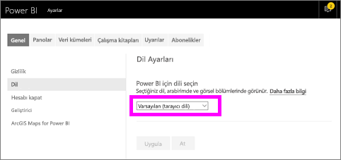
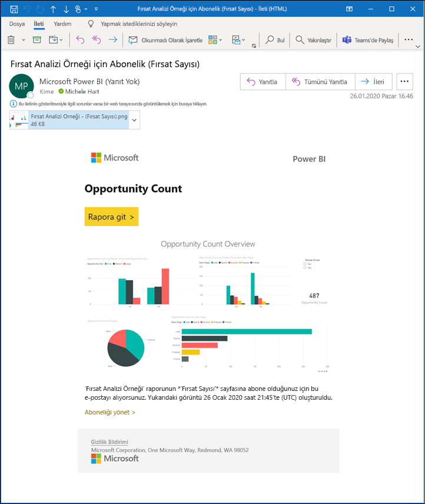
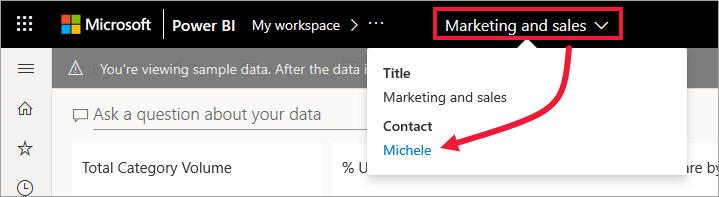
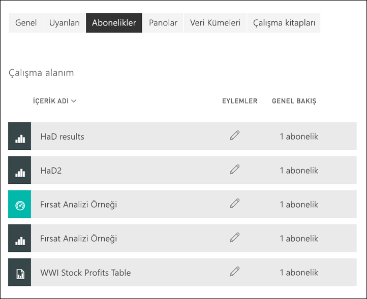

# Power BI hizmetinde bir rapora veya panoya abone olma 

[!INCLUDE[consumer-appliesto-ynny](../includes/consumer-appliesto-ynny.md)]

[!INCLUDE [power-bi-service-new-look-include](../includes/power-bi-service-new-look-include.md)]

En önemli panolarınıza ve raporlarınıza ilişkin en güncel verilere sahip olmak hiç bu kadar kolay olmamıştı. Sizin için en fazla önem taşıyan rapor sayfalarına ve panolara abone olduğunuzda Power BI, gelen kutunuza e-posta yoluyla bir anlık görüntü gönderir. Power BI'da e-postaları hangi sıklıkla almak istediğinizi seçebilirsiniz: günlük, haftalık veya veriler yenilendiğinde. Hatta Power BI'ın e-postaları göndermesi için belirli bir zaman ayarlayabilir veya bunu hemen çalıştırabilirsiniz.  Toplamda her rapor veya pano için günde en fazla 24 farklı abonelik ayarlayabilirsiniz.

E-posta ve anlık görüntü, Power BI ayarlarında belirtilen dil ayarını kullanır (bkz. [Power BI için desteklenen diller ve ülkeler/bölgeler](../supported-languages-countries-regions.md)). Dil tanımlanmazsa, Power BI geçerli tarayıcınızın yerel ayarına göre seçilen dili kullanır. Dil tercihinizi görmek veya belirlemek için sırasıyla dişli simgesini  > **Ayarlar > Genel > Dil** seçeneklerini belirleyin. 

Aldığınız e-postanın "rapora veya panoya git" bağlantısı içerdiğini görürsünüz. Power BI uygulamalarının yüklü olduğu mobil cihazlarda bu bağlantı seçildiğinde uygulama başlatılır (Power BI web sitesinde varsayılan olarak gerçekleştirilen, raporu veya panoyu açma işleminin aksine).

## Gereksinimler
Kendinize abonelik **oluşturmanız** için belirli bir [lisans](end-user-license.md) türü gerekir. Abonelik oluşturamıyorsanız Power BI yöneticinize başvurun. **Başkalarını abone yapma** yalnızca pano veya rapor sahibi tarafından kullanılabilir. Sayfalandırılmış raporlara abone olmak biraz farklıdır. Ayrıntıları için bkz. [Kendinizi ve başkalarını Power BI hizmetinde sayfalandırılmış rapora abone yapma](paginated-reports-subscriptions.md). 

## Bir panoya veya rapor sayfasına abone olma
Panoya ve rapora abone olma süreçleri birbirine benzer. Aynı düğmeyi kullanarak Power BI hizmet panolarına ve raporlarına abone olabilirsiniz.
 
.

1. Panoyu veya raporu açın.
2. Üstteki menü çubuğundan **Abone ol** seçeneğini belirleyin veya zarf simgesini  seçin.
   

   
    
    Sol taraftaki ekran, bir panoda aldığınızda ve **Abone ol**'u seçtiğinizde gösterilir. Sağ taraftaki ekran, bir rapor sayfasında aldığınızda ve **Abone ol**'u seçtiğinizde gösterilir. 
    
    a. Raporun birden çok sayfasına abone olmak için **Başka bir abonelik ekle**’yi seçin ve sonra üst kısımdaki açılan listeden farklı bir sayfa seçin.

    b. Aboneliği açıp kapatmak için sarı kaydırıcıyı kullanın.  Kaydırıcı Kapalı olarak ayarlandığında abonelik silinmez. Aboneliği silmek için çöp kutusu simgesini seçin.

    c. İsterseniz bir konu ekleyin ve e-posta iletisinin ayrıntılarını doldurun. 

    d. Aboneliğiniz için **Sıklık** seçin.  Günlük, Haftalık veya Veri yenilemesinden sonra (Günlük) seçeneğini belirtebilirsiniz.  Abonelik e-postasını yalnızca belirli günlerde almak için, **Haftalık** seçin ve hangi günler almak istediğinizi belirtin.  Örneğin, abonelik e-postasını yalnızca iş günleri almak istiyorsanız, sıklık olarak **Haftalık** seçin ve Cts ile Paz kutularının işaretini kaldırın. **Aylık** seçeneğini belirlerseniz, abonelik e-postalarını ayın hangi günlerinde almak istediğinizi belirtin.   

    e. Günlük, Saatlik, Aylık veya Haftalık’ı seçerseniz, abonelik için Zamanlanan Saat’i de seçebilirsiniz. Bir saat ya da 15, 30 veya 45 dakika geçince çalıştırabilirsiniz. Sabah (AM) veya öğleden sonra/akşam (PM) ayarını seçin. Saat dilimini de belirtebilirsiniz. Saatlik’i seçerseniz aboneliğin başlamasını istediğiniz Zamanlanan Saat’i belirtin. E-posta, bu ayardan sonraki her saat çalışır.  

    f. Tarih alanlarına tarih girerek başlangıç ve bitiş tarihlerini zamanlayın. Varsayılan olarak, aboneliğinizin başlangıç zamanı bu aboneliği oluşturduğunuz tarih ve bitiş zamanı da bir yıl sonrası olur. Bu tarihi, aboneliğiniz bitmeden önce gelecekte istediğiniz herhangi bir tarihle değiştirebilirsiniz (en fazla 9999 yıl). Abonelik bitiş tarihine ulaşıldığında, siz yeniden etkinleştirene kadar abonelik durdurulur.  Zamanlanan bitiş tarihinden önce, süreyi uzatmayı isteyip istemediğinizi soran bildirimler alırsınız.     

    örneğin: Aboneliğinizi gözden geçirmek ve test etmek için **Şimdi çalıştır**'ı seçin.  Bu, size e-postayı hemen gönderir. 

3. Her şey düzgün görünüyorsa, aboneliği kaydetmek için **Kaydet ve kapat**'ı seçin. Ayarladığınız zamanlamaya göre bir e-posta ve pano veya raporun anlık görüntüsünü alırsınız. Sıklığı **Veri yenilemesinden sonra** olarak ayarlanan tüm aboneliklerde, yalnızca söz konusu günde yapılan ilk zamanlanmış yenilemeden sonra e-posta gönderilir.
   
   
   
    Rapor sayfasını yenilediğinizde veri kümesi yenilenmez. Yalnızca veri kümesi sahibi bir veri kümesini el ile yenileyebilir. Temel alınan veri kümesinin sahibinin adını aramak için menü çubuğundan açılan listeyi seçin veya ilk abonelik e-postasını arayın.
   
    

## Aboneliklerinizi yönetme
Oluşturduğunuz abonelikleri yalnızca siz yönetebilirsiniz. Tekrar **Abone ol**'u ve ardından sol alt köşedeki **Tüm abonelikleri yönet**'i seçin (yukarıdaki ekran görüntülerine bakın). Görüntülenen abonelikler o sırada etkin olan çalışma alanına bağlıdır. Tüm çalışma alanları için aboneliklerinizi aynı anda görmek için **Çalışma Alanım**'ın etkin olduğundan emin olun. Çalışma alanlarının anlaşılması konusunda yardım almak için bkz. [Power BI'daki Çalışma Alanları](end-user-workspaces.md). 

Pro lisansının süresi dolarsa, pano veya rapor sahibi tarafından silinirse veya aboneliğin oluşturulması için kullanılan kullanıcı hesabı silinirse abonelik sona erer.

## Önemli noktalar ve sorun giderme
* Abonelik e-postalarının istenmeyen posta klasörüne gitmesini önlemek için, kişilerinize Power BI e-posta diğer adını (no-reply-powerbi@microsoft.com) ekleyin. Microsoft Outlook kullanıyorsanız diğer ada sağ tıklayın ve **Outlook kişilerine ekle**’yi seçin. 
* Üzerinde 25’ten fazla sabitlenmiş kutucuk veya dört sabitlenmiş canlı rapor sayfası olan panolar, kullanıcılara gönderilen abonelik e-postalarında tam olarak işlenemeyebilir. E-postanın düzgün şekilde işlenmesini sağlamak için pano tasarımcısıyla iletişime geçip, sabitlenmiş kutucuk sayısını 25'in altına ve sabitlenmiş canlı rapor sayısını dördün altına düşürmesini istemenizi öneririz.  
* Pano e-posta abonelikleri için, satır düzeyi güvenlik (RLS) uygulanan kutucuklar varsa bunlar görüntülenmez.  
* E-postanızdaki bağlantılar (içerik bağlantıları) çalışmayı durdurursa, içeriğin silinmiş olmasından kaynaklanabilir. E-postadaki ekran görüntüsünün altında, kendinizin mi abone olduğunu, yoksa başka bir kişinin mi sizi abone yaptığını görebilirsiniz. Başka birisi ise, o iş arkadaşınızdan e-postaları iptal etmesini veya sizi yeniden abone yapmasını isteyin.
* Pano abonelikleri için belirli kutucuk türleri henüz desteklenmiyor. Bu kutucuk türleri şunlardır: akış kutucukları, video kutucukları ve özel web içeriği kutucukları. 
* Rapor sayfası abonelikleri rapor sayfasının adıyla ilişkilidir. Bir rapor sayfasına abone olursanız ve bu rapor sayfası yeniden adlandırılırsa, aboneliğinizi yeniden oluşturmanız gerekir.
* Abonelik özelliğini kullanamıyorsanız sistem yöneticinize başvurun. Kuruluşunuz bu özelliği devre dışı bırakmış olabilir.  
* E-posta abonelikleri çoğu [özel görseli](../developer/visuals/power-bi-custom-visuals.md) desteklemez.  Power BI özel görsellerindeki istisna, [sertifikalı](../developer/visuals/power-bi-custom-visuals-certified.md) olanlardır.    
* E-posta abonelikleri raporun varsayılan filtresi ve dilimleyici durumları ile gönderilir. Abone olduktan sonra varsayılanlarda yaptığınız hiçbir değişiklik e-postada gösterilmez. Sayfalandırılmış Raporlar bu özelliği destekler ve abonelik başına belirli parametre değerleri ayarlamanıza olanak tanır.  
* E-posta abonelikleri şu anda R tarafından desteklenen Power BI görsellerini desteklememektedir.  
* Özellikle pano abonelikleri için belirli kutucuk türleri henüz desteklenmemektedir.  Bu kutucuk türleri şunlardır: akış kutucukları, video kutucukları ve özel web içeriği kutucukları.     
* E-posta boyutu sınırları nedeniyle, çok büyük resimler içeren panolarda veya raporlarda abonelikler başarısız olabilir.    
* Power BI, 2 aydan daha uzun bir süredir ziyaret edilmemiş panolar ve raporlar ile ilişkili veri kümelerinde yenilemeyi otomatik olarak duraklatır.  Ancak bir panoya veya rapora abonelik eklerseniz, bu abonelik ziyaret edilmese bile duraklatılmaz.
* E-posta aboneliklerinin, alıcılarına teslim edilmesi nadiren beş dakikadan uzun sürebilir.  Bu durumda, veri yenilemenizin çalıştırılmasını ve zamanında teslimden emin olunması için e-posta aboneliklerinin farklı zamanlarda e-postayla gönderilmesini öneririz.  Sorun devam ederse, Power BI desteğiyle iletişime geçin.

## Sonraki adımlar

[İçeriği arama ve sıralama](end-user-search-sort.md)
