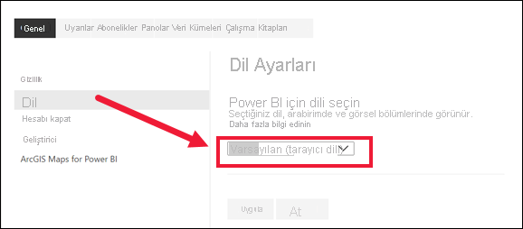
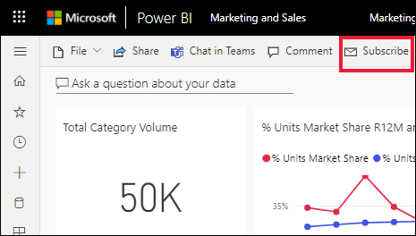
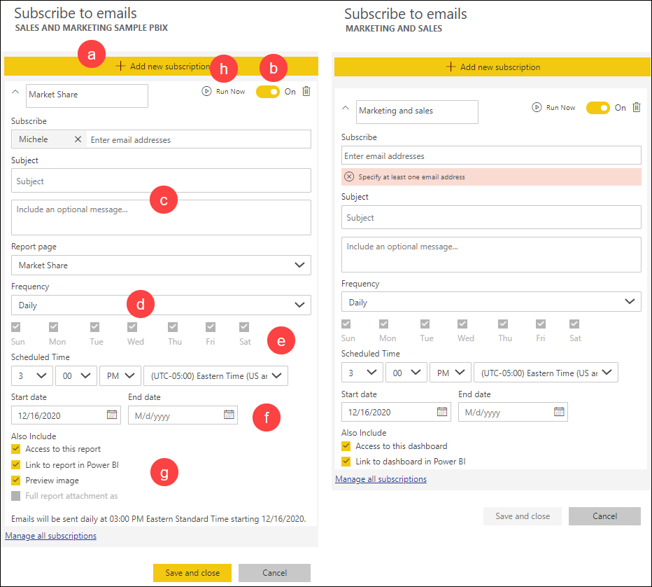
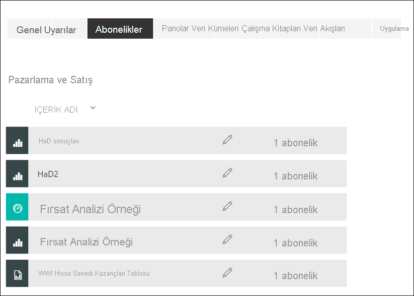

# Power BI hizmetinde bir rapora veya panoya abone olma 

[!INCLUDE[consumer-appliesto-ynny](../includes/consumer-appliesto-ynny.md)]

En önemli panolarınıza ve raporlarınıza ilişkin en güncel verilere sahip olmak hiç bu kadar kolay olmamıştı. Sizin için en fazla önem taşıyan rapor sayfalarına ve panolara abone olduğunuzda Power BI, gelen kutunuza e-posta yoluyla bir anlık görüntü gönderir. Power BI'da e-postaları hangi sıklıkla almak istediğinizi seçebilirsiniz: günlük, haftalık veya veriler yenilendiğinde. Hatta Power BI'ın e-postaları göndermesi için belirli bir zaman ayarlayabilir veya bunu hemen çalıştırabilirsiniz.  Toplamda her rapor veya pano için günde en fazla 24 farklı abonelik ayarlayabilirsiniz.

E-posta ve anlık görüntü, Power BI ayarlarında belirtilen dil ayarını kullanır (bkz. [Power BI için desteklenen diller ve ülkeler/bölgeler](../fundamentals/supported-languages-countries-regions.md)). Herhangi bir dil tanımlanmadığında Power BI, İngilizce dilini kullanır. Dil tercihinizi görmek veya belirlemek için sırasıyla dişli simgesini  > **Ayarlar > Genel > Dil** seçeneklerini belirleyin. 

Aldığınız e-postanın "rapora veya panoya git" bağlantısı içerdiğini görürsünüz. Power BI uygulamalarının yüklü olduğu mobil cihazlarda bu bağlantı seçildiğinde uygulama başlatılır (Power BI web sitesinde varsayılan olarak gerçekleştirilen, raporu veya panoyu açma işleminin aksine).

## Gereksinimler
Kendiniz için bir abonelik **oluşturma** bir *Power BI Pro* veya *kullanıcı başına Premium* [lisansı](end-user-license.md) gerektirir. Ayrıca rapor veya pano bir Premium çalışma alanındaysa ve size bu çalışma alanı için erişim verildiyse, kendiniz için bir abonelik oluşturabilirsiniz. Abonelik oluşturamıyorsanız Power BI yöneticinize veya BT yardım masasına başvurun. 

**Başkalarını abone yapma** yalnızca *Power BI Pro* lisansı olan pano veya rapor sahibi tarafından kullanılabilir. Sayfalandırılmış raporlara abone olmak biraz farklıdır. Ayrıntıları için bkz. [Kendinizi ve başkalarını Power BI hizmetinde sayfalandırılmış rapora abone yapma](paginated-reports-subscriptions.md). 

## Bir panoya veya rapor sayfasına abone olma
Panoya ve rapora abone olma süreçleri birbirine benzer. Aynı düğmeyi kullanarak Power BI hizmet panolarına ve raporlarına abone olabilirsiniz.
 
.

1. Panoyu veya raporu açın.
2. Üstteki menü çubuğundan **Abone ol** seçeneğini belirleyin veya zarf simgesini  seçin.    
1. **Yeni abonelik ekle**'yi seçin.
   

   
    
    Sol taraftaki ekran, bir rapor sayfasında aldığınızda ve **Abone ol**'u seçtiğinizde gösterilir. Sağ taraftaki ekran, bir panoda aldığınızda ve **Abone ol**'u seçtiğinizde gösterilir. 
    
    a. Raporda birden fazla sayfaya abone olmak için: **Yeni abonelik ekle**'yi ve ardından üst kısımdaki açılan listeden farklı bir sayfayı seçebileceğiniz gibi, **Ayrıca dahil et** alanında **Tam rapor eki** onay kutusunu da seçebilirsiniz. 

    b. Aboneliği açıp kapatmak için sarı kaydırıcıyı kullanın.  Kaydırıcı **Kapalı** olarak ayarlandığında abonelik silinmez. Aboneliği silmek için çöp kutusu simgesini seçin.

    c. En az bir e-posta adresi ekleyin ve isterseniz konu ve e-posta iletisi ayrıntılarını da ekleyebilirsiniz. 

    d. Aboneliğiniz için **Sıklık** seçin.  Günlük, Haftalık veya Veri yenilemesinden sonra (Günlük) seçeneğini belirtebilirsiniz.  Abonelik e-postasını yalnızca belirli günlerde almak için, **Haftalık** seçin ve hangi günler almak istediğinizi belirtin.  Örneğin, abonelik e-postasını yalnızca iş günleri almak istiyorsanız, sıklık olarak **Haftalık** seçin ve Cts ile Paz kutularının işaretini kaldırın. **Aylık** seçeneğini belirlerseniz, abonelik e-postalarını ayın hangi günlerinde almak istediğinizi belirtin.   

    e. Günlük, Saatlik, Aylık veya Haftalık’ı seçerseniz, abonelik için Zamanlanan Saat’i de seçebilirsiniz. Bir saat ya da 15, 30 veya 45 dakika geçince çalıştırabilirsiniz. Sabah (AM) veya öğleden sonra/akşam (PM) ayarını seçin. Saat dilimini de belirtebilirsiniz. Saatlik’i seçerseniz aboneliğin başlamasını istediğiniz Zamanlanan Saat’i belirtin. E-posta, bu ayardan sonraki her saat çalışır.  

    f. Tarih alanlarına tarih girerek başlangıç ve bitiş tarihlerini zamanlayın. Varsayılan olarak, aboneliğinizin başlangıç zamanı bu aboneliği oluşturduğunuz tarih ve bitiş zamanı da bir yıl sonrası olur. Bu tarihi, aboneliğiniz bitmeden önce gelecekte istediğiniz herhangi bir tarihle değiştirebilirsiniz (en fazla 9999 yıl). Abonelik bitiş tarihine ulaşıldığında, siz yeniden etkinleştirene kadar abonelik durdurulur.  Zamanlanan bitiş tarihinden önce, süreyi uzatmayı isteyip istemediğinizi soran bildirimler alırsınız.     

    örneğin: Onay kutularından birini veya birden fazlasını seçin.
    - Alıcılara raporu veya panoyu açma ve görüntüleme izni verin.
    - E-postanın gövdesine "Rapora git" bağlantısı eklemek için **Rapora/Panoya git**'i seçin.
    - E-postanın gövdesine rapor sayfasının bir küçük resim önizlemesini ekleyin.
    - Tek bir rapor sayfası yerine raporun tamamını ek olarak iliştirin ve PDF veya PowerPoint'i seçin. Ekin boyutu 20 sayfayı aşamaz ve 25 MB'tan küçük olmalıdır. Ek, raporun tüm gizlilik etiketlerine uyar. 
    
    h. Aboneliğinizi gözden geçirmek ve test etmek için **Şimdi çalıştır**'ı seçin.  Bu, size e-postayı hemen gönderir. 

3. Her şey düzgün görünüyorsa, aboneliği kaydetmek için **Kaydet ve kapat**'ı seçin. Ayarladığınız zamanlamaya göre bir e-posta ve pano veya raporun anlık görüntüsünü alırsınız. Sıklığı **Veri yenilemesinden sonra** olarak ayarlanan tüm aboneliklerde, yalnızca söz konusu günde yapılan ilk zamanlanmış yenilemeden sonra e-posta gönderilir.
   
   
   
    Rapor sayfasını yenileyebilir ama veri kümesini yenileyemezsiniz. Yalnızca veri kümesi sahibi bir veri kümesini el ile yenileyebilir. Temel alınan veri kümesinin sahibinin adını aramak için raporu açın ve menü çubuğundan açılan listeyi seçin.
   
    

## Aboneliklerinizi yönetme
Oluşturduğunuz abonelikleri yalnızca siz yönetebilirsiniz. Tekrar **Abone ol**'u ve ardından sol alt köşedeki **Tüm abonelikleri yönet**'i seçin (yukarıdaki ekran görüntülerine bakın). Geçerli çalışma alanına ait abonelikler görüntülenir. Çalışma alanlarının anlaşılması konusunda yardım almak için bkz. [Power BI'daki Çalışma Alanları](end-user-workspaces.md). 

Pro lisansının süresi dolarsa, pano veya rapor sahibi tarafından silinirse veya aboneliğin oluşturulması için kullanılan kullanıcı hesabı silinirse abonelik sona erer.

## Önemli noktalar ve sorun giderme
* Abonelik e-postalarının istenmeyen posta klasörüne gitmesini önlemek için, kişilerinize Power BI e-posta diğer adını (no-reply-powerbi@microsoft.com) ekleyin. Microsoft Outlook kullanıyorsanız diğer ada sağ tıklayın ve **Outlook kişilerine ekle**’yi seçin. 
* Üzerinde 25’ten fazla sabitlenmiş kutucuk veya dört sabitlenmiş canlı rapor sayfası olan panolar, kullanıcılara gönderilen abonelik e-postalarında tam olarak işlenemeyebilir. E-postanın düzgün şekilde işlenmesini sağlamak için pano tasarımcısıyla iletişime geçip, sabitlenmiş kutucuk sayısını 25'in altına ve sabitlenmiş canlı rapor sayısını dördün altına düşürmesini istemenizi öneririz.  
* Pano e-posta abonelikleri için, satır düzeyi güvenlik (RLS) uygulanan kutucuklar varsa bunlar görüntülenmez.  
* E-postanızdaki bağlantılar (içerik bağlantıları) çalışmayı durdurursa, içeriğin silinmiş olmasından kaynaklanabilir. E-postadaki ekran görüntüsünün altında, kendinizin mi abone olduğunu, yoksa başka bir kişinin mi sizi abone yaptığını görebilirsiniz. Başka birisi ise, o iş arkadaşınızdan e-postaları iptal etmesini veya sizi yeniden abone yapmasını isteyin.
* Pano abonelikleri için belirli kutucuk türleri henüz desteklenmiyor. Bu kutucuk türleri şunlardır: akış kutucukları, video kutucukları ve özel web içeriği kutucukları. 
* Rapor sayfası abonelikleri rapor sayfasının adıyla ilişkilidir. Bir rapor sayfasına abone olursanız ve bu rapor sayfası yeniden adlandırılırsa, aboneliğinizi yeniden oluşturmanız gerekir.
* Abonelik özelliğini kullanamıyorsanız sistem yöneticinize veya BT yardım masasına başvurun. Kuruluşunuz bu özelliği devre dışı bırakmış olabilir.  
* E-posta abonelikleri çoğu [özel görseli](../developer/visuals/power-bi-custom-visuals.md) desteklemez.  Power BI özel görsellerindeki istisna, [sertifikalı](../developer/visuals/power-bi-custom-visuals-certified.md) olanlardır.    
* E-posta abonelikleri raporun varsayılan filtresi ve dilimleyici durumları ile gönderilir. Abone olduktan sonra varsayılanlarda yaptığınız hiçbir değişiklik e-postada gösterilmez. Sayfalandırılmış Raporlar bu özelliği destekler ve abonelik başına belirli parametre değerleri ayarlamanıza olanak tanır.  
* E-posta abonelikleri şu anda R tarafından desteklenen Power BI görsellerini desteklememektedir.  
* E-posta boyutu sınırları nedeniyle, çok büyük resimler içeren panolarda veya raporlarda abonelikler başarısız olabilir.    
* Power BI, 2 aydan daha uzun bir süredir ziyaret edilmemiş panolar ve raporlar ile ilişkili veri kümelerinde yenilemeyi otomatik olarak duraklatır.  Ancak bir panoya veya rapora abonelik eklerseniz, bu abonelik ziyaret edilmese bile duraklatılmaz.
* Unutmayın; aynı diğer BI ürünlerde olduğu gibi aboneliğinizi ayarladığınız zaman, aboneliğin işlemeye başladığı zaman olur.  Rapor işleme tamamlandıktan sonra abonelik kuyruğa alınır ve e-posta alıcılarına gönderilir.  Tüm abonelikleri mümkün olan en kısa zamanda işlemeye ve teslim etmeye çalışıyoruz ama talebin yoğun olduğu zamanlarda aynı anda gönderilebilen abonelik sayısından dolayı daha uzun bir gecikmeyle karşılaşabilirsiniz.  Müşterilerin çoğunluğu raporların işlenmesi ve gönderilmesinde 15 dakikadan daha uzun bir gecikmeyle karşılaşmamalıdır ama kullanımın önemli düzeyde olduğu bazı dönemlerde ve kiracılarda bu süre 30 dakikaya kadar çıkabilir.  Hiçbir zaman aboneliğin zamanlanmasıyla teslimi arasında 60 dakikadan fazla bir gecikme olmasını beklemiyoruz.  Bir müşteri bu uzunlukta bir gecikme yaşarsa ilk önce no-reply-powerbi@microsoft.com adresinin güvenli gönderenler listesinde olduğundan ve e-posta sağlayıcınız tarafından engellenmediğinden emin olmaları gerekir.  E-posta engellenmemişse yardım için Power BI yöneticilerine veya BT yardım masasına ulaşmaları gerekir.
* Tam rapor ekleme özelliği, aşağıdaki üç koşula uyan raporlarda kullanılabilir. Tam raporların eklenmiş olduğu ve bu koşullara uymayan mevcut abonelikler devre dışı bırakılır ve hatayı açıklayan bir e-posta alırsınız.
    - [Power BI Premium veya Kullanıcı Başına Premium](../admin/service-premium-what-is.md) destekli yükseltilmiş çalışma alanında bulunması. 
    - Ek dosyasının boyutunun 25 MB'ın altında olması.
    - Raporun 20 sayfadan az olması.

## Sonraki adımlar

[İçeriği arama ve sıralama](end-user-search-sort.md)
