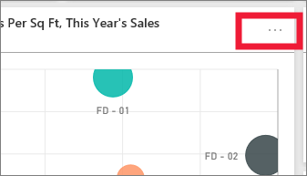
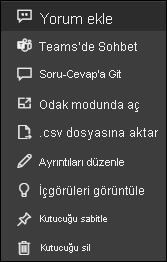

# Power BI'daki pano kutucukları

[!INCLUDE[consumer-appliesto-yyny](../includes/consumer-appliesto-ynny.md)]

[!INCLUDE [power-bi-service-new-look-include](../includes/power-bi-service-new-look-include.md)]

Kutucuklar, verilerinizin bir *tasarımcı* tarafından panoya sabitlenmiş olan anlık görüntüleridir. *Tasarımcılar* bir rapor, veri kümesi, pano, Soru-Cevap soru kutusu, Excel, SQL Server Reporting Services (SSRS) ve diğer hizmetlerden kutucuk oluşturabilir.  Bu ekran görüntüsünde, bir panoya sabitlenmiş birçok farklı kutucuk gösterilmektedir.

Raporlardan sabitlenen kutucuklara ek olarak *tasarımcılar*, **Kutucuk ekle** komutuyla doğrudan panoya bağımsız kutucuklar ekleyebilir. Ayrı kutucuklar arasında metin kutuları, resimler, videolar, akış verileri ve web içeriği bulunur.

Power BI'ın yapı taşlarını anlamak için yardıma mı ihtiyacınız var?  Bkz. [Power BI - Temel Kavramlar](end-user-basic-concepts.md).

## Bir panodaki kutucuklarla ile etkileşim kurma

1. Üç noktanın görüntülenmesi için kutucuğun üzerine gelin.
   
    
2. Kutucuk eylem menüsünü açmak için üç nokta simgesini seçin. Seçenekler izinlerinize, görsel türüne ve kutucuğu oluşturmak için kullanılan yönteme göre değişiklik gösterir. Örneğin Soru-Cevap özelliğinden sabitlenen kutucuklara yönelik menü öğeleri, rapordan sabitlenen kutucuklardan farklıdır. Aşağıda Soru-Cevap kullanılarak oluşturulan bir kutucuğa ait eylem menüsü gösterilmiştir.

   
    

   
    Bu menüler aracılığıyla sunulan eylemlerden bazıları şunlardır:
   
   * [Kutucuğu oluşturmak için kullanılan raporu açma ](end-user-reports.md)   
   
   * [Kutucuğu oluşturmak için kullanılan Soru-Cevap sorusunu açma ](end-user-reports.md)   
   

   * [Kutucuğu oluşturmak için kullanılan çalışma kitabını açma ](end-user-reports.md)   
   * [Kutucuğu odak modunda görüntüleme ](end-user-focus.md)   
   * [İçgörüler görüntüleme ](end-user-insights.md) 
   * [Bir yorum ekleme ve tartışma başlatma](end-user-comment.md) 
   * [Pano kutucuğunda ayarlanan uyarıları yönetme](end-user-alerts.md) 
   * [Verileri Excel’de açma](end-user-export.md) 

3. Eylem menüsü kapatmak için tuvalde boş bir alan seçin.

### Bir kutucuğu seçme veya bir kutucuğa tıklama
Bir kutucuğu seçtiğinizde sonraki adım, kutucuğun nasıl oluşturulduğuna ve [özel bağlantı](../create-reports/service-dashboard-edit-tile.md) içerip içermediğine göre değişir. Kutucuk özel bir bağlantı içeriyorsa kutucuğu seçtiğinizde söz konusu bağlantıya yönlendirilirsiniz. Aksi halde, kutucuğu seçtiğinizde, kutucuğu oluşturmak için kullanılan rapora, Excel Online çalışma kitabına, şirket içi SSRS raporuna veya Soru-Cevap sorusuna yönlendirilirsiniz.

> [!NOTE]
> Bu durum *tasarımcılar* tarafından panolara eklenen video kutucukları için geçerli değildir. Bu şekilde oluşturulmuş bir video kutucuğunun seçilmesi, videonun doğrudan panoda oynatılmasına neden olur.   
> 
> 

## Önemli noktalar ve sorun giderme
* Bir kutucuğu seçtiğinizde (üzerine tıkladığınızda) bir şey olmuyorsa veya hata iletisi görüntüleniyorsa aşağıdaki nedenleri değerlendirebilirsiniz:
  - Görselleştirmeyi oluşturmak için kullanılan rapor kaydedilmemiş veya silinmiş olabilir.
  - Kutucuk Excel Online'da bir çalışma kitabından oluşturulmuş olabilir ve söz konusu çalışma kitabı üzerinde Okuma izniniz yoktur.
  - SSRS'den oluşturulan kutucuklar için SSRS raporuna veya SSRS sunucusunun bulunduğu ağa erişim izniniz olmayabilir.
* **Kutucuk ekle** seçeneği kullanılarak doğrudan pano üzerinde oluşturulan kutucuklar için özel bir köprü oluşturulduysa başlığı, alt başlığı ve/veya kutucuğu seçtiğinizde söz konusu URL açılır.  Aksi halde, bir resim, web kodu veya metin kutusu için doğrudan panoda oluşturulan bu kutucukları seçtiğinizde varsayılan olarak herhangi bir işlem geçekleşmez.
* Kutucuğu oluşturmak için kullanılan özgün görselleştirmenin değişmesi halinde kutucuk değişmez.  Örneğin, *tasarımcı* bir rapordan çizgi grafik sabitler ve ardından çizgi grafiği çubuk grafik olarak değiştirirse pano kutucuğunda bir çizgi grafik gösterilmeye devam eder. Veriler yenilenir ancak görselleştirme türü yenilenmez.

## Sonraki adımlar
[Veri yenileme](../connect-data/refresh-data.md)

[Power BI - Temel Kavramlar](end-user-basic-concepts.md)

