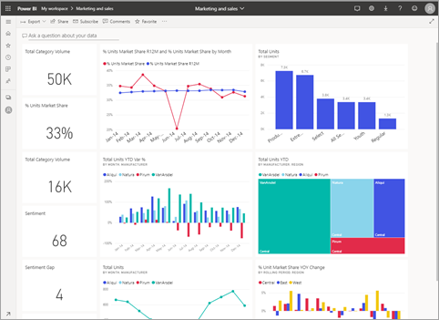

# Power BI'daki pano kutucukları
Kutucuklar, verilerinizin bir *tasarımcı* tarafından panoya sabitlenmiş olan anlık görüntüleridir. Bir rapor, veri kümesi ve panonun yanı sıra Soru-Cevap soru kutusu, Excel, SQL Server Reporting Services (SSRS) ve diğer hizmetlerden kutucuk oluşturabilirsiniz.  Bu ekran görüntüsünde, bir panoya sabitlenmiş birçok farklı kutucuk gösterilmektedir.

Raporlardan sabitlenen kutucuklara ek olarak *tasarımcılar*, **Kutucuk ekle** komutuyla doğrudan panoya bağımsız kutucuklar ekleyebilir. Ayrı kutucuklar arasında metin kutuları, resimler, videolar, akış verileri ve web içeriği bulunur.

Power BI'ın yapı taşlarını anlamak için yardıma mı ihtiyacınız var?  Bkz. [Power BI - Temel Kavramlar](end-user-basic-concepts.md).

## Bir panodaki kutucuklarla ile etkileşim kurma

1. Üç noktanın görüntülenmesi için kutucuğun üzerine gelin.
   
    
2. Kutucuk eylem menüsünü açmak için üç nokta simgesini seçin. Seçenekler, kutucuğu oluşturmak için kullanılan görsel türüne ve yöntemine göre değişiklik gösterir. Görebileceğiniz birkaç örnek aşağıda verilmiştir.

    - Soru-Cevap kullanılarak oluşturulan kutucuk
   
        

    - çalışma kitabından oluşturulan kutucuk
   
        

    - rapordan oluşturulan kutucuk
   
        
   
    Burada yapabilecekleriniz:
   
   * [Bu kutucuğu oluşturmak için kullanılan raporu açma ](end-user-reports.md)   
   
   * [Kutucuğu oluşturmak için kullanılan Soru-Cevap sorusunu açma ](end-user-reports.md)   
   

   * [Bu kutucuğu oluşturmak için kullanılan çalışma kitabını açma ](end-user-reports.md)   
    * [Kutucuğu odak modunda görüntüleme ](end-user-focus.md)   
     * [Öngörüleri çalıştırma ](end-user-insights.md) 
    * [Bir yorum ekleme ve tartışma başlatma](end-user-comment.md) 

3. Eylem menüsü kapatmak için tuvalde boş bir alan seçin.

### Bir kutucuğu seçme veya bir kutucuğa tıklama
Bir kutucuğu seçtiğinizde sonraki adım, kutucuğun nasıl oluşturulduğuna ve [özel bağlantı](../service-dashboard-edit-tile.md) içerip içermediğine göre değişir. Kutucuk özel bir bağlantı içeriyorsa kutucuğu seçtiğinizde söz konusu bağlantıya yönlendirilirsiniz. Aksi halde, kutucuğu seçtiğinizde, kutucuğu oluşturmak için kullanılan rapora, Excel Online çalışma kitabına, şirket içi SSRS raporuna veya Soru-Cevap sorusuna yönlendirilirsiniz.

> [!NOTE]
> Bu, **Kutucuk ekle** seçeneği kullanılarak doğrudan pano üzerinde oluşturulan video kutucukları için geçerli değildir. Bu şekilde oluşturulmuş bir video kutucuğunun seçilmesi, videonun doğrudan panoda oynatılmasına neden olur.   
> 
> 

## Önemli noktalar ve sorun giderme
* Görselleştirmeyi oluşturmak için kullanılan rapor kaydedilmemişse kutucuk seçildiğinde herhangi bir işlem gerçekleşmez.
* Kutucuk Excel Online'daki bir çalışma kitabından oluşturulduysa ve bu çalışma kitabı için en azından Okuma izinlerine sahip değilseniz kutucuğu seçtiğinizde çalışma kitabı Excel Online'da açılmaz.
* **Kutucuk ekle** seçeneği kullanılarak doğrudan pano üzerinde oluşturulan kutucuklar için özel bir köprü oluşturulduysa başlığı, alt başlığı ve/veya kutucuğu seçtiğinizde söz konusu URL açılır.  Aksi halde, bir resim, web kodu veya metin kutusu için doğrudan panoda oluşturulan bu kutucukları seçtiğinizde varsayılan olarak herhangi bir işlem geçekleşmez.
* SSRS'deki rapor için izniniz yoksa SSRS'den oluşturulmuş bir kutucuğu seçtiğinizde erişiminizin olmadığını belirten bir sayfa (rsAccessDenied) görüntülenir.
* SSRS sunucusunun bulunduğu ağa erişiminiz yoksa SSRS'den oluşturulmuş bir kutucuğu seçtiğinizde sunucunun bulunamadığını belirten bir sayfa (HTTP 404) görüntülenir. Raporu görüntülemek için cihazınızın, rapor sunucusuna ilişkin ağ erişimine sahip olması gerekir.
* Kutucuğu oluşturmak için kullanılan özgün görselleştirmenin değişmesi halinde kutucuk değişmez.  Örneğin, *tasarımcı* bir rapordan çizgi grafik sabitler ve ardından çizgi grafiği çubuk grafik olarak değiştirirse pano kutucuğunda bir çizgi grafik gösterilmeye devam eder. Veriler yenilenir ancak görselleştirme türü yenilenmez.

## Sonraki adımlar
[Veri yenileme](../refresh-data.md)

[Power BI - Temel Kavramlar](end-user-basic-concepts.md)
