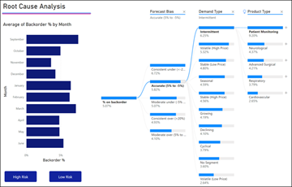
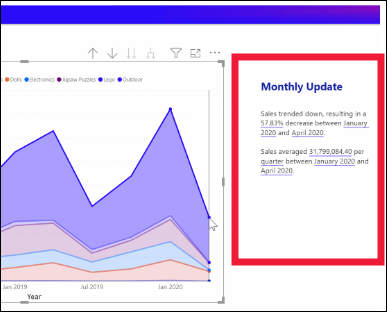

# Power BI’daki görsel türleri

[!INCLUDE[consumer-appliesto-yynn](../includes/consumer-appliesto-yynn.md)]

Görseller (*grafikler* ve *görselleştirmeler* olarak da bilinir), verilerinizin temsili resimleridir. Bazı yaygın örnekler arasında sütun grafikleri, haritalar, dağılım grafikleri ve radyal ölçerler yer alır. Görselleri raporlarda, panolarda ve Soru-Cevap’ta bulabilirsiniz.

Bu sayfada açıklanan görseller, Power BI ile birlikte sunulanlardır. Bunlar en sık karşılaşacağınız görsel türleridir. Bu sayfa, bu önceden paketlenmiş görsellere ilişkin hızlı bir genel bakış sağlar. Bu görsellerden herhangi biriyle ilgili daha ayrıntılı bilgi için [Görsel türleriyle ilgili Power BI rapor *tasarımcısı* belgelerine](../visuals/power-bi-visualization-types-for-reports-and-q-and-a.md) bakın.

Power BI’a otomatik olarak dahil edilmeyen görseller, *özel görseller* olarak adlandırılır. Özel görseller Microsoft AppSource gibi dış web sitelerinden veya kuruluşunuzun mağazası gibi iç kaynaklardan Power BI’a içeri aktarılabilir. Özel görselleri içeri aktarmak için raporda düzenleme izinlerine sahip olmanız gerekir. Bu ek görseller hakkında daha fazla bilgi edinmek için [Power BI’daki özel görseller](../developer/visuals/power-bi-custom-visuals.md) sayfasını ziyaret edin.

## Power BI’da sağlanan görsellerin listesi
Bu görsellerin tümü Power BI panolarıyla raporlarında bulunabilir ve [Soru-Cevap’ta belirtilebilir](end-user-q-and-a.md). Görsellerle etkileşimli çalışmayı öğrenmek için bkz. [Raporlarda, panolarda ve uygulamalardaki görsellerle etkileşimli çalışma](end-user-visualizations.md)

## A
### Alan grafikleri: basit (katmanlı) ve yığılmış

Basit alan grafiği için çizgi grafik temel alınır ve eksen ile çizgi arasındaki alan doldurulur. Alan grafikleri, zaman içindeki değişimin büyüklüğünü vurgular ve bir eğilime ilişkin toplam değere dikkat çekmek için kullanılabilir. Örneğin, zaman içindeki kârı gösteren veriler, bir alan grafiğinde toplam kârı vurgulayacak şekilde gösterilebilir.

## B
### Çubuk grafikler ve sütun grafikleri

 

Belirli bir değere farklı kategorilerde bakmak için standart olarak çubuk grafikler kullanılır.

## C
### Kartlar: Tek sayı

Tek sayı kartları tek bir olguyu, tek bir veri noktasını görüntüler. Bazen Power BI panonuzda veya raporunuzda izlemek istediğiniz en önemli şey (örneğin, toplam satış, yıldan yıla pazar payı veya toplam fırsat) tek bir sayı olabilir.  

### Kartlar: Çok satırlı

Çok satırlı kartlar, satır başına bir tane olmak üzere bir veya birden çok veri noktasını görüntüler.

### Birleşik haritalar

Birleşik haritada sütun grafikleri ile çizgi grafikler birleştirilir. Bu iki grafiği tek bir görselleştirmede birleştirdiğinizde verileri daha hızlı karşılaştırabilirsiniz. Birleşik haritalarda bir veya iki Y ekseni olabilir; bu nedenle yakından bakın. 

Birleşik haritalar aşağıdaki durumlarda harika bir seçimdir:
- aynı X eksenine sahip bir çizgi grafiğiniz ve sütun grafiğiniz olduğunda.
- farklı değer aralıklarına sahip birden fazla ölçüyü karşılaştırmak istediğinizde
- bir görselde yer alan iki ölçü arasındaki bağıntıyı göstermek istediğinizde
- bir ölçünün, başka bir ölçü tarafından tanımlanan hedefi karşılayıp karşılamadığını kontrol etmek istediğinizde
- tuval alanını tasarruflu kullanmak istediğinizde

## D    
### Ayrıştırma ağacı

Ayrıştırma ağacı görseli, birden çok boyuttaki verileri görselleştirmenize olanak tanır. Verileri otomatik olarak toplar ve herhangi bir sırada boyutlarınızda detaya gitmenizi sağlar. Aynı zamanda bir yapay zeka (AI) görselleştirmesi olduğundan, belirli ölçütler temelinde detayına gidilecek bir sonraki boyutu bulmasını isteyebilirsiniz. Bu da geçici bir inceleme yapmak ve kök neden analizi yürütmek için değerli bir araç olmasını sağlar.

### Halka grafikler

Halka grafikler, pasta grafiklerine benzer.  Parçaların bütünle ilişkisini gösterir. Tek fark ortasının boş ve bir etiket veya simge yerleştirmeye müsait olmasıdır.

## F
### Huni grafikler

Huniler, aşamalardan oluşan bir işlemin görselleştirilmesine yardımcı olur ve öğe akışı bir aşamadan diğerine sıralı olarak yapılır.  Fırsat ile başlayan ve alımın tamamlanmasıyla biten bir satış işlemi buna örnektir.

Örneğin, şu aşamalarda müşterileri izleyen bir satış hunisi: Müşteri Adayı > Nitelikli Müşteri Adayı > Olası Müşteri > Sözleşme > Kapanış. Huninin şekli ilk bakışta takip ettiğiniz sürecin ilerleme durumu hakkında bilgi verir.
Huninin her aşaması, toplamın belirli bir yüzdesini temsil eder. Bu nedenle çoğu durumda huni grafik bir huniye benzer. İlk aşama en büyüktür ve sonraki her aşama da bir öncekinden küçüktür. Armut şeklindeki huni de kullanışlıdır. Süreçte bir sorun olduğunu belirtebilir. Ancak genellikle ilk aşama olan "giriş" aşaması en büyük olandır.

## G
### Ölçek grafikleri

Radyal ölçerler dairesel bir yay içerir ve belirli bir hedefe/KPI'ye yönelik ilerlemeyi ölçen tek bir değer görüntüler. Hedef veya hedef değer çizgi (iğne) ile gösterilir. Hedefe yönelik ilerleme gölgelendirme ile gösterilir. İlerlemeyi gösteren değer ise yayın içinde kalın olarak gösterilir. Olası tüm değerler, minimumdan (en soldaki değer) başlayıp maksimumda (en sağdaki değer) sonlanacak şekilde yay boyunca eşit olarak dağılır.

Yukarıdaki örnekte, Satış ekibimizin aylık ortalama satışlarını izleyen bir araba satıcısı olduğumuzu varsayıyoruz. Hedefimiz olan 140 değeri siyah bir iğneyle gösterilmektedir. Mümkün olan minimum ortalama satışı 0, maksimum ortalama satışı ise 200 olarak belirledik. Mavi gölge, bu ay ortalama yaklaşık 120 satışa ulaştığımızı gösteriyor. Şanslıyız ki hedefimize ulaşmak için bir haftamız daha var.

Radial ölçerler şunlar için harika bir seçimdir:
- bir hedefe yönelik ilerlemeyi göstermek
- KPI gibi bir yüzde değerini göstermek
- tek bir ölçünün durumunu göstermek
- hızla taranabilen ve anlaşılabilen bilgiler görüntülemek

## K
 ### Ana etmenler grafiği

Ana etmenler grafiği, seçili bir sonuç veya değere en çok katkıda bulunanları gösterir.

Bir ana ölçümü etkileyen faktörleri anlamak için ana etmenlerden faydalanabilirsiniz. Örneğin, *müşterilerin ikinci siparişi vermelerindeki etmenler *veya* satışların geçen Haziran ayında çok yüksek olmasının nedenleri*. 

### KPI'ler

Ana Performans Göstergesi (KPI), ölçülebilen bir hedefe yönelik ilerlemeyi gösteren bir görsel ipucudur. 

KPI'ler şunlar için harika seçimdir:
- ilerlemeyi ölçme (ne kadar geride ne kadar ilerideyim?)
- bir hedef için kalan mesafeyi ölçme (ne kadar yakın ne kadar uzağım?)

## L
### Çizgi grafikler

Çizgi grafikler değerler dizisinin tümünün, genellikle zaman içindeki genel şeklini vurgular.

## M
### Haritalar: Temel haritalar

Hem kategorik hem de nicel bilgileri uzamsal konumlarla ilişkilendirmek için bir temel harita kullanın.

### Haritalar: ArcGIS haritaları

ArcGIS haritaları ile Power BI birlikte kullanıldığında eşleme deneyimi, haritada belirli noktaları göstermenin ötesinde yepyeni bir boyut kazanıyor. Temel haritalar, konum türleri, temalar, sembol stilleri ve başvuru katmanları için sağlanan seçenekler, göz kamaştırıcı ve bilgilendirici harita görselleri oluşturur. Harita üzerindeki güvenilir veri katmanlarıyla (nüfus sayımı verileri gibi) uzamsal analizin bileşimi, görselinizdeki verilerin daha derinden anlaşılmasını sağlar.

### Haritalar: Kartogramlar (Koroplet)

Bir kartogram, değerlerin bir coğrafya veya bölge üzerinde orantısal olarak nasıl farklılık gösterdiğini görüntülemek için gölgelendirmeyi ya da tonlandırmayı veya desenleri kullanır. Bu göreli farklılıkları açıktan (daha az sık/daha düşük) koyuya (daha fazla sık/daha yüksek) çeşitlilik gösteren gölgelendirme ile hızlıca görüntüleyin.

### Haritalar: Şekil haritaları

Şekil haritaları haritadaki bölgeleri renk kullanarak karşılaştırır. Şekil haritası, harita üzerinde veri noktalarının hassas coğrafi konumlarını gösteremez. Bunun yerine, ana amacı bölgelerin göreli karşılaştırmalarını, farklı şekilde renklendirerek bir haritada göstermektir.

### Matris

Matris görseli basamaklı düzeni destekleyen bir tür tablo görselidir (aşağıdaki "Tablo" bölümüne bakın). Genellikle rapor tasarımcıları rapor ve panolara matrisler ekler ve bu matrisler kullanıcıların rapor sayfasındaki diğer görselleri çapraz vurgulayabilmek için matristeki bir veya birden fazla öğeyi (satır, sütun, hücre) seçebilmesini sağlar.  

## P
### Pasta grafikleri

Pasta grafikleri parçaların bütünle ilişkisini gösterir. 

### Power Apps görseli

Rapor tasarımcıları bir Power App oluşturup bunu Power BI raporuna ekleyebilir. *İşletme kullanıcıları* Power BI raporunun içinde bu görselle etkileşimli çalışabilir. 

## Q
### Soru-Cevap görseli

>[!TIP]
>[Panolarda Soru-Cevap deneyimine](../create-reports/power-bi-tutorial-q-and-a.md) benzer şekilde Soru-Cevap görselleri de doğal dili kullanarak verilerinizle ilgili sorular sormanıza olanak tanır. 

Daha fazla bilgi için bkz. [Power BI’daki Soru-Cevap görselleri](../visuals/power-bi-visualization-types-for-reports-and-q-and-a.md).

## R
### Şerit grafik

Şerit grafikleri hangi veri kategorisinin en yüksek derecelendirmeye (en büyük değer) sahip olduğunu gösterir. Şerit grafikler, sıralama değişimini gösterme konusunda etkili bir araçtır; en yüksek sıra (değer) her bir zaman aralığı için her zaman en üstte görüntülenir.

## S
### Dağılım ve kabarcık grafikleriyle noktalı grafikler

Dağılım grafiğinde her zaman, biri yatay eksende bir sayısal veri kümesi gösteren, diğeri ise dikey eksen üzerinde bir sayısal değer kümesi gösteren iki değer ekseni bulunur. Grafik, X ve Y sayısal değerlerinin kesişim noktalarını görüntüler ve bu değerleri tekli veri noktalarına dönüştürür. Bu veri noktaları, verilere bağlı olarak yatay eksende eşit veya eşit olmayan şekilde dağıtılabilir.

Kabarcık grafiğinde veri noktaları yerine kabarcıklar kullanılır ve kabarcığın boyutu verilerin farklı bir boyutunu gösterir.

Noktalı grafik, kabarcık grafiğine ve dağılım grafiğine benzer ancak onlardan farklı olarak X ekseninde sayısal veya kategorik veriler çizilmesine imkan tanır. Bu örnekte daireler yerine kareler kullanılır ve satışlar X ekseni boyunca çizilir.

### Yüksek yoğunluklu dağılım

Tanımı gereği, görsellerin makul bir hızla oluşturulması ve etkileşime yanıt vermesi için yüksek yoğunluklu verilerde örnekleme yapılır. Yüksek yoğunluklu örnekleme çakışan noktaları ortadan kaldıran bir algoritma kullanır ve veri kümesindeki tüm noktaların görsele yansıtılmasını sağlar. Verilerin yalnızca temsili bir örneğini çizmez.  

Veri kümesinin tamamındaki önemli noktalar için yanıtlama, temsil ve korumanın en iyi bileşimini sağlamayı güvence altına alır.

### Dilimleyiciler

Dilimleyici, sayfadaki diğer görselleri filtrelemek için kullanılabilen tek başına bir grafiktir. Dilimleyiciler birçok farklı biçimde (kategori, aralık, tarih vb.) gelir ve kullanılabilir değerlerin yalnızca birini, birçoğunu veya tümünü seçecek şekilde biçimlendirilebilir. 

Dilimleyiciler aşağıdaki durumlarda harika seçimdir:
- daha kolay erişim sağlamak amacıyla, sık kullanılan veya önemli filtreleri rapor tuvalinde görüntülemek
- açılan bir listeyi açmak zorunda kalmadan, o sırada filtreli olan durumu daha kolay görüntülemek
- veri tablolarında gereksiz ve gizli sütunlara göre filtreleme yapmak
- dilimleyicileri önemli görsellerin yanına koyarak daha iyi odaklanmış raporlar oluşturmak

### Akıllı anlatı

Akıllı anlatı; eğilimleri ve ana fikirleri göstermek için raporlara metinler ekler ve açıklama ile bağlam katar. Metin, kullanıcıların verileri anlamasına ve önemli bulgulara hızlıca ulaşmasına yardımcı olur.

### Tek başına resimler

Tek başına resim rapora veya panoya eklenmiş bir grafiktir. 

## T
### Tablolar

Tablo, mantıksal satır ve sütun dizilerinde ilgili verileri içeren bir kılavuzdur. Tabloda başlık ve toplam satırı da bulunabilir. Tablolar, tek bir kategoriye ait birden fazla değeri incelediğiniz nicelik karşılaştırmaları için idealdir. Örneğin bu tabloda Category için beş farklı ölçü gösterilmektedir.

Tablolar şunlar için harika seçimdir:
- ayrıntılı verileri ve tam değerleri görüp karşılaştırmak için (görsel gösterimler yerine)
- verileri tablo biçiminde görüntülemek için
- sayısal verileri kategorilere göre ayrılmış şekilde görüntülemek için

### Ağaç haritalar

Ağaç haritaları, renkli dikdörtgenlerden oluşan grafiklerdir ve boyutlar değerleri temsil eder.  Bu grafikler hiyerarşik (ana dikdörtgenlerde iç içe geçmiş dikdörtgenler halinde) olabilir. Her dikdörtgenin içindeki alan, ölçülmekte olan değere bağlıdır. Ayrıca dikdörtgenler, sol üstten (en büyük) sağ alta (en küçük) doğru boyutlarına göre düzenlenir.

Ağaç haritaları aşağıdaki durumlarda kullanım için mükemmel seçimdir:
- büyük miktarlarda hiyerarşik veri görüntüleme
- çubuk grafik, yüksek miktarlardaki değerleri etkili bir şekilde işleyemediğinde
- her bir parça ve bütün arasındaki oranları gösterme
- hiyerarşideki kategorilerin her düzeyinde ölçü dağılımının desenini gösterme
- boyut ve renk kodlaması kullanarak öznitelikleri gösterme
- desenleri, aykırı değerleri, en önemli katkıda bulunanları ve istisnaları bulma

## W
### Şelale grafikler

Şelale grafikler, değerler eklenirken veya çıkarılırken değişen toplamı gösterir. Bir başlangıç değerinin (örneğin, net gelir) bir dizi pozitif ve negatif değişiklikten nasıl etkilendiğini anlamak için faydalıdır.

Artış ve azalışları hızlıca görebilmeniz için sütunlar renk kodludur. Başlangıç değeri ve son değer sütunları genellikle yatay eksende başlar ve ara değerler de yüzen sütunlar olarak görünür. Bu "görünüm" nedeniyle şelale grafikler köprü grafikleri olarak da adlandırılır.

Şelale grafikler aşağıdaki durumlarda harika bir seçimdir:
- zaman içinde veya farklı kategorilerde ölçü için değişiklikler yapıldığında
- toplam değere etki eden büyük değişiklikleri denetlemek için
- çeşitli gelir kaynaklarını göstererek şirketinizin yıllık kârının çizimini yapmak ve toplam kâra (veya zarara) ulaşmak için.
- şirketinizin bir yılın başındaki ve sonundaki çalışan sayısını göstermek için
- her ay kazandığınız ve harcadığınız para tutarını ve hesabınızın değişen bakiyesini görselleştirmek için.

## Soru-Cevap’a hangi görselin kullanılacağını bildirme
Power BI Soru-Cevap’ta doğal dilde sorgular yazarken, sorgunuzda görsel türünü belirtebilirsiniz.  Örnek:

“***ağaç haritası olarak eyalete göre satışlar***”

## Sonraki adımlar
[Raporlarda, panolarda ve uygulamalardaki görsellerle etkileşimli çalışma](end-user-visualizations.md)    
[Doğru görsel başvuruları ile ilgili sqlbi.com sayfası](https://www.sqlbi.com/wp-content/uploads/videotrainings/dashboarddesign/visuals-reference-may2017-A3.pdf)

