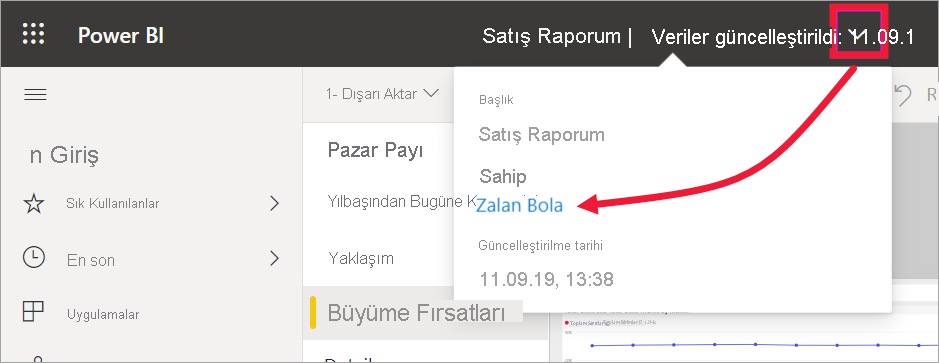

# Raporlarda, panolarda ve uygulamalardaki görsellerle etkileşimli çalışma

[!INCLUDE[consumer-appliesto-ynny](../includes/consumer-appliesto-ynny.md)]

En basit anlamıyla ***görselleştirme** _ (veya _görsel*), Power BI *tasarımcılarının* raporlardaki ve veri kümelerindeki verileri kullanarak oluşturdukları bir grafik türüdür. 

Görseller panolarda, raporlarda bulunur ve Power BI Soru-Cevap kullanılarak hemen oluşturulabilir. Tasarımcı raporda bir görsel oluşturduğunda bu görseli panoya *sabitleyebilir*. [Panodaki görsel *kutucuk* olarak adlandırılır](end-user-tiles.md). Bu panoda sekiz kutucuk vardır. 

> [!TIP]
> Buradaki ayrıntılı bilgilere geçmeden önce genel bakış niteliğindeki [*İşletme kullanıcıları* için Power BI temel kavramları](end-user-basic-concepts.md) sayfasını incelemenizi öneririz.

## Görseller ile ne yapabilirim?

Görseller, rapor ve pano *tasarımcıları* tarafından oluşturulur ve iş arkadaşlarıyla paylaşılır. Tasarımcı, iş arkadaşlarına raporu veya panoyu kullanma şekline göre farklı izinler atar. Örneğin bir *geliştiriciye* atanan izinler, bir *işletme kullanıcısına* atananlardan farklı olabilir. 

*İşletme kullanıcılarına* yönelik yaygın görevler aşağıdaki tabloda, adım adım yönergelerin bağlantılarıyla birlikte listelenmiştir. *İşletme kullanıcıları* içgörülere ulaşmak ve verilere dayalı iş kararları almak üzere görsellerle etkileşim kurmak için birçok seçeneğe sahiptir.  

Bu seçeneklerin birçoğu için yöneticiniz veya *tasarımcı* bu özelliklerini görme veya kullanma becerinizi devre dışı bırakabilir. Ayrıca bu özelliklerden bazıları yalnızca belirli görsel türleriyle çalışır.  Sorularınız varsa yöneticinize ya da rapor veya panonun sahibine başvurun. Sahibi bulmak için pano veya rapor açılan listesini seçin. 

> [!IMPORTANT]
> Ama önce Soru-Cevap özelliği konusunda bilgi vermek istiyoruz. Soru-Cevap, Power BI'ın doğal dil arama aracıdır. Doğal dil kullanarak bir soru yazarsınız, Soru-Cevap özelliği de sorunuzu bir görselle yanıtlar. Soru-Cevap, işletme kullanıcılarının hemen kendi görsellerini oluşturmak için kullanabilecekleri bir araçtır. Ancak Soru-Cevap ile oluşturulan görseller kaydedilemez. Ancak verilerden öğrenmek istediğiniz, tasarımcının bir rapora veya panoya dahil etmediği bir bilgi varsa Soru-Cevap yardımınıza koşabilir. Soru-Cevap hakkında daha fazla bilgi edinmek için bkz. [İşletme kullanıcıları için Soru-Cevap](end-user-q-and-a.md).

|Görev  |Panoda  |Raporda  | Soru-Cevap özelliğinde
|---------|---------|---------|--------|
|[Görsele kendi kullanımınız için açıklamalar ekleyin veya iş arkadaşlarınızla görsel hakkında bir konuşma başlatın](end-user-comment.md).     |  evet       |   evet      |  hayır  |
|[Görselin oluşturulduğu raporu açın ve keşfedin](end-user-tiles.md).     |    evet     |   yok      |  hayır |
|[Görseli etkileyen filtrelerin ve dilimleyicilerin listesini görüntüleyin](end-user-report-filter.md).     |    Odak modunda açarsanız     |   evet      |  hayır |
|[Görseli Soru-Cevap özelliğinde açın ve keşfedin (*tasarımcı* görsel Soru-Cevap ile oluşturmuşsa)](end-user-q-and-a.md).     |   evet      |   yok      |  yok  |
|[Soru-Cevap'ta bir görsel oluşturun (araştırma için, bu görseli kaydedemezsiniz)](end-user-q-and-a.md).     |   evet      |   Tasarımcı rapora Soru-Cevap eklediyse      |  evet  |
|[Power BI'ın görsel verilerindeki ilgi çekici olguları veya eğilimleri aramasını isteyin](end-user-insights.md).  Otomatik olarak oluşturulan bu görseller *içgörü* olarak adlandırılır.     |    evet, kutucuklar için    |  hayır       | hayır   |
|[*Odak* modunu kullanarak bir kerede tek bir görseli görüntüleyin](end-user-focus.md).     | evet, kutucuklar için        |   evet, görseller için      | yok  |
|[Görselin en son yenilenme zamanını bulun](end-user-fresh.md).     |  evet       |    evet     | yok  |
|[*Tam ekran* modunu kullanarak tek seferde kenarlıklar veya gezinti bölmeleri olmadan tek bir görseli görüntüleyin](end-user-focus.md).     |   evet      |  evet       | varsayılan olarak  |
|[Yazdırın](end-user-print.md).     |  evet       |   evet      | hayır  |
|[Görsel filtreleri ekleyip var olanları düzenleyerek görselin ayrıntılarına inin.](end-user-report-filter.md)     |    hayır     |   evet      | hayır  |
|Ek ayrıntıları ve araç ipuçlarını görmek için bir görselin üzerine gelin.     |    evet     |   evet      | evet  |
|[Sayfadaki diğer görselleri birlikte filtreleyin ve vurgulayın.](end-user-interactions.md)    |   hayır      |   evet      | yok  |
|[Görseli oluşturmak için kullanılan verileri gösterin](end-user-show-data.md).     |  hayır       |   evet      | hayır  |
| [Görselin sıralama ölçütünü değiştirin](end-user-change-sort.md). | hayır  | evet  | sorunun ifade biçimi değiştirilerek sıralama değiştirilebilir  |
| [Görsele spot ışığı ekleyin](end-user-spotlight.md). | hayır  | evet  |  hayır |
| [Excel'e dışarı aktarın.](end-user-export.md) | evet | evet | hayır|
| Ayarladığınız eşiği aşan değerlerin size bildirilmesi için [uyarı oluşturun](end-user-alerts.md).  | evet  | hayır  | hayır |
| [Sayfadaki diğer görselleri çapraz filtreleyin ve çapraz vurgulayın](end-user-report-filter.md).  | hayır      | evet  | yok |
| [Hiyerarşisi olan görseli detaylandırın](end-user-drill.md).  | hayır  | evet   | hayır |

## Sonraki adımlar
[İşletme kullanıcıları için temel kavramlar](end-user-basic-concepts.md) sayfasına dönün    
[Rapor açmak için bir görsel seçme](end-user-report-open.md)    
[Power BI'da kullanılabilen görsellerin türleri](end-user-visual-type.md)