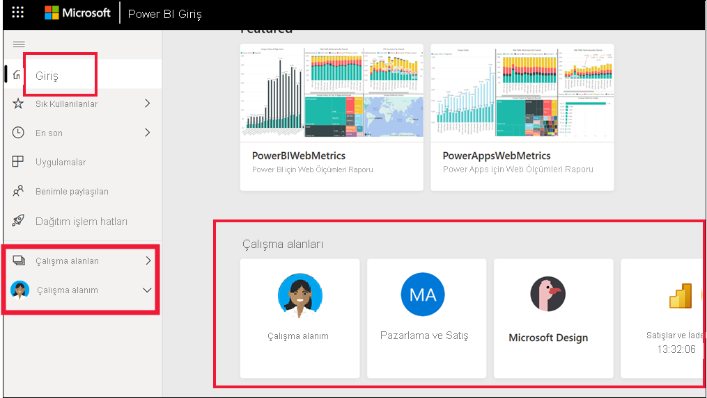
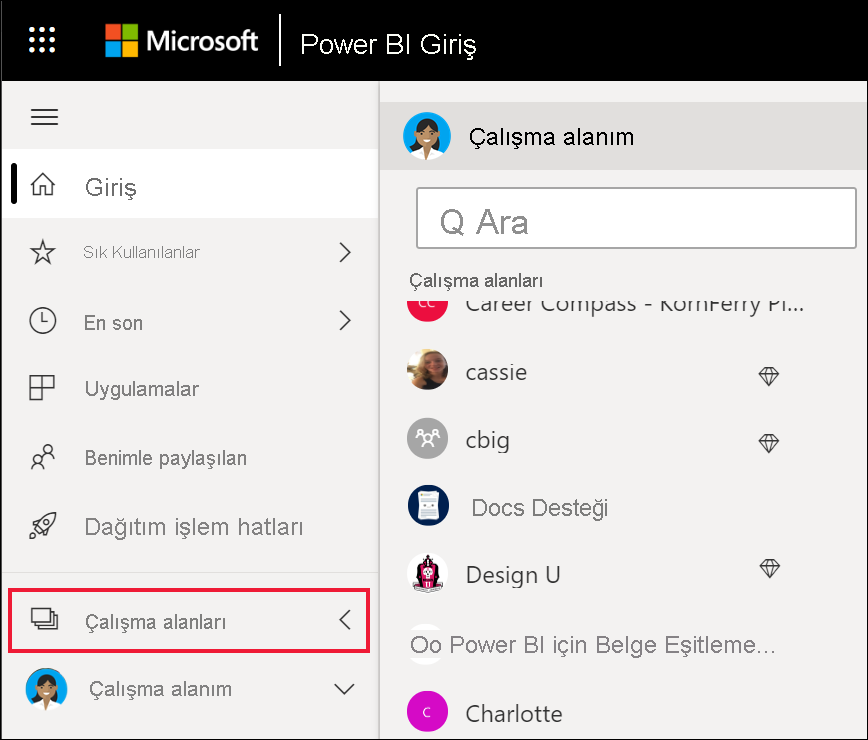

# Çalışma alanında işbirliği yapma

 *Çalışma alanları* iş arkadaşlarınızla belirli bir içerik üzerinde işbirliği yaptığınız yerlerdir. Çalışma alanları Power BI *tasarımcıları* tarafından pano ve rapor koleksiyonlarını barındırmak için oluşturulur. Tasarımcı, bu çalışma alanlarını iş arkadaşlarıyla paylaşabilir. Tasarımcılar ayrıca panolardan ve raporlardan oluşan bir koleksiyonu bir *uygulama* halinde paketleyebilir ve topluluğun tamamına, kuruluşuna veya belirli kişi ya da gruplara dağıtabilir. *Şablon uygulamaları* olarak adlandırılan belirli uygulama türleri yüklendiğinde bir çalışma alanı oluşturur. [Uygulamalar hakkında daha fazla bilgi edinin](end-user-apps.md). 

 Power BI hizmetini kullanan herkes **Çalışma alanıma** sahiptir.  Çalışma alanım, kendiniz için içerik oluşturabileceğiniz kişisel korumalı alanınızdır.

 Çalışma alanlarınızı görmek için Power BI **Giriş** sayfasını kullanabilir veya gezinti bölmesinden **Çalışma alanları**'nı seçebilirsiniz.

 

## Çalışma alanlarının türleri
**Çalışma Alanım**, size ait olan ve sizin oluşturduğunuz tüm içeriği depolar. Bunu kişisel koruma alanınız veya kendi içeriğinize yönelik bir çalışma alanı gibi düşünün. Yeni içerik oluşturmak çoğu Power BI *işletme kullanıcısının* işinin bir parçası olmadığından birçok kullanıcının **Çalışma alanım** bölümü boş görünür. Tanım gereği *işletme kullanıcıları*, diğer kişiler tarafından oluşturulan verileri kullanır ve iş kararları alırken bu verilerden faydalanır. İçerik oluşturuyorsanız, [Tasarımcılara yönelik Power BI makalelerini](../create-reports/index.yml) okuyabilirsiniz.

**Çalışma alanlarında** belirli bir uygulamaya yönelik içeriğin tamamı yer alır. Bir *tasarımcı* uygulama oluşturduğunda, uygulamanın kullanılması için gereken tüm içeriği paket haline getirir. İçerikte panolar, raporlar ve veri kümeleri bulunabilir. Her uygulama bu üç içerik türünü içermeyebilir. Bir uygulama yalnızca bir panoyu, her içerik türünden üçer tane öğeyi veya yirmi tane raporu içerebilir. Bu tamamen *tasarımcının* uygulamaya neleri eklediğine bağlıdır. Genelde *işletme kullanıcılarıyla* paylaşılan uygulama çalışma alanlarında veri kümeleri bulunmaz.

Aşağıdaki Fig sales çalışma alanı, üç rapor ve bir pano içerir. 

## Çalışma alanlarındaki izinler

Erişim izinleri çalışma alanında neler yapabileceğinizi belirler ve bu sayede ekipler işbirliği yapabilir.  Yeni çalışma alanına erişim verirken, *tasarımcılar* kullanıcıları veya grupları çalışma alanı rollerinden birine ekler: **Görüntüleyici**, **Üye**, **Katkıda Bulunan** veya **Yönetici**. 

Power BI *işletme kullanıcısı* olarak çalışma alanlarında genellikle **Görüntüleyici** rolünü kullanarak etkileşim kurarsınız. Ancak bir *tasarımcı*, sizi **Üye** veya **Katılımcı** rolüne atayabilir. Görüntüleyici rolü, başkaları tarafından oluşturulup sizinle paylaşılan içeriği (panolar, raporlar, uygulamalar) görüntülemenizi ve içerikle etkileşim kurmanızı sağlar. Görüntüleyici rolü temeldeki veri kümesine erişemediğinden, içerikle etkileşim kurmak güvenli bir yoldur ve temeldeki veriye zarar verme konusunda endişe duymanıza gerek yoktur.

Görüntüleyici rolüyle *işletme kullanıcısı* olarak yapabileceklerinizin ayrıntılı listesi için bkz. [İşletme kullanıcıları için Power BI özellikleri](end-user-features.md).

### Çalışma alanı izinleri ve rolleri

Dört rolün özellikleri şunlardır: Yöneticiler, Üyeler, Katkıda Bulunanlar ve Görüntüleyiciler. Görüntüleme ve etkileşim dışında bu özelliklerin tamamı için bir Power BI Pro lisansı gerekir.

[!INCLUDE[power-bi-workspace-roles-table](../includes/power-bi-workspace-roles-table.md)]

## Lisans, çalışma alanları ve kapasite
Çalışma alanında neleri yapabileceğinizin ve neleri yapamayacağınızın belirlenmesinde lisanslamanın da rolü vardır. Çoğu özellik için kullanıcının Power BI *Pro* lisansına sahip olması veya çalışma alanının Premium kapasitede depolanması gerekir. 

*İşletme kullanıcıları* genellikle ücretsiz lisansla çalışır. [Lisanslama hakkında daha fazla bilgi edinin](end-user-license.md). İşletme kullanıcıları, Premium kapasitede depolanmayan içeriklere erişemez.

Çalışma alanı Premium kapasitede depolanıyorsa *işletme kullanıcıları* bu çalışma alanındaki içeriği görüntüleyebilir ve bu içerikle etkileşim kurabilir. Elmas simgesi, Premium kapasitede depolanan çalışma alanlarını belirtir.

 Daha fazla bilgi edinmek için bkz. [Hangi lisansa sahibim?](end-user-license.md).

## Sonraki adımlar
* [Power BI'daki uygulamalar](end-user-apps.md)    

* Sorularınız mı var? [Power BI Topluluğu'na sorun](https://community.powerbi.com/)

