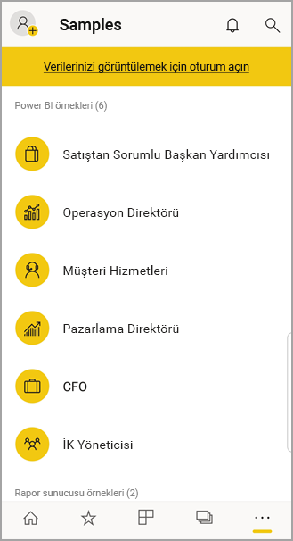

# Android cihazlarda Power BI mobil uygulaması ile çalışmaya başlama
Android telefonlardaki Microsoft Power BI uygulaması Power BI, Power BI Rapor Sunucusu ve Reporting Services için mobil BI deneyimi sunar. Nerede olursanız olun, gerçek zamanlı ve dokunmatik kullanıma uygun mobil erişimle şirket içindeki ve buluttaki şirket panolarınızı görüntüleyin ve bunlarla etkileşime geçin. Panolardaki verileri araştırın ve e-posta veya kısa mesaj yoluyla iş arkadaşlarınızla paylaşın. 

Power BI Desktop'ta Power BI raporları oluşturur ve bunları yayımlarsınız:

* [Raporlarınızı Power BI hizmetinde yayımlayın](../../fundamentals/power-bi-overview.md) ve panolar oluşturun.
* [Raporlarınızı Power BI Rapor Sunucusu’nda yayımlayarak şirket içinde paylaşın](../../report-server/quickstart-create-powerbi-report.md).

Daha sonra Android için Power BI uygulamasında, şirket içinde veya bulutta olmaları fark etmeksizin panolarınızla ve raporlarınızla etkileşime geçin.

[Power BI mobil uygulamalarındaki yenilikleri](../../mobile-whats-new-in-the-mobile-apps.md) öğrenin.

## Önkoşullar

### Uygulamayı alın

Google Play'den [Android için Power BI uygulamasını indirin](https://go.microsoft.com/fwlink/?LinkID=544867).
  
Power BI, Android 5.0 veya sonraki işletim sistemlerini çalıştıran birkaç farklı Android cihazda çalışabilir. Cihazınızı kontrol etmek için **Ayarlar** > **Cihaz hakkında** > **Android sürümü** menüsüne gidin. 

**Uygulamayı açtığınızda çalışmaya başlayın**    
Kaydolmanıza veya oturum açmanıza gerek kalmadan, Android cihazınızdaki Power BI uygulaması ile neler yapabileceğinize ilişkin hızlı bir genel bakış edinmek için oturum açma sayfalarına göz atabilirsiniz. Örnekleri görüntülemek ve incelemek için **Atla**'ya dokunun ve uygulamayı bizzat deneyin. Panoların bulunduğu giriş sayfasından dilediğiniz zaman [örneklere geri dönebilirsiniz](mobile-android-app-get-started.md#try-the-power-bi-and-reporting-services-samples).

[Power BI mobil uygulamalarındaki yenilikleri](../../mobile-whats-new-in-the-mobile-apps.md) öğrenin.

## Web üzerinde Power BI hizmetine kaydolma
Henüz kaydolmadıysanız [Power BI hizmeti](https://powerbi.com/) sayfasına gidin. Kendi hesabınızla panolar ve raporlar oluşturup bunları saklamanın yanı sıra verilerinizi bir araya getirmek için hizmete kaydolun. Ardından, nerede olursanız olun Android cihazınızdan panolarınızı görebilmek için Power BI'da oturum açın.

1. Power BI hizmetinde bir Power BI hesabı oluşturmak için [Kaydol](https://go.microsoft.com/fwlink/?LinkID=513879) seçeneğine dokunun.
2. [Kendi panolarınızı ve raporlarınızı oluşturmaya](../../fundamentals/service-get-started.md) başlayın.

## Cihazınızdaki Power BI uygulaması ile çalışmaya başlama
1. Android cihazınızdaki başlangıç ekranından Android için Power BI uygulamasını açın.
   
   
2. Power BI’da oturum açmak için **Power BI** sekmesine dokunun ve oturum açma ayrıntılarınızı girin.

    Power BI oturumunuzun açılmadığını bildiren bir ileti alırsanız bu sorunun nasıl çözüleceğiyle ilgili ayrıntılı bilgi edinmek için bkz. ["Kurumsal SSL sertifikanıza güvenilmediği için kimlik doğrulaması yapılamadı"](mobile-android-app-error-corporate-ssl-account-is-untrusted.md).

   Reporting Services mobil raporlarınızda ve KPI’larda oturum açmak için **Rapor sunucusu** sekmesine dokunun ve oturum açma ayrıntılarınızı girin.
   
   

## Power BI ve Reporting Services örneklerini deneme
Kaydolmadan bile Power BI ve Reporting Services örneklerini görüntüleyebilir ve bunlarla etkileşim kurabilirsiniz.

Örneklere erişmek için gezinti çubuğunda **Diğer seçenekler**'e (...) dokunun ve **Örnekler**'i seçin.

Bir dizi Power BI örneğinin ardında çeşitli Rapor sunucusu örnekleri yer alır.
   
   

   
   > [!NOTE]
   > Örneklerde tüm özellikler kullanılamaz. Örneğin panoların temelini oluşturan raporları görüntüleyemez, örnekleri başkalarıyla paylaşamaz ve bunları sık kullanılanlarınıza ekleyemezsiniz. 
   > 
   >

## Power BI mobil uygulamalarında içeriklerinizi bulma

Power BI içeriğinizi aramaya başlamak için üst bilgide büyütece dokunun.

## Sık kullandığınız panoları ve raporları görüntüleme
Sık Kullanılanlar sayfanızı görüntülemek için gezinti çubuğunda **Sık Kullanılanlar** () öğesine dokunun. 

[Power BI mobil uygulamalarındaki sık kullanılanlar](mobile-apps-favorites.md) hakkında daha fazla bilgi edinin.

## Power BI mobil uygulamaları için kurumsal destek
Kuruluşlar, Android ve iOS için Power BI mobil uygulamaları da dahil olmak üzere cihazları ve uygulamaları yönetmek için Microsoft Intune'u kullanabilir.

Microsoft Intune, kuruluşların; bir erişim PIN'i gerektirme, verilerin uygulama tarafından nasıl işlendiğini denetleme ve hatta uygulama kullanılmadığı sırada uygulama verilerini şifreleme gibi işlemler gerçekleştirerek öğeleri denetlemesine olanak sağlar.

> [!NOTE]
> Android cihazınızda Power BI mobil uygulamasını kullanıyorsanız ve kuruluşunuzda Microsoft Intune MAM yapılandırıldıysa arka planda veri yenileme devre dışıdır. Uygulamaya bir sonraki girişinizde Power BI, web üzerindeki Power BI hizmetinden verileri yeniler.
> 
> 

[Microsoft Intune ile Power BI mobil uygulamalarını yapılandırma](../../admin/service-admin-mobile-intune.md) hakkında daha fazla bilgi edinin. 

## Sonraki adımlar
Android cihazı için Power BI mobil uygulamasındaki panolar ve raporların yanı sıra Power BI Rapor Sunucusu veya Reporting Services web portalındaki raporlar ve KPI'ler ile gerçekleştirebileceğiniz diğer işlemlerden bazıları aşağıda verilmiştir.

### Power BI panoları ve raporları
* [Uygulamalarınızı](../../collaborate-share/service-create-distribute-apps.md) görüntüleme.
* [Panolarınızı](../../mobile-apps-view-dashboard.md) görüntüleme.
* [Panolarınızdaki kutucukları](../../mobile-tiles-in-the-mobile-apps.md) araştırma.
* [Power BI raporlarını](../../mobile-reports-in-the-mobile-apps.md) açma.
* [Uygulamalarınızı](../../collaborate-share/service-create-distribute-apps.md) görüntüleme.
* [Kutucuklara not ekleme ve kutucukları paylaşma](mobile-annotate-and-share-a-tile-from-the-mobile-apps.md).
* [Panoları](../../mobile-share-dashboard-from-the-mobile-apps.md) paylaşma.
* Android telefonunuzla [bir Power BI QR kodu tarayarak](../../mobile-apps-qr-code.md) ilişkili pano kutucuklarını veya raporları açma. 
* İş arkadaşlarınızın sizinle paylaştığı panolar gibi, [Power BI hesabınızdaki güncelleştirmelere yönelik bildirimleri](../../mobile-apps-notification-center.md) görüntüleme.

### Power BI Rapor Sunucusu ve Reporting Services web portallarındaki raporlar ve KPI'ler
* Android cihazlardaki Power BI mobil uygulamasını kullanarak [web portalındaki raporları ve KPI'leri görüntüleme](mobile-app-ssrs-kpis-mobile-on-premises-reports.md).
* [Web portalında KPI'ler](https://docs.microsoft.com/sql/reporting-services/working-with-kpis-in-reporting-services) oluşturma.
* [Power BI Desktop'ta raporlar oluşturma ve bunları Power BI Rapor Sunucusu](../../report-server/quickstart-create-powerbi-report.md) web portalında yayımlama

### Ayrıca bkz.
* Android uygulama mağazasından [Android uygulamasını indirme](https://go.microsoft.com/fwlink/?LinkID=544867).
* [Power BI nedir?](../../fundamentals/power-bi-overview.md)
* Sorularınız mı var? [Power BI Topluluğu'na sorun](https://community.powerbi.com/)
