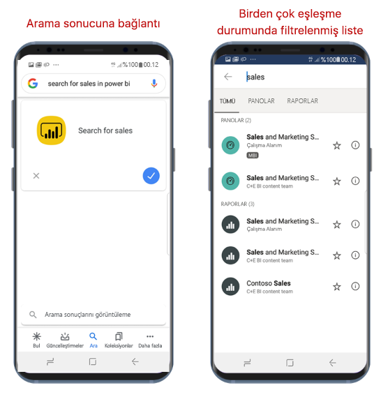

# Google Search ile içeriğinizi bulma ve içeriğinize erişme

Aşağıdakiler için geçerlidir:

|  |  |
|:--- |:--- |
| Android telefonlar |Android tabletler |

Aradığınız rapor veya panoyu bulmak için Google Search’ü kullanabilir ve doğrudan Power BI mobil uygulamasının yanında açabilirsiniz. Uygulamada gezinmenize gerek kalmaz.

Belirli bir öğeyi açmak istiyorsanız ancak nerede arayacağınızı bilmiyorsanız Google Search’ü kullanabilirsiniz.

## Google Search kullanarak arama

Google arama kutusunda, ***power bi’da &lt;arama öğesini&gt; ara*** formunu kullanarak arama yapabilirsiniz. Örneğin, **power bi’da satışları ara**.

* Yalnızca bir eşleşme bulunursa Power BI mobil uygulaması aradığınız öğeyi açar.
* Birden fazla eşleşme bulunursa Power BI, arama ekranını isteğinize göre filtreleyerek açar.

## Sonraki adımlar
* [Power BI Android uygulamasında Android uygulama kısayollarını kullanma](mobile-app-quick-access-shortcuts.md)
* [Power BI Mobil iOS Uygulaması ile iOS Cihaz Araması (Spotlight) tümleştirmesi](mobile-apps-ios-search-integration.md)
* [Power BI mobil uygulamalarında sık kullanılanlar](mobile-apps-favorites.md)
