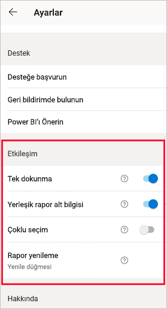
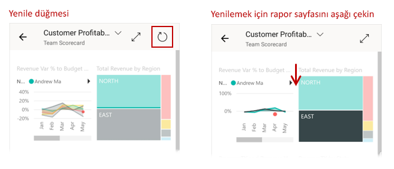
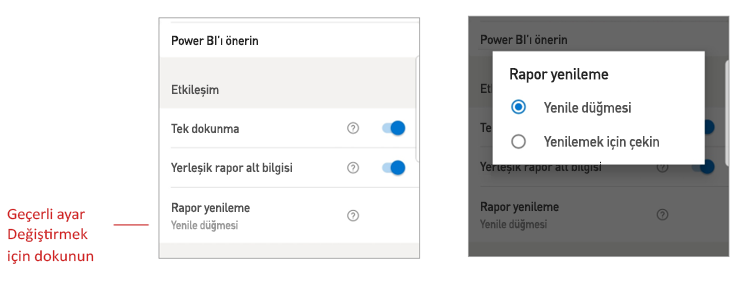

# Rapor etkileşim ayarlarını yapılandırma

## Genel bakış

Power BI mobil uygulamasının bir dizi yapılandırılabilir "etkileşim" ayarı vardır. Bu ayarlar verilerinizle kurduğunuz etkileşimi denetlemenize ve Power BI mobil uygulamasındaki bazı öğelerin davranışını tanımlamanıza olanak tanır. Aşağıdaki tabloda şu anda kullanılabilen etkileşim ayarları ve bunlara sahip olan cihazlar gösterilir.

|| Android telefon | iPhone | Android tablet  | iPad |
|-|:-:|:-:|:-:|:-:|
| [Rapor görsellerinde tek dokunma veya iki kez dokunma etkileşimi](#single-tap) |✔|✔|||
| [Rapor görsellerinde veri noktalarının çoklu seçimi ve tek seçimi](#multi-select) |✔|✔|✔|✔|
| [Yerleşik veya dinamik rapor alt bilgisi](#docked-report-footer) |✔|✔|||
| [Düğmeyle başlatılan rapor yenileme veya çekerek yenileme](#report-refresh) |✔||||
|

Etkileşim ayarlarına ulaşmak için profil resminize dokunarak [yan paneli](./mobile-apps-home-page.md#header) açın, **Ayarlar**'ı seçin ve **Etkileşim** bölümünü bulun.

Aşağıdaki bölümlerde etkileşim ayarları açıklanmıştır.

## Etkileşim ayarları

### Tek dokunma
Power BI mobil uygulamasını indirdiğinizde, tek dokunma etkileşimine ayarlanmış durumda olur. Diğer bir deyişle dilimleyici öğesini seçme, çapraz vurgulama, bir bağlantıya veya düğmeye tıklama gibi herhangi bir eylem gerçekleştirmek için görsele dokunduğunuzda, bu dokunma hem görseli seçer hem de istediğiniz eylemi gerçekleştirir.

İsterseniz tek dokunmalı etkileşimi kapatabilirsiniz. Bir de iki kez dokunmalı etkileşim seçeneğiniz vardır. İki kez dokunmalı etkileşimle, önce görsele dokunarak onu seçer ve sonra yeniden dokunarak istenen eylemi gerçekleştirirsiniz.

### Çoklu seçim

Çoklu seçim seçeneği rapor sayfasında birden fazla veri noktasının seçilmesini mümkün kılar. Çoklu seçim modu açıklığında, dokunduğunuz her veri noktası seçilen diğer veri noktalarına eklenir ve sayfadaki tüm görsellerde birleşik sonuçlar otomatik olarak vurgulanır. Çoklu seçim kapatıldığında, seçmek için bir veri noktasına dokunursanız yeni seçim geçerli seçimin yerini alır.

Veri noktasının seçimini kaldırmak için bu veri noktasına yeniden dokunun.

>[!NOTE]
>Çoklu seçim, Power BI görsellerinde desteklenmez.
>
>Çoklu seçim modu, Power BI Rapor Sunucusu’nun sonraki sürümünde Rapor Sunucusu’nda desteklenecektir.

### Yerleşik rapor alt bilgisi

Yerleşik rapor alt bilgisi ayarı, rapor alt bilgisinin raporun alt kısmında yerleşik mi kalacağını (sabit ve her zaman görünür) yoksa rapordaki eylemlerinize (örneğin kaydırma) göre gizlenip yeniden mi görüntüleneceğini belirler.

Android telefonlarında yerleşik rapor alt bilgisi ayarı varsayılan olarak **açıktır**, yani rapor alt bilgisi yerleşiktir ve raporun alt kısmında her zaman görünür. Rapordaki eylemleriniz temelinde görüntülenen ve görüntüden kaldırılan dinamik bir rapor alt bilgisini tercih ediyorsanız, ayarı **kapalı** konuma getirin.

### Rapor yenileme

Rapor yenileme ayarı, rapor yenilemelerini nasıl başlatacağınızı tanımlar. Raporu yenilemek için tüm rapor üst bilgilerinde bir yenileme düğmesi olmasını veya rapor sayfasında çekerek yenileme eylemini (yukarıdan aşağıya doğru hafifçe çekme) kullanmayı seçebilirsiniz. Aşağıdaki şekilde bu iki alternatif gösterilir. 

Android telefonlarında yenileme düğmesi varsayılan olarak eklenir.

Rapor yenileme ayarını değiştirmek için etkileşim ayarlarında rapor yenileme öğesine gidin. Geçerli ayar gösterilir. Değere dokunarak yeni değeri seçebileceğiniz açılan pencereyi açın.

## Uzaktan yapılandırma

Etkileşimler bir yönetici tarafından, uygulama yapılandırma dosyasıyla MDM aracı kullanılarak uzaktan da yapılandırılabilir. Bu şekilde kuruluş genelinde veya kuruluştaki belirli kullanıcı grupları için rapor etkileşimi deneyimini standart hale getirmek mümkündür. Ayrıntılar için bkz. [Mobil cihaz yönetimini kullanarak etkileşimi yapılandırma](./mobile-app-configuration.md).

## Sonraki adımlar
* [Raporlarla etkileşim kurma](./mobile-reports-in-the-mobile-apps.md#interact-with-reports)
* [Mobil cihaz yönetimini kullanarak etkileşimi yapılandırma](./mobile-app-configuration.md)
