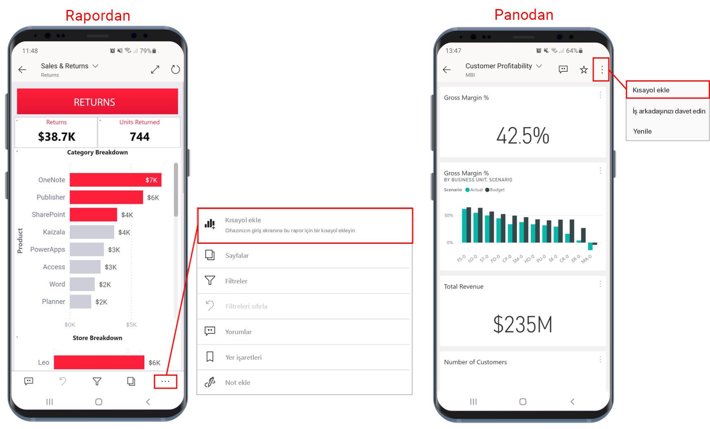
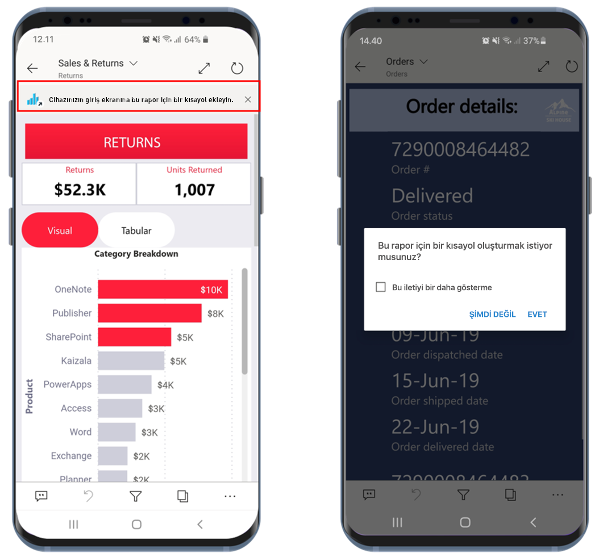
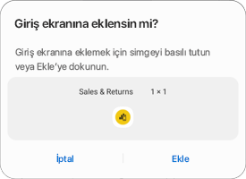
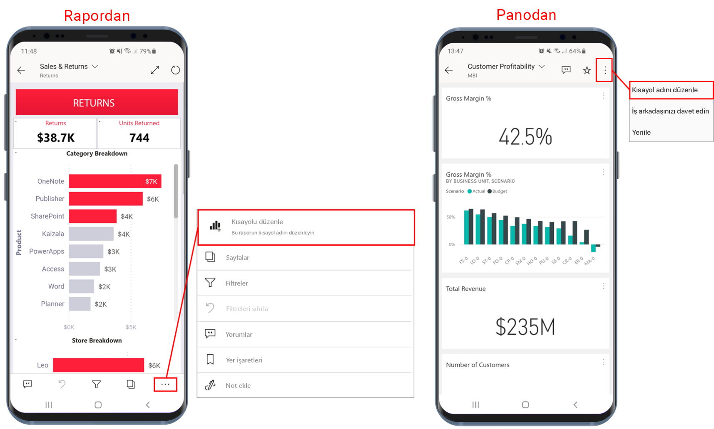
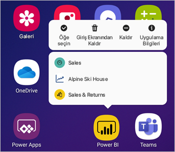

# Power BI Android uygulamasında Android uygulama kısayollarını kullanma

Aşağıdakiler cihazlar için geçerlidir:

|  |  |
|:--- |:--- |
| Android telefonlar |Android tabletler |

Android için Power BI, uygulamada gezinmek zorunda kalmadan ihtiyaç duyduğunuz rapor ve panolara doğrudan ulaşmanız için iki kolay yöntem sunar: **cihaz giriş ekranı kısayolları** ve **uygulama başlatıcısı kısayolları**.
 * **Cihaz giriş ekranı kısayolları**: Bir rapor veya panonun kısayolunu oluşturup cihazınızın giriş ekranına sabitleyebilirsiniz. Rapor veya panonun çalışma alanlarınızdan birinde olması gerekmez. Uygulamalardaki rapor ve panolara, hatta bir dış (B2B) kiracıda bulunanlara yönelik kısayollar oluşturabilirsiniz.
 * **Uygulama başlatıcısı kısayolları**: Uygulama başlatıcısını açmak için cihazınızın giriş ekranındaki uygulama başlatıcısı simgesine uzun dokunarak doğrudan sık görüntülenen raporlara ve panolara ulaşabilirsiniz. Hızlı erişim menüsü, sık görüntülenen üç öğeye yönelik kısayol sağlar. Bu öğeler zaman zaman değişir. Power BI mobil uygulaması, sık görüntülediğiniz öğeleri izleyip kısayolları buna göre değiştirir.

 >[!NOTE]
 >Android uygulama kısayolları, Android 8 ve üzeri sürümlerde kullanılabilir.

## Bir rapor veya panoya kısayol oluşturma

Bir rapor veya panoya kısayollar oluşturabilirsiniz.

1. Eylemler menüsünde **Daha fazla seçenek...** öğesine tıklayıp **Kısayol ekle**’yi seçin.

   

   Ayrıca, Power BI sık eriştiğiniz öğeyi görür ve bu öğeye yönelik bir kısayol oluşturmayı önerir. Bu iki şekilde gerçekleşir:
   * Sık görüntülenen raporlarda ve panolarda, öğeyi açtığınızda başlıkta **Kısayol ekle** seçeneği görüntülenir.
   * Bir rapora ulaşmak için sık kullandığınız bir bağlantı varsa (örneğin, paylaşılan bir e-postadan, ek açıklamadan vb.) bu bağlantıyı birkaç kez kullandıktan sonra kısayol oluşturmak isteyip istemediğinizi soran bir pencere açılır. **Evet** seçeneği, **Kısayol ekle** iletişim penceresini açar (aşağıya bakın). **Şimdi değil** seçeneği, sizi erişmeye çalıştığınız öğeye götürür.
   
   Bu iki deneyim aşağıda gösterilmiştir.

   

 1. Öğenizin adıyla bir **Kısayol ekle** iletişim kutusu açılır. Dilerseniz adı düzenleyebilirsiniz. İşiniz bittiğinde, **Ekle**’ye dokunun.

    

1. Kısayolu eklemek isteyip istemediğinizi onaylamanız istenir. Kısayolu cihazınızın giriş ekranına eklemek için **Ekle**’ye dokunun.

   

   Cihazınızın giriş ekranına, seçtiğiniz adla bir pano veya rapor kısayolu simgesi eklenir.

   

## Kısayol adını düzenleme

Kısayolun adını düzenlemek için eylemler menüsünden **Daha fazla seçenek...** öğesini seçip **Kısayol adını düzenle** seçeneğini belirleyin

 

## Sık görüntülenen içeriğe erişmek için Power BI mobil uygulama başlatıcısını kullanma

Doğrudan sık erişilen öğelere gitmek için Power BI mobil uygulama başlatıcısını kullanabilirsiniz.

Sık görüntülenen öğelerin yer aldığı hızlı erişim menüsünü görüntülemek için uygulama başlatıcısına uzun dokunun. Ardından istediğiniz öğeyi açmak için bir kısayola dokunun.

İstediğiniz kısayol simgesini cihazınızın giriş ekranına sürükleyerek, listelenen öğelerden birine yönelik kalıcı kısayol oluşturabilirsiniz.

## Sonraki adımlar
* [Google Search ile içeriğinizi bulma ve içeriğinize erişme](mobile-app-find-access-google-search.md)
* iOS işletim sistemine sahip bir cihazdaysanız ve Siri kısayollarını arıyorsanız bkz. [Power BI Mobil iOS Uygulamasında Siri Kısayollarını Kullanma](mobile-apps-ios-siri-shortcuts.md).
* [Power BI mobil uygulamalarında sık kullanılanlar](mobile-apps-favorites.md)
