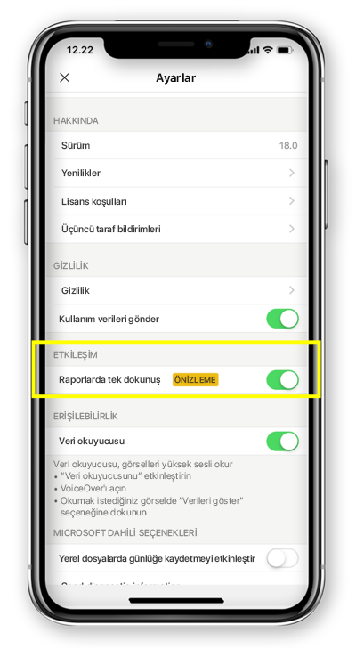

# Rapor etkileşimini tek dokunuşa veya çift dokunuşa yapılandırma
Aşağıdakiler cihazlar için geçerlidir:

|  |  | 
|:--- |:--- |
| iPhone'lar |Android telefonlar |

Power BI raporu, verilerinizin etkileşimli bir görünümüdür ve verilerinize dayalı farklı bulguları ve öngörüleri temsil eden görseller içerir.

Verilerinizle nasıl etkileşim kurulacağını yapılandırabilirsiniz. Tek dokunuşla veya çift dokunuşla etkileşim kurulacağına karar verebilirsiniz.

* Çift dokunuşla etkileşimde, bir görsele ilk dokunuşunuzla görsel seçilir ve dilimleyici öğesi seçimi, çapraz vurgulama veya bir bağlantı, düğme vb. tıklama gibi gerçek eylemi ancak ikinci dokunuş gerçekleştirir.

* Tek dokunuşla etkileşimde ise bir dokunuş her ikisini de yapar: görseli seçer ve eylemi gerçekleştirir.

Power BI uygulamasının iOS için 18.0 ve Android için 112540 sürümlerinden itibaren tüm yeni yüklemeler varsayılan davranış olarak Tek dokunuşla yapılandırılacaktır.
Telefonlarında zaten Power BI yüklü olan ve bu yeni sürümlere yükseltme yapacak kullanıcılara tek dokunuşa geçiş seçeneği sunulacaktır.

## Etkileşim davranışını değiştirme

Etkileşim davranışını değiştirmek için uygulama ayarlarına giderek tek dokunuşla etkileşimi açabilir/kapatabilirsiniz.

Bu makale hem yatay raporlar hem de telefon raporları için geçerlidir.

## Sonraki adımlar
* [Telefonunuz için en iyi duruma getirilmiş Power BI raporlarını görüntüleme ve raporlarla etkileşim kurma](mobile-apps-view-phone-report.md)
* Sorularınız mı var? [Power BI Topluluğu'na sorun](http://community.powerbi.com/)

