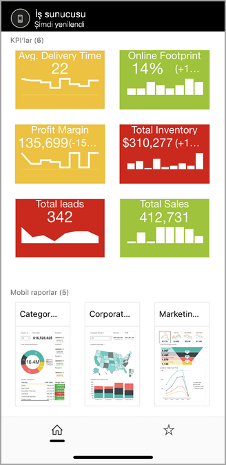
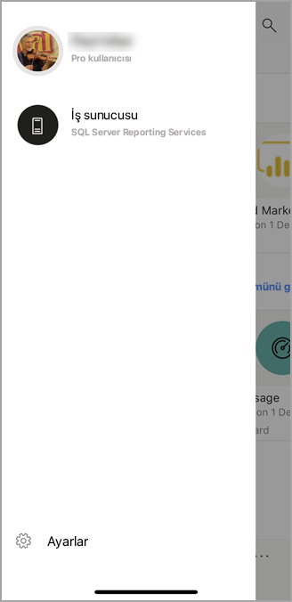
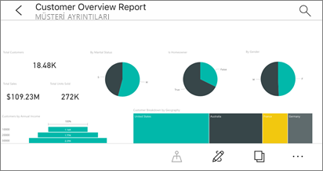
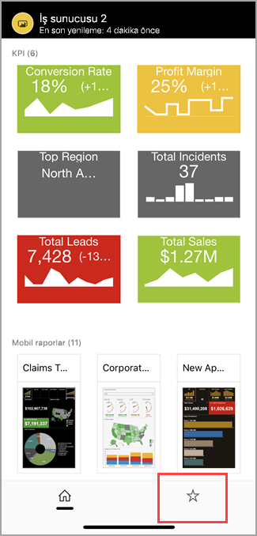
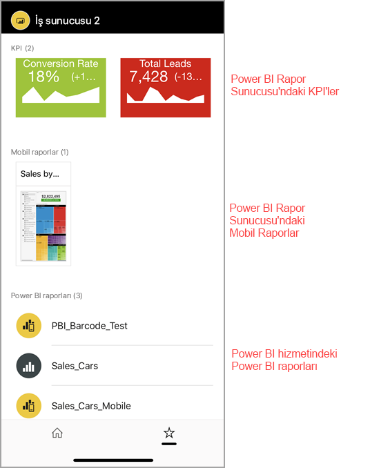

# Power BI mobil uygulamalarında şirket içi rapor sunucusu raporlarını ve KPI'lerini görüntüleme

Power BI mobil uygulamaları, Power BI Rapor Sunucusu ve SQL Server 2016 Reporting Services'de (SSRS) bulunan şirket içi iş bilgilerinize yönelik gerçek zamanlı ve dokunmatik kullanıma uygun mobil erişim sağlar.

Aşağıdakiler için geçerlidir:

|  |  |  |  |
|:--- |:--- |:--- |:--- |
| iPhone'lar |iPad'ler |Android telefonlar |Android tabletler |

## İlk yapılacaklar
**Mobil uygulamalar, Power BI içeriklerinizi oluşturduğunuz değil, görüntülediğiniz yerdir.**

* Siz ve kuruluşunuzda rapor oluşturan diğer kişiler, [Power BI Desktop'ı kullanarak Power BI raporları oluşturur ve bu raporları Power BI Rapor Sunucusu](../../report-server/quickstart-create-powerbi-report.md) web portalında yayımlarsınız. 
* [KPI'leri doğrudan web portalında](/sql/reporting-services/working-with-kpis-in-reporting-services) oluşturur, klasörler halinde düzenler, sık kullandıklarınızı işaretler ve istediğinizde kolayca bulabilirsiniz. 
* SQL Server 2016 Enterprise Edition Mobil Rapor Yayımcısı ile [Reporting Services mobil raporları oluşturur](/sql/reporting-services/mobile-reports/create-mobile-reports-with-sql-server-mobile-report-publisher) ve bu raporları [Reporting Services web portalında](/sql/reporting-services/web-portal-ssrs-native-mode) yayımlarsınız.  

Ardından, Power BI mobil uygulamalarında beş adede kadar rapor sunucusuna bağlanarak Power BI raporlarını ve KPI'lerini klasörler halinde düzenlenmiş veya sık kullanılanlar olarak bir araya getirilmiş şekilde görüntüleyebilirsiniz. 

## Sunucu bağlantısı olmadan mobil uygulamalardaki örnekleri inceleme
Reporting Services web portalına erişiminiz olmasa bile Reporting Services mobil raporlarının ve KPI'lerinin özelliklerini inceleyebilirsiniz. 

1. Sol üst köşedeki profil resminize dokunun ve sonra da beliren hesaplar panelinde **Ayarlar**'a dokunun.

2. Açılan ayarlar sayfasında **Reporting Services Örnekleri**'ne dokunup sayfaya göz atarak örnek KPI'ler ve mobil raporlarla etkileşime geçin.
   
   

## Şirket içi rapor sunucusuna bağlanma
Power BI mobil uygulamalarında şirket içi Power BI raporlarını, Reporting Services mobil raporlarını ve KPI'leri görüntüleyebilirsiniz. 

1. Mobil cihazınızda Power BI uygulamasını açın.
2. Henüz Power BI'da oturum açmadıysanız **Rapor Sunucusu**'na dokunun.
   
   
   
   Power BI uygulamasında zaten oturum açmış durumdaysanız, sol üst köşedeki profil resminize dokunun ve sonra da beliren hesaplar panelinde **Ayarlar**'a dokunun.
3. Açılan ayarlar sayfasında **Sunucuya bağlan**'a dokunun.
   
    

    Mobil uygulamanın sunucuya bir şekilde erişmesi gerekir. Bunu yapmanın birkaç yolu vardır:
     * Aynı ağda olmak/VPN kullanmak en kolay yöntemdir.
     * Kuruluş dışından bağlantı kurmak için Web Uygulaması Ara Sunucusu kullanabilirsiniz. Ayrıntılar için bkz. [OAuth kullanarak Reporting Services'e bağlanma](mobile-oauth-ssrs.md).
     * Güvenlik duvarında bir bağlantı (bağlantı noktası) açma.

4. Sunucu adresini girin ve isterseniz sunucuya kolay bir ad verin. Sunucu adresi için şu biçimi kullanın:
   
     `https://<servername>/reports`
   
     VEYA
   
     `https://<servername>/reports`
   
   Bağlantı dizesinin önüne **http** veya **https** ifadesini ekleyin.
   
    
5. Sunucu adresini ve isteğe bağlı olarak kolay adı yazdıktan sonra **Bağlan**'a dokunun ve istendiğinde kullanıcı adınızı ve parolanızı girin.
6. Artık Hesaplar bölmesinde sunucunuzu görürsünüz. Bu örnekte sunucu "Work server" olarak adlandırılmıştır.
   
   

## iOS veya Android'de şirket içi rapor sunucusuna bağlanma

Power BI’yı iOS veya Android mobil uygulamasında görüntülüyorsanız BT yöneticiniz bir uygulama yapılandırma ilkesi tanımlamış olabilir. Tanımlamışsa, rapor sunucusuna bağlanma deneyiminiz daha kolay olur ve bir rapor sunucusuna bağlandığınızda sağladığınız kadar fazla bilgi vermeniz gerekmez. 

1. Mobil uygulamanızın bir rapor sunucusu ile yapılandırıldığına dair bir ileti görürsünüz. **Oturum aç**’a dokunun.

    

2.  **Sunucuya bağlan** sayfasında rapor sunucusu ayrıntıları zaten doldurulmuştur. **Bağlan**’a dokunun.

    

3. Kimlik doğrulaması için bir parola girip **Oturum aç**’a dokunun. 

    

Artık KPI’leri ve rapor sunucusunda depolanmış Power BI raporlarını görüntüleyebilir ve etkileşimde bulunabilirsiniz.

## Power BI uygulamasında Power BI raporlarını ve KPI'lerini görüntüleme
Power BI raporları, Reporting Services mobil raporları ve KPI'ler, Reporting Services web portalındaki klasör düzeninde görüntülenir. 

* Bir Power BI raporuna dokunun. Rapor yatay modda açılır ve Power BI uygulamasında raporla etkileşime geçebilirsiniz.

    > [!NOTE]
  > Power BI Rapor Sunucusu'nda Power BI raporlarında şu anda detaya gitme ve detaydan çıkma etkin değildir.
  
    
* Rapor sahipleri Power BI Desktop'ta, [bir raporu Power BI mobil uygulamaları için en iyi duruma getirebilir](../../create-reports/desktop-create-phone-report.md). En iyi duruma getirilmiş raporlar cep telefonunuzda özel bir simge,  ve düzenle gösterilir.
  
    
* Odak modunda görmek için bir KPI'ye dokunun.
  
    

## Sık kullandığınız KPI'leri ve raporları görüntüleme
Web portalında KPI'leri ve raporları sık kullanılanlara ekleyip daha sonra bunları mobil cihazınızda tek bir klasörde, sık kullanılan Power BI panolarınızla birlikte görüntüleyebilirsiniz.

* Gezinti çubuğunda **Sık Kullanılanlar**'a dokunun.
  
   
  
   Web portalında sık kullandığınız KPI ve raporlarınızın tümü, Power BI hizmetindeki Power BI panoları ile birlikte bu sayfada yer alır:
  
   

## Rapor sunucusu bağlantısını kesme
1. Hesaplar bölmesini açın ve **Ayarlar**'a dokunun.
2. Bağlantısını kesmek istediğiniz sunucunun adına dokunun.
3. **Sunucuyu Kaldır**'a dokunun.

## Sonraki adımlar
* [Power BI nedir?](../../fundamentals/power-bi-overview.md)  
* Sorular? [Power BI Topluluğu'na sorun](https://community.powerbi.com/)