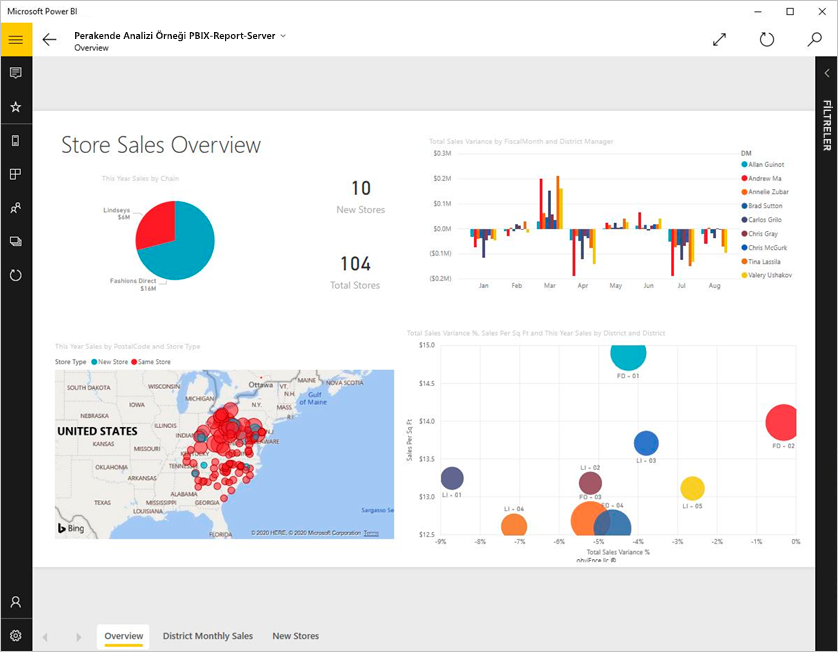
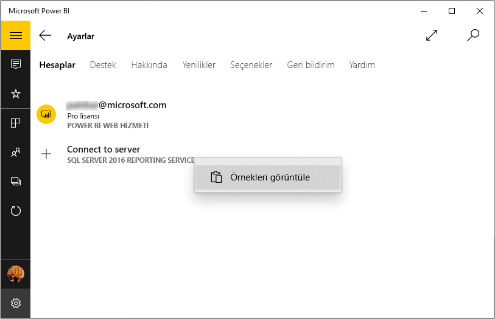
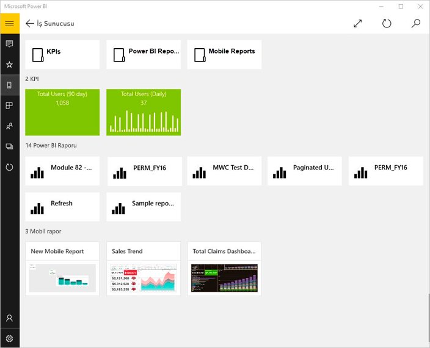
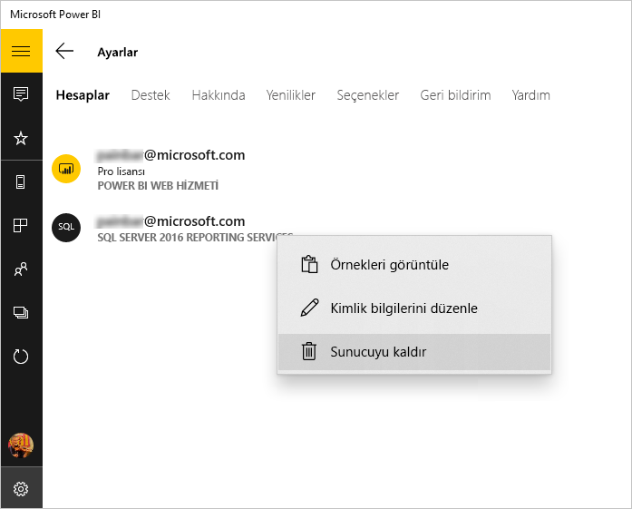

# Power BI Windows uygulamasında şirket içi raporları ve KPI'leri görüntüleme
Windows 10 için Power BI uygulaması, SQL Server 2016 Reporting Services'deki önemli şirket içi iş bilgilerinize gerçek zamanlı ve dokunmatik kullanıma uygun mobil erişim olanağı sağlar. 

## İlk yapılacaklar
SQL Server 2016 Enterprise Edition Mobil Rapor Yayımcısı ile [Reporting Services mobil raporları oluşturun](/sql/reporting-services/mobile-reports/create-mobile-reports-with-sql-server-mobile-report-publisher) ve bu raporları [Reporting Services web portalında](/sql/reporting-services/web-portal-ssrs-native-mode) yayımlayın. Doğrudan web portalında KPI'ler oluşturun. İstediğinizde kolayca bulabilmek için bunları klasörler halinde düzenleyin ve sık kullandıklarınızı işaretleyin. 

Ardından, klasörler halinde düzenlenmiş veya sık kullanılanlar olarak bir araya getirilmiş KPI’leri, mobil raporları ve Power BI raporlarını Windows 10 için Power BI uygulamasında görüntüleyin. 

> [!NOTE]
> Cihazınızın Windows 10'u çalıştırması gerekir. Uygulama, en az 1 GB RAM'e ve 8 GB iç depolama alanına sahip olan cihazlarda en iyi şekilde çalışır.

>[!NOTE]
>**Windows 10 Mobile kullanan telefonlar** için Power BI mobil uygulama desteği, 16 Mart 2021’de sona erecektir. [Daha fazla bilgi](/legal/powerbi/powerbi-mobile/power-bi-mobile-app-end-of-support-for-windows-phones)

## Bir SQL Server 2016 Reporting Services sunucusu olmadan örnekleri keşfetme
Reporting Services web portalına erişiminiz olmasa bile Reporting Services mobil raporlarının özelliklerini inceleyebilirsiniz.

1. Windows 10 cihazınızda Power BI uygulamasını açın.
2. Sol üst köşede bulunan genel gezinti düğmesine  dokunun.
3. **Ayarlar** simgesine  dokunun, **Sunucuya bağlan** seçeneğine sağ tıklayın veya bu seçeneği basılı tutun, ardından **Örnekleri görüntüle**'ye dokunun.
   
   
4. Retail Reports veya Sales Reports klasörünü açarak ilgili KPI'leri ve mobil raporları keşfedin.
   
   

KPI'ler ve mobil raporlarla etkileşim kurmak için örneklere göz atın.

## Bir Reporting Services rapor sunucusuna bağlanma
1. Gezinti bölmesinin alt kısmındaki **Ayarlar**'a  dokunun
2. **Sunucuya bağlan**'a dokunun.
3. Sunucu adresinin yanı sıra kullanıcı adınızı ve parolanızı girin. Sunucu adresi için şu biçimi kullanın:
   
     `https://<servername>/reports` VEYA   `https://<servername>/reports`
   
   > [!NOTE]
   > Bağlantı dizesinin başına **http** veya **https** ifadesini ekleyin.
   > 
   > 
   
    Sunucuya istediğiniz adı vermek için **Gelişmiş seçenek**'e dokunun.
4. Bağlanmak için onay işaretine dokunun. 
   
   Artık sunucuyu gezinti bölmesinde görebilirsiniz.
   
   
   
   >[!TIP]
   >İstediğiniz zaman genel gezinti düğmesine  dokunarak Reporting Services mobil raporları ve Power BI hizmetindeki panolarınız arasında gezinebilirsiniz. 
   > 

   >[!NOTE]
   >Özel bağlantı noktalarıyla yapılandırılan Rapor Sunucuları desteklenmez ve bu sunucular Power BI Windows uygulamasından erişilemez. 

## Reporting Services KPI'lerini ve mobil raporlarını Power BI uygulamasında görüntüleme
Reporting Services KPI’leri, mobil raporları ve Power BI raporları (önizleme), Reporting Services web portalındaki klasör düzeninde görüntülenir.

* Odak modunda görmek için bir KPI'ye dokunun.
  
    
* Power BI uygulamasında açmak ve etkileşim kurmak için bir mobil rapora dokunun.
  
    

## Sık kullandığınız KPI'leri ve raporları görüntüleme
Reporting Services web portalınızda sık kullanılan olarak işaretlediğiniz KPI'leri, mobil raporları ve Power BI raporlarını Windows 10 cihazınızda kolayca ulaşabileceğiniz tek bir klasörde, sık kullanılan Power BI panolarınız ve raporlarınızla birlikte görüntüleyebilirsiniz.

* **Sık Kullanılanlar**'a dokunun.
  
   
  
   Web portalında sık kullanılan olarak işaretlediğiniz öğelerin tümü bu sayfada bulunur.
  
[Power BI mobil uygulamalarındaki sık kullanılanlar](mobile-apps-favorites.md) hakkında daha fazla bilgi edinin.

## Rapor sunucusu bağlantısını kesme
Power BI mobil uygulamanızdan tek seferde yalnızca bir rapor sunucusuna bağlanabilirsiniz. Farklı bir sunucuya bağlanmak isterseniz geçerli sunucu bağlantısını kesmeniz gerekir.

1. Gezinti bölmesinin alt kısmındaki **Ayarlar**'a  dokunun.
2. Bağlantısını kesmek istediğiniz sunucunun adını basılı tutun.
3. **Sunucuyu kaldır**'a dokunun.
   
    

## Reporting Services mobil raporları ve KPI'leri oluşturma
Reporting Services KPI'leri ve mobil raporları Power BI mobil uygulamasında oluşturulmaz. Bunlar, SQL Server Mobil Rapor Yayımcısı ve bir SQL Server 2016 Reporting Services web portalında oluşturulur.

* [Kendi Reporting Services mobil raporlarınızı oluşturun](/sql/reporting-services/mobile-reports/create-mobile-reports-with-sql-server-mobile-report-publisher) ve bu raporları bir Reporting Services web portalında yayımlayın.
* [Bir Reporting Services web portalında KPI](/sql/reporting-services/working-with-kpis-in-reporting-services) oluşturma

## Sonraki adımlar
* [Windows 10 için Power BI mobil uygulamasını kullanmaya başlama](mobile-windows-10-phone-app-get-started.md)  
* [Power BI nedir?](../../fundamentals/power-bi-overview.md)  
* Sorularınız mı var? [Power BI Topluluğu'na sorun](https://community.powerbi.com/)