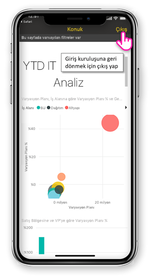

# Bir dış kuruluştan paylaşılan Power BI içeriğini görüntüleme

Power BI, Azure Active Directory--işletmeler arası (B2B Power BI içeriklerinin kuruluş dışındaki kullanıcılara güvenli dağıtım izin vermek için Azure AD) ile tümleşir. Ve dış konuk kullanıcılara kendileriyle paylaşılan Power BI içeriği erişmek için Power BI mobil uygulamasını kullanabilirsiniz. 

Aşağıdakiler cihazlar için geçerlidir:

|  |  |  |  |
|:--- |:--- |:--- |:--- |
| iPhone'lar |iPad'ler |Android telefonlar |Android tabletler |

## Paylaşılan içeriği erişme

**İlk olarak, birisi sizinle bir öğe paylaştırmak için bir dış kuruluştan gerekir.** Birisi olduğunda [öğeyi paylaştığında](../../service-share-dashboards.md), aynı kuruluş veya bir dış kuruluştan, paylaşılan öğeyi bağlantısını içeren bir e-posta alırsınız. Mobil Cihazınızı, bağlantıyı izleyerek Power BI mobil uygulamasında açılır. Uygulama öğesi bir dış kuruluştan paylaşıldı tanıyorsa uygulama, kuruluş kimliğinizle yeniden bağlanır. Uygulama, daha sonra bu kuruluştan Sizinle paylaşılmış olan tüm öğeleri yükler.

> [!NOTE]
> Bu bir dış konuk kullanıcıyla paylaşılan ilk öğesi ise, bir tarayıcıda davet talep gerekir. Talep Power BI uygulamasında davet edilemiyor.

Harici bir kuruluş için bağlı olduğu sürece, uygulamada siyah üstbilgi görünür. Bu üst bilgisi, ev kuruluşunuza bağlı değil gösterir. Giriş kuruluşunuza bağlamak için konuk modundan çıkın.

Harici bir kuruluş için uygulamanızı geçer sonra bağlanmak için Power BI yapı bağlantısına ihtiyacınız olsa da, (yalnızca e-postadan açılır öğe) sizinle paylaşılan tüm öğelere erişebilirsiniz. Dış kuruluştaki erişebileceğiniz tüm öğeleri görüntülemek için uygulama menüsüne gidin ve seçin **benimle paylaşılan**. Altında **uygulamaları** de kullanabilen uygulamalar bulun.

## Sınırlamalar

- Koşullu erişim ve diğer Intune ilkeleri, Azure AD B2B ve Power BI mobil uygulamalarında desteklenmez. Varsa bu uygulama yalnızca giriş kuruluşun ilkelerini zorlayan anlamına gelir.
- Anında iletme bildirimleri yalnızca giriş kuruluş siteden alınan (hatta kullanıcı harici bir kuruluş için bir konuk olarak bağlandığında). Bildirim açarak uygulamayı kullanıcının ev kuruluş siteye yeniden bağlanır.
- Kullanıcı, uygulamayı kapanıyorsa olduğunda yeniden açılmış uygulamayı kullanıcının ev kuruluşa otomatik olarak bağlanır.
- Harici bir kuruluş için bağlandığınızda, bazı eylemler devre dışı: sık kullanılan öğe veri uyarıları, yorum oluşturma ve paylaşma.
- Harici bir kuruluş için bağlı değilken çevrimdışı veri kullanılamıyor.
- Şirket portalı uygulamasının Cihazınızda yüklü varsa, cihazın kayıtlı olmalıdır.
