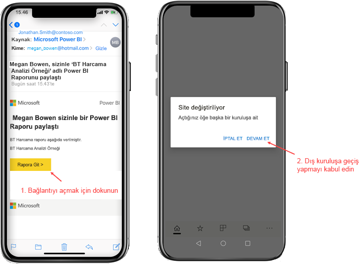

# Dış kuruluştan sizinle paylaşılan Power BI içeriğini görüntüleme

Power BI, işletmeler arası Azure Active Directory (Azure AD B2B ) ile tümleşerek Power BI içeriklerinin kuruluşunuz dışındaki kullanıcılara güvenli bir şekilde dağıtılmasına olanak sağlar. Dış konuk kullanıcılar ise kendileriyle paylaşılan Power BI içeriğine erişmek için Power BI mobil uygulamasını kullanabilirler. 

Aşağıdakiler için geçerlidir:

|  |  |  |  |
|:--- |:--- |:--- |:--- |
| iPhone'lar |iPad'ler |Android telefonlar |Android tabletler |

## Paylaşılan içeriğe erişme

**İlk olarak, sizinle içerik paylaşması için dış kuruluştan bir kişi gereklidir.** Sizinle aynı kuruluştan ya da bir dış kuruluştan birisi [sizinle bir içerik paylaştığında](../../service-share-dashboards.md), paylaşılan içeriğin bağlantısını içeren bir e-posta alırsınız. Mobil cihazınızda bu bağlantıyı takip etmek Power BI mobil uygulamasını açar. Uygulama içeriğin bir dış kuruluştan paylaşıldığını belirlerse, uygulama sizin kimliğinizi kullanarak bu kuruluşa yeniden bağlanır. Uygulama daha sonra o kuruluştan sizinle paylaşılan tüm içerikleri yükler.

> [!NOTE]
> Dış konuk kullanıcı olarak sizinle paylaşılan ilk içerik buysa, daveti bir tarayıcıdan kabul etmeniz gerekir. Daveti Power BI uygulamasından kabul edemezsiniz.

Bir dış kuruluşa bağlı olduğunuz sürece uygulamada siyah bir üst bilgi görünür. Bu üst bilgi, ana kuruluşunuza bağlı olmadığınızı gösterir. Ana kuruluşunuza tekrar bağlanmak için konuk modundan çıkış yapın.

Bir dış kuruluşa bağlanmak için Power BI yapıt bağlantısına sahip olmanız gerekse de, uygulamanız geçiş yaptıktan sonra sizinle paylaşılan tüm içeriklere erişebilirsiniz (yalnızca e-postadan açtığınız içeriğe değil). Dış kuruluşta erişebileceğiniz tüm içerikleri görüntülemek için uygulama menüsüne gidin ve **Benimle paylaşılan**’ı seçin. **Uygulamalar**'ın altında, kullanabileceğiniz uygulamaları da bulabilirsiniz.

## Sınırlamalar

- Kullanıcıların etkin bir Power BI hesabına ve Ana kiracıya sahip olması gerekir.
- Kullanıcıların, bir dış kiracıdan kendileriyle paylaşılan içeriğe erişebilmesi için Power BI ana kiracılarında oturum açmış olmaları gerekir.
- Koşullu erişim ve diğer Intune ilkeleri, Azure AD B2B ve Power BI mobilde desteklenmez. Bunun anlamı, uygulamanın varsa yalnızca ana kuruluşun ilkelerini zorlamasıdır.
- Anında iletme bildirimleri yalnızca ana kuruluş sitesinden alınır (kullanıcı bir dış kuruluşa konuk olarak bağlandığında bile). Bildirimin açılması, uygulamayı kullanıcının ana kuruluş sitesine yeniden bağlar.
- Kullanıcı uygulamayı kapatırsa, uygulama yeniden açıldığında kullanıcının ana kuruluşuna otomatik olarak bağlanır.
- Bir dış kuruluşa bağlanıldığında bazı eylemler devre dışı bırakılır: sık kullanılan öğeler, veri uyarıları, yorum yapma ve paylaşma.
- Bir dış kuruluşa bağlıyken çevrimdışı veriler kullanılamaz.
- Cihazınızda Şirket Portalı uygulaması yüklüyse cihazınızın kayıtlı olması gerekir.
