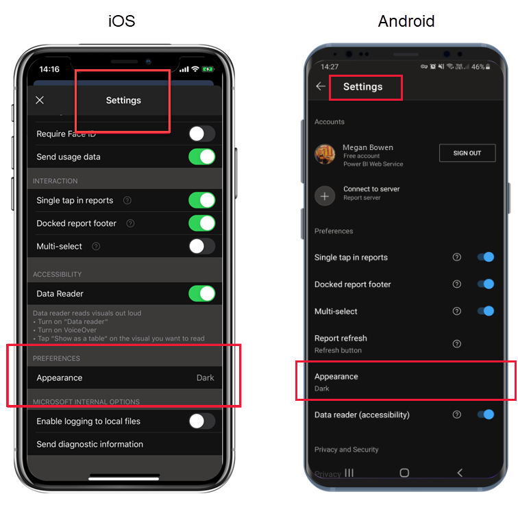

# Koyu mod

Tek görüntüleme tercihlerinizi karşılamak amacıyla iOS ve Android için Power BI mobil uygulaması hem açık hem de koyu ekran modlarını desteklemektedir. Koyu mod, içeriğinizi görmenizi kolaylaştırmak için ekran parlaklığını azaltır.

 Koyu modda tüm uygulama deneyimleri koyu renkteki arka planda görüntülenir. Ancak Power BI içeriği bundan etkilenmez. Rapor, pano ve uygulamalarınız her zaman tasarımcıların hedeflediği şekilde görüntülenir.
 
 Power BI mobil uygulamanız varsayılan olarak, görüntülenecek ekranı belirlemek için cihazınızın ayarlarını kullanır. Cihazınız koyu mod için yapılandırılmışsa uygulama koyu modda görüntülenir.

>[!NOTE]
>Android cihazlarda koyu mod için cihaz düzeyinde destek, Android 10 sürümünden itibaren resmi olarak sunulmuştur. Daha eski Android sürümlerini çalıştıran cihazlarda Power BI mobil uygulamasındaki koyu mod, uygulamanın görünüm ayarlarından denetlenebilir.

Açık ve koyu mod arasında geçiş yapmak veya cihaz ayarlarının modu belirlemesini sağlamak için **Ayarlar** sayfasına gidin, **Görünüm** bölümüne inin ve dilediğiniz modu dokunarak seçin.

