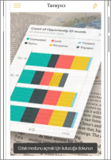

# Power BI mobil uygulamaları ile gerçek dünyadan veriler alma
Power BI mobil uygulamaları çok çeşitli şekillerde gerçek dünya ve ilgili BI bilgileri arasında doğrudan bağlantı kurabilir. 

## Kutucuklara yönelik QR kodları
Bir rapor veya panodaki bir kutucuk için QR kodu oluşturun ve QR kodunu dilediğiniz yere yerleştirin. İş arkadaşlarınız kodu iPhone'ları, Android telefonları veya Karma Gerçeklik için Power BI uygulaması ile taradığında, söz konusu QR koduyla ilişkilendirdiğiniz kutucuğu görür. iPhone’da genişletilmiş gerçeklikte kutucuğu görür.

Daha fazla bilgi:

* [Power BI'da bir kutucuk için QR kodu oluşturma](../../create-reports/service-create-qr-code-for-tile.md)
* [Mobil cihazınızda Power BI QR kodu tarama](mobile-apps-qr-code.md)
* [Karma Gerçeklik için Power BI uygulamasıyla QR kodunu tarama](mobile-mixed-reality-app.md#scan-a-report-qr-code-in-holographic-view).

## Raporlara yönelik QR kodları
Bir rapor için QR kodu oluşturun.  İş arkadaşlarınız kodu iPhone'ları (Android telefonlar için destek yakında sunulacaktır) ile taradığında, söz konusu QR koduyla ilişkilendirdiğiniz raporla karşılaşır. 

[Power BI'da bir rapor için QR kodu oluşturma](../../create-reports/service-create-qr-code-for-report.md) hakkında daha fazla bilgi

## Barkodlar
Raporunuzda barkod verileri etiketlerseniz iş arkadaşlarınız bir üründeki barkodu tarayabilir ve söz konusu ürün için filtrelenmiş şekilde bu rapora doğrudan gidebilir.

Daha fazla bilgi:

* [Bir raporda barkod verileri etiketleme](../../transform-model/desktop-mobile-barcodes.md)
* [iPhone'unuzdaki Power BI uygulamasından barkod tarama](mobile-apps-scan-barcode-iphone.md)

## Konuma göre filtreleme
Power BI Desktop'taki bir raporda bulunan coğrafi verileri kategorilere ayırın. Böylece iş arkadaşlarınız söz konusu raporu iOS için Power BI mobil uygulamasında görüntülediğinde Power BI, otomatik olarak iş arkadaşlarınızın bulundukları konumlarla eşleşen coğrafi filtreler sağlar.

[Konuma göre filtreleme](mobile-apps-geographic-filtering.md) hakkında daha fazla bilgi.

## Sonraki adımlar
* [Power BI'da bir kutucuk için QR kodu oluşturma](../../create-reports/service-create-qr-code-for-tile.md)
* [Power BI'da bir rapor için QR kodu oluşturma](../../create-reports/service-create-qr-code-for-report.md)
