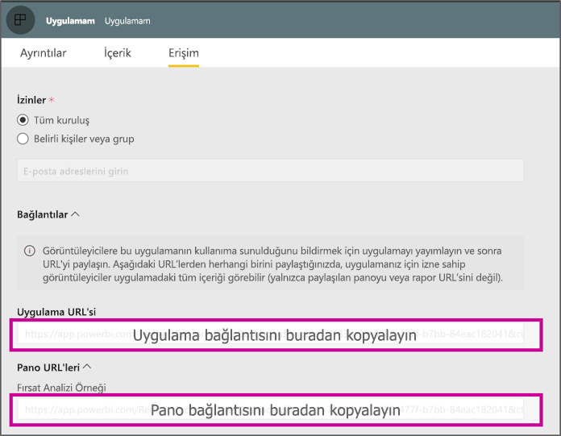

# <a name="create-a-link-to-a-specific-location-in-the-power-bi-mobile-apps"></a>Power BI mobil uygulamalarında belirli bir konumun bağlantısını oluşturma
Bağlantıları, doğrudan Power bı'da belirli öğelere erişmek için kullanabilirsiniz: Raporu, Pano ve kutucuk.

Power BI mobilde bağlantıları kullanarak için çoğunlukla iki senaryo vardır: 

* Power BI'dan açmak için **uygulama dışında**ve land belirli içeriğe (rapor/Pano/uygulama). Power BI mobil başka bir uygulamadan açmak istediğinizde bu genellikle bir tümleştirme, senaryodur. 
* İçin **gidin** Power BI içinde. Bu durum, genellikle Power BI'da özel bir gezinti oluşturmak istediğiniz durumdur.


## <a name="use-links-from-outside-of-power-bi"></a>Power BI dışındaki bağlantılarını kullanın
Power BI uygulaması dışında bir bağlantıdan kullandığınızda, uygulama tarafından açılacak emin olmanız gerekir ve cihazın'i yüklemek için kullanıcı sunmak için uygulama yüklü değil. Tam olarak desteklemek için özel bağlantı biçimi oluşturduk. Bu bağlantı biçimi cihazı bağlantıyı açmak için uygulamayı kullanan ve uygulamayı cihazda yüklü değilse, kullanıcıyı almak için depoya sağlayacağı emin olun.

Bağlantıyı aşağıdaki ile başlamalıdır  
```html
https://app.powerbi.com/Redirect?[**QUERYPARAMS**]
```

> [!IMPORTANT]
> İçeriğinizi Government, Çin, vb. gibi özel bir veri merkezinde barındırılıyorsa. Bağlantıyı sağ Power BI adresiyle gibi başlamalıdır `app.powerbigov.us` veya `app.powerbi.cn`.   
>


**Sorgu PARAMS** şunlardır:
* **Eylem** (zorunlu) OpenApp = / OpenDashboard / OpenTile / RaporAç
* **AppID** bir rapora veya bir uygulamanın parçası olan bir panoyu açmak isteyip istemediğiniz = 
* **groupObjectId** raporu veya çalışma alanı (ancak çalışma Alanım değil) parçası olan bir panoyu açmak isteyip istemediğiniz =
* **dashboardObjectId** Pano nesnesi Kimliğini (eylem OpenDashboard veya OpenTile ise) =
* **reportObjectId** rapor nesnesi Kimliğini (eylem RaporAç ise) =
* **tileObjectId** kutucuk nesne kimliği (eylem OpenTile ise) =
* **reportPage** (eylem RaporAç ise), belirli bir rapor bölümü açmak isteyip istemediğiniz =
* **ctid** = öğesi Kuruluş Kimliği (B2B senaryo için geçerli. Öğesi, kullanıcının bir kuruluşa aitse bu atlanmış olabilir).

**Örnekler:**

* Açık uygulama bağlantısı 
  ```html
  https://app.powerbi.com/Redirect?action=OpenApp&appId=appidguid&ctid=organizationid
  ```

* Bir uygulamanın parçası olan panoyu Aç 
  ```html
  https://app.powerbi.com/Redirect?action=OpenDashboard&appId=**appidguid**&dashboardObjectId=**dashboardidguid**&ctid=**organizationid**
  ```

* Bir çalışma alanının parçası olan raporu açın
  ```html
  https://app.powerbi.com/Redirect?Action=OpenReport&reportObjectId=**reportidguid**&groupObjectId=**groupidguid**&reportPage=**ReportSectionName**
  ```

### <a name="how-to-get-the-right-link-format"></a>Doğru bağlantı biçimi alma

#### <a name="links-of-apps-and-items-in-app"></a>Uygulamaları ve uygulama öğelerinde bağlantıları

İçin **uygulamalar ve raporlar ve bir uygulamanın parçası olan Pano**, uygulama çalışma alanına gidin ve "Uygulamayı güncelleştir" bağlantısını almak için en kolay yolu olan. Bu "Yayımla uygulama" deneyimi açar ve erişim sekmede bulursunuz bir **bağlantıları** bölümü. Bölümü ve uygulama listesi görürsünüz ve tüm içeriğini, bağlantıları genişleterek bunları doğrudan erişmek için kullanılabilir.



#### <a name="links-of-items-not-in-app"></a>Bağlantılar öğeleri app içinde değil 

Raporlar ve bir uygulamanın parçası olmayan panolar için kimlikleri öğesi URL'den çıkarma gerekir.

Örneğin, 36 karakterlik bulmak için **Pano** nesne kimliği, Power BI hizmetinde konusu panoya gidin 

```html
https://app.powerbi.com/groups/me/dashboards/**dashboard guid comes here**?ctid=**organization id comes here**`
```

36 karakterden oluşan bulmak için **rapor** nesne kimliği, Power BI hizmetinde konusu rapora gidin.
Bu rapor "Çalışma Alanım" den örneğidir

```html
https://app.powerbi.com/groups/me/reports/**report guid comes here**/ReportSection3?ctid=**organization id comes here**`
```
Yukarıdaki URL'yi de belirli bir rapor sayfası içeren **"ReportSection3"** .

Bir rapor örneği (değil çalışma Alanım) bir çalışma alanından budur.

```html
https://app.powerbi.com/groups/**groupid comes here**/reports/**reportid comes here**/ReportSection1?ctid=**organizationid comes here**
```

## <a name="use-links-inside-power-bi"></a>Power BI içinde bağlantıları kullanın

Bağlantılarını Power BI mobil uygulamalarında Power BI hizmetinde olduğu gibi çalışmaktadır.

Başka bir Power BI öğesine işaret eden raporunuza bağlantı eklemek istiyorsanız, o öğe URL'si yalnızca tarayıcınızın adres çubuğundan kopyalayabilirsiniz. Daha fazla bilgi edinin [bir rapordaki metin kutusuna köprü ekleme](https://docs.microsoft.com/power-bi/service-add-hyperlink-to-text-box).

## <a name="use-report-url-with-filter"></a>Rapor URL'si ile filtre kullanın
Power BI hizmeti ile aynı, Power BI mobil uygulamaları, ayrıca bir filtre query param içeren rapor URL'si destekler. Power BI mobil uygulamasında bir rapor açın ve belirli bir durum için filtre. Örneğin, bu URL'yi satış raporu açar ve bölgeye göre filtrele

```html
https://app.powerbi.com/groups/me/reports/**report guid comes here**/ReportSection3?ctid=**organization id comes here**&filter=Store/Territory eq 'NC'
```

Daha fazla bilgi [query param filtrelemek için yapı raporları](https://docs.microsoft.com/power-bi/service-url-filters).

## <a name="next-steps"></a>Sonraki adımlar
Geri bildiriminiz gelecekte neler yapacağımıza karar verme konusunda bize yardımcı olur, bu nedenle Power BI mobil uygulamalarında görmek istediğiniz diğer özellikleri oylamayı unutmayın. 

* [Mobil cihazlar için Power BI uygulamaları](mobile-apps-for-mobile-devices.md)
* Bizi Twitter'da takip edin: @MSPowerBI
* [Power BI Topluluğu](http://community.powerbi.com/)'nda sohbete katılın
* [Power BI nedir?](../../power-bi-overview.md)

