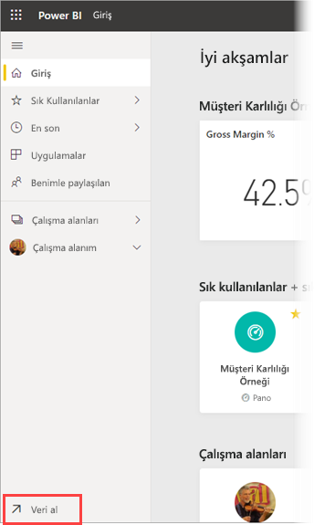
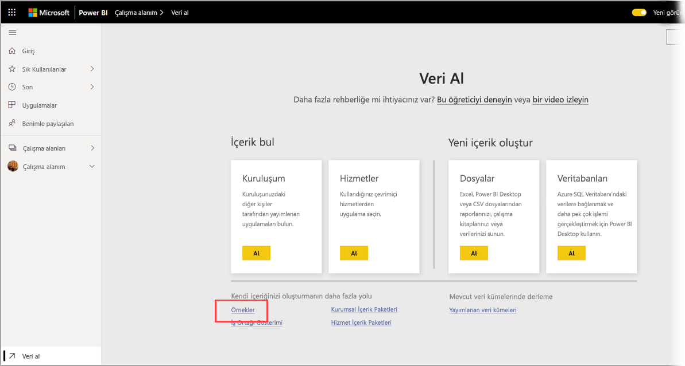
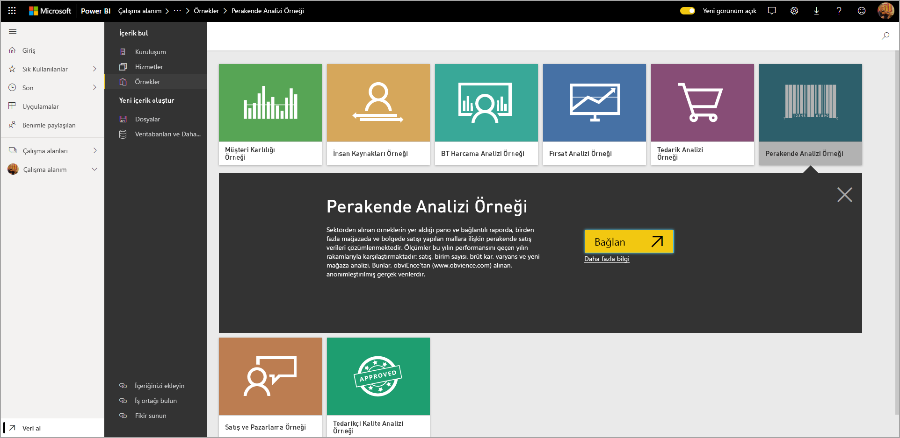
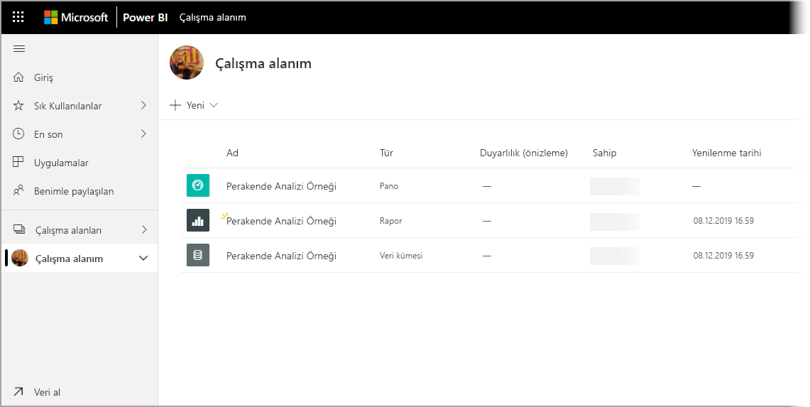

# Örnekleri Power BI hizmetinde Çalışma alanım'a indirme

Burada sağlanan Mobil uygulama belgelerinden bazılarında örnek veriler gösterim amacıyla kullanılır. Kendi cihazınızda takip etmek için örnek verileri Power BI hizmeti hesabınıza indirebilirsiniz. Burada verileri cihazınızdaki Power BI Mobil uygulamasından görüntüleyebilirsiniz. Bu makalede örnek verilerin Power BI hizmeti hesabınıza nasıl indirileceği açıklanır. 

## Önkoşullar

Verileri indirebilmek için bir Power BI hizmeti hesabınız olmalıdır. Power BI’ya henüz kaydolmadıysanız başlamadan önce [ücretsiz deneme için kaydolun](https://app.powerbi.com/signupredirect?pbi_source=web).

## Örneği indirme

1. Tarayıcınızda [Power BI hizmetine](https://app.powerbi.com) gidin ve oturum açın.

2. Gezinti bölmesinin sol alt köşesinde **Veri al**'ı seçin. Gezinti bölmesi gizliyse ve Veri al bağlantısını göremiyorsanız, bölmeyi görüntülemek için göster/gizle gezinti bölmesi simgesine  tıklayın.  
   
    

3. Veri Al sayfasında **Örnekler** bağlantısını seçin.
   
   

4. İndirilecek örneği seçin. Kullandığınız öğreticide, hızlı başlangıçta veya makalede başvurulan örneği seçtiğinizden emin olun. Bunu seçtikten sonra **Bağlan**'a tıklayın.
  
   
   
5. Power BI, örneği içeri aktarır ve Çalışma Alanınıza yeni bir pano, rapor ve veri kümesi ekler.
   
   
  
Artık örnekleri mobil cihazınızda görüntülenmeye hazırsınız.

## Sonraki adımlar
* [Hızlı Başlangıç](mobile-apps-quickstart-view-dashboard-report.md)
* Sorular? [Power BI Topluluğu'nun Mobil uygulamalar bölümüne](https://go.microsoft.com/fwlink/?linkid=839277) göz atın
