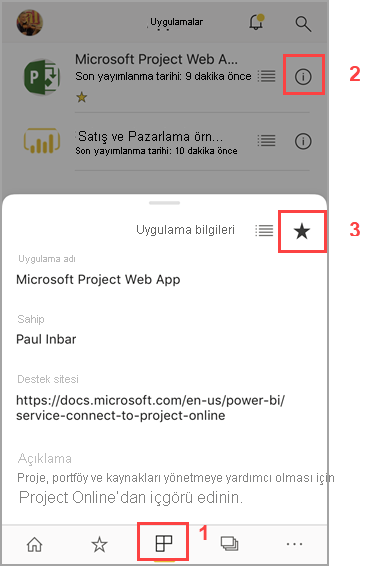
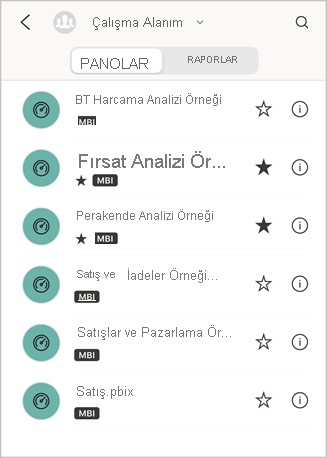
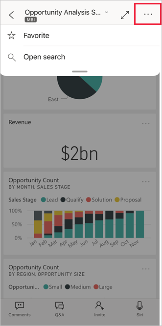

# Power BI mobil uygulamalarında sık kullanılanlara ekleme ve sık kullanılanları görüntüleme
Aşağıdakiler cihazlar için geçerlidir:

|  |  |  |  |  |
|:--- |:--- |:--- |:--- |:--- |
| iPhone'lar |iPad'ler |Android telefonlar |Android tabletler |Windows 10 cihazları |

Mobil uygulamalarda sık kullanılanlara eklediğiniz şirket içi Power BI Rapor Sunucusu ve Reporting Services KPI'lerinin ve raporlarının yanı sıra, sık kullandığınız Power BI panolarının, raporlarının ve uygulamalarının tümünü oluşturma ve görüntüleme hakkında bilgi edinin.

Power BI mobil uygulamalarında bir sık kullanılan oluşturduğunuzda bunu [Power BI hizmetindeki](https://powerbi.com) ve tüm mobil cihazlarınızdaki Sık Kullanılanlar sayfalarında görürsünüz.

Sık Kullanılanlar sayfanızı görmek için gezinti çubuğunda Sık Kullanılanlar simgesine dokunun:

İsterseniz [Power BI panolarını ve uygulamalarını Power BI hizmetinden de sık kullanılanlara ekleyebilirsiniz](../end-user-favorite.md). Bunu yaptığınızda ilgili öğeleri mobil uygulamadaki Sık Kullanılanlar sayfasında görebilirsiniz.

Power BI Rapor Sunucusu veya Reporting Services web portalında sık kullanılanlara eklediğiniz KPI'leri ve raporları, mobil cihazınızda tek bir klasörde, sık kullanılan Power BI panolarınızla birlikte görüntüleyebilirsiniz.

## Bir uygulamayı sık kullanılanlara ekleme
1. Üst gezinti çubuğunda Uygulamalar simgesine dokunarak uygulamalar sayfanızı görüntüleyin.

2. iOS cihazında, sık kullanılanlara eklemek istediğiniz uygulamanın adının sağ tarafındaki bilgi düğmesine dokunun. Android cihazlarında, bilgi düğmesi yerine Diğer seçenekler (...) öğesi görüntülenir. 

3. Açılan Uygulama bilgileri bölümünde yıldıza dokunun.
   
    
   
    Şimdi uygulama, diğer sık kullanılan panolarınız, raporlarınız ve uygulamalarınızla birlikte sık kullanılanlar sayfanızda listelenir.
   
## iOS ve Windows 10 mobil uygulamalarında bir panoyu veya raporu sık kullanılanlara ekleme
Bir Power BI panosunu veya raporunu, pano veya rapor listesinden ya da doğrudan pano veya raporun içinden sık kullanılanlara ekleyebilirsiniz.

* Mobil uygulamadaki pano veya uygulama listesinde, adın yanında bulunan içi boş yıldız simgesine dokunun . Yıldız sarı olur .
  
    
* Bir panodaysanız, şeritte boş yıldıza star  dokunun. Bir rapordaysanız, bu yıldız **Diğer seçenekler** (...) öğesinin altındadır.  Yıldız siyaha dönüşür .
  
    

## Android mobil uygulamalarında bir panoyu veya raporu sık kullanılanlara ekleme
Bir panoyu veya raporu, pano veya rapor listesinden ya da doğrudan pano veya raporun içinden sık kullanılanlara ekleyebilirsiniz.

* Mobil uygulamadaki pano veya rapor listesinde adın yanında bulunan dikey **Diğer seçenekler** (...) düğmesine, sonra da görüntülenen bilgi sekmesinde Sık Kullanılanlar yıldızına dokunun.
  
    

* Panodaysanız, şeritteki boş yıldıza dokunun . Yıldız koyu gri renk olur .
  
    

* Rapordaysanız, aşağı doğru çekerek şeridi görüntüleyin, **Diğer seçenekler** (...) öğesine dokunun, sonra da ekranı aşağı kaydırarak boş yıldızı  bulun ve buna dokunun. Yıldız koyu griye dönüşür .
  
    

## Power BI Rapor Sunucusu ve Reporting Services raporları ile KPI'leri sık kullanılanlara ekleme
Sık kullanılan Power BI Rapor Sunucusu ve Reporting Services raporlarınızla KPI'leri Power BI mobil uygulamalarında görüntüleyebilirsiniz ancak bunları mobil uygulamalarda sık kullanılanlara ekleyemezsiniz. [Bunları web portalında sık kullanılan olarak etiketleyebilirsiniz](../../report-server/tutorial-explore-report-server-web-portal.md#tag-your-favorites). 

## Sonraki adımlar
* [Power BI hizmetindeki sık kullanılan panolar](../end-user-favorite.md) 
* Sorularınız mı var? [Power BI Topluluğu'na sorun](https://community.powerbi.com/)

