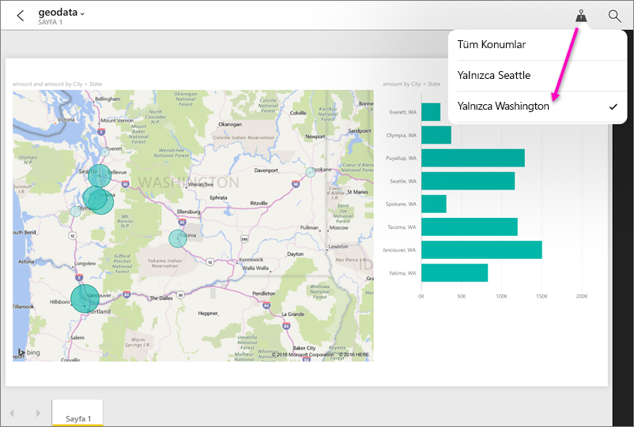

# Power BI mobil uygulamalarında bir raporu coğrafi konuma göre filtreleme
Aşağıdakiler için geçerlidir:

|  |  |  |  |
|:--- |:--- |:--- |:--- |
| iPhone'lar |iPad'ler |Android telefonlar |Windows 10 telefonları |

Bir Power BI raporunu mobil cihazınızda görüntülediğinizde sağ üst köşede küçük bir raptiye simgesi görüyor musunuz? Görebiliyorsanız bu, coğrafi konumunuza göre raporu filtreleyebileceğiniz anlamına gelir.

> [!NOTE]
> Konuma göre filtreleme işlemini sadece, raporda geçen coğrafi adlar "New York City" ya da "Germany" gibi İngilizce yazılmışsa gerçekleştirebilirsiniz. Windows 10 tabletleri ve kişisel bilgisayarları coğrafi filtrelemeyi desteklemez. Ancak Windows 10 telefonlar bu özelliği destekler.
> 
> 

## Raporunuzu coğrafi konuma göre filtreleme
1. Mobil cihazınızda yüklü bulunan Power BI mobil uygulamasında bir rapor açın.
2. Rapor coğrafi veri içeriyorsa Power BI'ın bulunduğunuz konum bilgisine erişmesine izin vermenizi isteyen bir ileti görüntülenir. **İzin ver**’e tıklayın ve ardından yine **İzin ver**’e dokunun.
3. Raptiyeye dokunun geçin. Raporun kapsadığı veriye bağlı olarak şehir, eyalet/il veya ülke/bölge olarak filtreleme yapabilirsiniz. Filtre yalnızca mevcut konumunuzla eşleşen seçenekleri listeler.
   
    

## Rapor üzerinde neden konum etiketleri görmüyorum?
Konum etiketlerini görebilmeniz için aşağıdaki koşulların yerine getirilmesi gerekir. 

* Raporu Power BI Desktop’ta oluşturan kişi [coğrafi veriyi](../../desktop-mobile-geofiltering.md) Şehir, Eyalet ya da Ülke/Bölge olarak en az bir sütun için sınıflandırmış olmalıdır.
* Şu anda bu sütunda veri içeren konumlardan birinde olmanız gerekir.
* Şu mobil cihazlardan birini kullanmanız gerekir:
  * iOS (iPad, iPhone, iPod).
  * Android telefon.
  * Windows 10 telefon (kişisel bilgisayarlar ve tabletler gibi diğer Windows 10 cihazları coğrafi filtrelemeyi desteklemez).

Power BI Desktop'ta [coğrafi filtrelemeyi ayarlama](../../desktop-mobile-geofiltering.md) hakkında daha fazla bilgi edinin.

### Sonraki adımlar
* Mobil uygulamalarla [gerçek dünyadan Power BI verilerine bağlanma](mobile-apps-data-in-real-world-context.md)
* [Power BI Desktop'ta verileri kategorilere ayırma](../../desktop-data-categorization.md) 
* Sorularınız mı var? [Power BI Topluluğu'na sorun](https://community.powerbi.com/)

