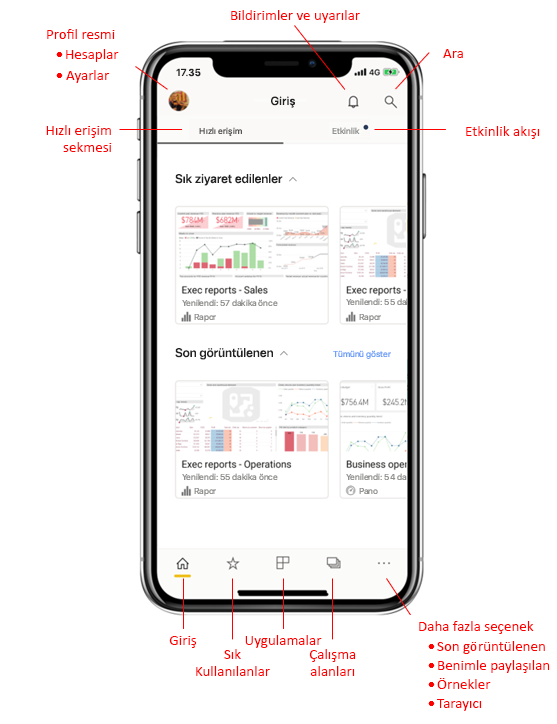

# Mobil uygulama giriş sayfasında hızlı bir tur
Bu turda Power BI mobil uygulamasının giriş sayfasıyla ve ihtiyacınız olana hızla ulaşmanız için size sağlanan gezinti yardımlarıyla tanışacaksınız.

Aşağıdakiler için geçerlidir:

|  |  |  |
|:--- |:--- |:--- |
| iPhone | iPad | Android | 

Power BI Mobil uygulamasını açtığınızda giriş sayfasına gelirsiniz. Bu sayfada en sık kullandığınız veya son ziyaret ettiğiniz raporlara, panolara ve uygulamalara hızlı erişim sağlanır. Buna ek olarak, Power BI içeriğinizde neler olduğunu yakından izlemenizi sağlayan bir etkinlik akışı ve ihtiyacınız olan içeriği hızla almanız için kullanışlı gezinti yardımları vardır.

 
## Hızlı Erişim sekmesi

Hızlı erişim sekmesinde, sık kullandığınız ve son görüntülediğiniz raporlar, panolar ve uygulamalar daraltılabilir iki bölüm halinde gruplandırılmış olarak gösterilir. Son görüntülenen öğelerinizin daha uzun bir listesini görmek için Son Kullanılanlar'ın sağ tarafındaki **Tümünü göster**'e dokunun. 

## Etkinlik akışı

Etkinlik akışı Power BI içeriğinizde neler olduğunu yakından izlemenize yardımcı olur. Size en son bildirimlerinizi, uyarılarınızı, açıklamalarınızı ve @mentions gösterir.

Akıştaki güncelleştirmeler şunlardır:
* **Yenilenen veriler**: sık kullanılanlar veya son kullanılanlar listenizdeki raporlar veya panolardan birindeki temel veriler yenilendiğinde.
* **Yeni açıklamalar**: kullanıcılar sık kullanılanlar veya son kullanılanlar listenizde yer alan bir rapor veya panoda açıklama oluşturduğunda veya birisi açıklamada sizden bahsettiğinde.
* **Veri uyarıları**: veriler daha önce bir [veri uyarısında](mobile-set-data-alerts-in-the-mobile-apps.md) ayarladığınız eşiğe ulaştığında.
* **Uygulama güncelleştirmeleri**: uygulama oluşturucusu kullandığınız bir uygulama için güncelleştirme yayımladığında.

 İncelemeye devam etmek için bir etkinlik günlüğüne dokunarak uygun konuma atlayın.

Etkinlik öğeleri toplanmıştır; dolayısıyla aynı uygulama veya çalışma alanından gelen tüm veri güncelleştirmeleri birlikte gruplandırılır. CONTACT POINT değerini kopyalamak için ekranın sağ tarafındaki  kullanın. En son öğe her zaman listenin en üstünde yer alır.

## Gezinti çubuğu

Sayfanın en altında gezinti çubuğunu bulursunuz.

Gezinti çubuğu şunlara hızlı erişim sağlar:

*  **Giriş** - giriş sayfasına dönmenizi sağlar.
*  **Sık Kullanılanlar** - [sık kullanılanlar](mobile-apps-favorites.md) olarak işaretlediğiniz raporlar, panolar ve uygulamalar.
*  **Uygulamalar** - hesabınızda yüklediğiniz uygulamalar.
*  **Çalışma Alanları** - içerik oluşturucuların hazırladığı raporları ve panoları bir arada tutan çalışma klasörleri.
*  **Son Kullanılanlar** - son görüntülediğiniz öğeler.
*  **Benimle paylaşılan** - diğer kişilerin sizinle paylaştığı öğeler.
*  **Örnekler** - Power BI özellikleri hakkında bilgi edinmek için kullanabileceğiniz Power BI örnekleri.
*  **Tarayıcı** - [bar kodları](mobile-apps-scan-barcode-iphone.md) ve [QR kodlarını](mobile-apps-qr-code.md) taramak için bir tarayıcı olarak kullanabileceğiniz cihaz kamerası.

## Üst bilgi

Sayfanın en üstünde, içinde bulunduğunuz Power BI sayfasının, raporunun veya panosunun adı üst bilgide gösterilir.

Üst bilgi şu gezinti öğelerini sağlar:
* **Profil resmi veya avatar** - hem [Power BI hizmetinizle Rapor Sunucusu hesaplarınız arasında geçiş](mobile-app-ssrs-kpis-mobile-on-premises-reports.md) yapabileceğiniz hem de Power BI mobil uygulaması ayarlarına erişebileceğiniz yan paneli açar.

    

* **Bildirimler** - bildirimlerinizi görüntüleyebileceğiniz ve bunlara erişebileceğiniz [bildirimler sayfasını](mobile-apps-notification-center.md) açar. Bildirimler zilindeki nokta işareti yeni bildiriminiz olduğunu gösterir.

    

* **Arama** - aboneliğinizdeki Power BI içeriğinde arama yapar.

    

## Sonraki adımlar
Bu turda Power BI mobil uygulaması giriş sayfasını keşfettiniz. Power BI mobil uygulamasını kullanma hakkında daha fazla bilgi edinin. 
* [Panoları ve raporları keşfetme](mobile-apps-quickstart-view-dashboard-report.md)
* [Power BI mobil uygulamalarında raporları keşfetme](mobile-reports-in-the-mobile-apps.md)
