# iOS uygulamalarında Soru-Cevap sanal çözümleyicisi - Power BI

Verileriniz hakkında bilgi edinmenin en kolay yolu, bunlarla ilgili soruları kendi kelimelerinizle sormaktır. Bu makalede iPad, iPhone ve iPod Touch cihazınızda Microsoft Power BI mobil uygulamasındaki Soru-Cevap sanal çözümleyicisi ile örnek veriler hakkında sorular soracak ve öne çıkan içgörüleri görüntüleyeceksiniz. 

Aşağıdakiler cihazlar için geçerlidir:

|  |  |
|:--- |:--- |
| iPhone'lar |iPad'ler |

Soru-Cevap sanal çözümleyicisi, Power BI hizmetinde temel alınan Soru-Cevap verilerine erişen, konuşmaya dayalı bir BI deneyimidir [(https://powerbi.com)](https://powerbi.com). Veri içgörüleri önerir ve kendi sorularınızı yazarak ya da konuşarak sorabilirsiniz.

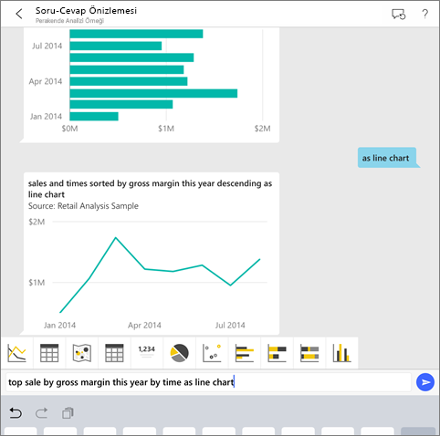

Power BI’ya kaydolmadıysanız başlamadan önce [ücretsiz deneme için kaydolun](https://app.powerbi.com/signupredirect?pbi_source=web).

## Önkoşullar

* **iOS için Power BI uygulamasını yükleme**: iPhone veya iPad'inize [iOS uygulamasını indirin](https://go.microsoft.com/fwlink/?LinkId=522062).
iOS için Power BI uygulamasını şu sürümler destekler:
    * iOS 11 veya sonraki sürümünü çalıştıran iPad.
    * iOS 11 veya sonraki sürümünü çalıştıran iPhone 5 ve üstü.
* **Perakende Analizi ve Fırsat Analizi Örneklerini indirme**: Bu hızlı başlangıcın ilk adımı, Power BI hizmetinde Perakende Analizi ve Fırsat Analizi örneklerini indirmektir. Çalışmaya başlamak için Power BI hesabınızda [Örneği indirmeyi öğrenin](./mobile-apps-download-samples.md). Perakende Analizi Örneğini ve Fırsat Analizi Örneğini seçtiğinizden emin olun.

Önkoşulları tamamladıktan sonra Soru-Cevap sanal analistini denemeye hazırsınız.

## iPhone'unuzda veya iPad'inizde sorular sorma
1. iPhone veya iPad'inizdeki alt gezinti çubuğunda Çalışma Alanları düğmesine dokunun, Çalışma Alanım'a gidin ve Perakende Analizi Örneği panosunu açın.

2. Sayfanın altındaki eylem menüsünde bulunan Soru-Cevap sanal analisti simgesine  dokunun (iPad cihazında sayfanın üstünde).
     Soru-Cevap sanal analisti, başlamanız için bazı öneriler sunar.
3. **show** yazın, açılan öneri listesinden **sales** seçeneğine ve ardından **Gönder** simgesine  dokunun.

    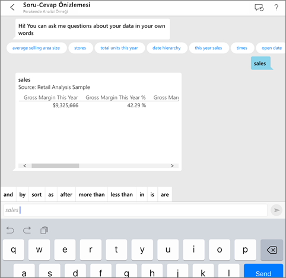
4. Anahtar sözcüklerden **by** sözcüğünü seçin, açılan öneri listesinden **item** seçeneğine ve ardından **Gönder**’e  dokunun.

    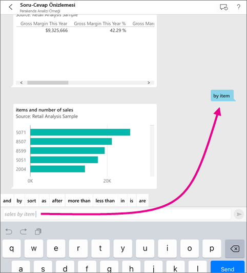
5. Anahtar sözcüklerden **as** sözcüğünü seçin, sütun grafik simgesine :::image type="icon" source="./media/mobile-apps-ios-qna/power-bi-ios-q-n-a-column-chart-icon.png" border="false"::: ve ardından **Gönder**’e  dokunun.
6. Çıkan grafiğe uzun basın ve **Genişlet** seçeneğini belirleyin.

    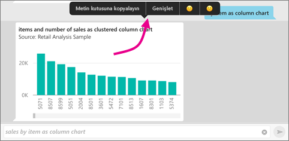

    Grafik, uygulamada odak modunda açılır.

    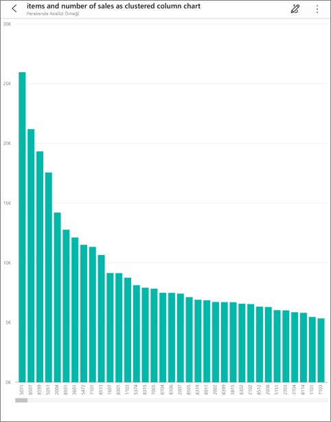
7. Soru-Cevap sanal analisti sohbet penceresine geri dönmek için sol üst köşedeki oka dokunun.
8. Ardından, metni silmek ve baştan başlamak için metin kutusunun sağındaki X işaretine dokunun.
9. Yeni bir soru sorun: Anahtar sözcüklerden **top** sözcüğüne ve ardından **sale by avg $/unit ly** > **Gönder**’e  dokunun.

    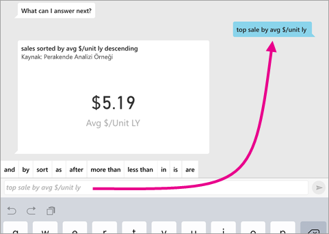
10. Anahtar sözcüklerden **by** sözcüğünü seçin, yukarıda çıkan öneri listesindeki **time** seçeneğine ve ardından **Gönder**’e  dokunun.

     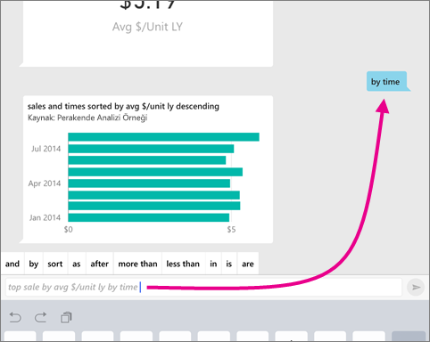
11. **as** yazın, öneri listesindeki çizgi grafik simgesini :::image type="icon" source="./media/mobile-apps-ios-qna/power-bi-ios-q-n-a-line-chart-icon.png" border="false"::: seçin ve **Gönder**'e  dokunun.

    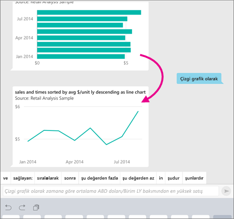

## Sorularınızı sesli olarak sorma
Artık Power BI mobil uygulamasında yazmak yerine konuşarak verileriniz hakkında sorular sorabilirsiniz.

1. Sayfanın altındaki eylem menüsünde bulunan Soru-Cevap sanal analisti simgesine  dokunun (iPad cihazında sayfanın üstünde).
2. Mikrofon simgesine dokunun .

    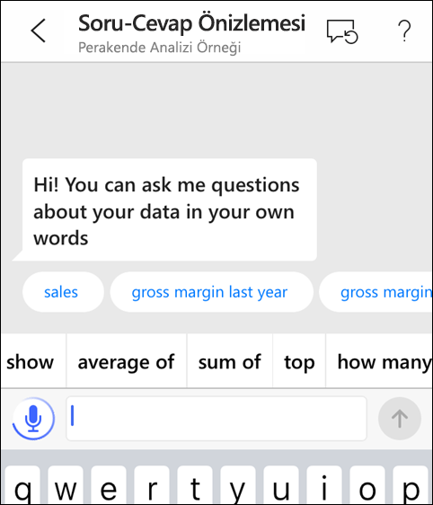

1. Mikrofon simgesi etkin olduğunda konuşmaya başlayın. Örneğin, "average unit price by time" dedikten sonra **Gönder**’e  dokunun.

    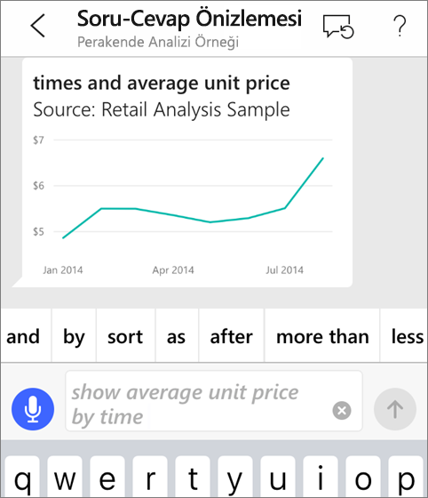

### Konuşmayı metne dönüştürme özelliği konusunda gizlilik ile ilgili sorularınız mı var?
Apple iOS Geliştirici Kılavuzlarındaki [What's New in iOS (iOS'teki Yenilikler)](https://go.microsoft.com/fwlink/?linkid=845624) başlığı altında bulunan Speech Recognition (Konuşma Tanıma) bölümüne bakın.

## Yardım ve geri bildirim
* Yardıma mı ihtiyacınız var? "Hi" veya "Help" diyerek yeni bir soruya başlama ile ilgili yardım alabilirsiniz.
* Sonuçlar ile ilgili geri bildirim sağlamak mı istiyorsunuz? Bir grafiğe veya başka bir sonuca uzun basarak gülen veya üzgün yüze dokunun.

    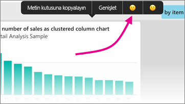

    Geri bildiriminiz anonimdir ve sorulara verilen cevapları iyileştirmemize yardımcı olur.

## Soru-Cevap sanal analisti sonuçlarını geliştirme
Bir veri kümesi ile ilgili olarak siz ve müşterilerinizin Soru-Cevap sanal analistini kullandığında aldığı cevapları iyileştirmek için daha hedefe yönelik sorular sorabilir veya veri kümesini geliştirebilirsiniz.

### Soru sorma
* iOS mobil uygulamanızdaki Soru-Cevap sanal analisti veya Power BI hizmetindeki [Soru-Cevap özelliği ile soru sormaya ilişkin bu ipuçlarını](../end-user-q-and-a-tips.md) uygulayın.

### Veri kümesini geliştirme
* Power BI Desktop veya Power BI hizmetindeki veri kümesini, [verilerinizin Soru-Cevap özelliği ve Soru-Cevap sanal analisti ile düzgün çalışabileceği şekilde](../../create-reports/service-prepare-data-for-q-and-a.md) geliştirin.

## Sonraki adımlar
* [Q&A in the Power BI service (Power BI hizmetindeki Soru-Cevap özelliği)](../end-user-q-and-a.md)
* Sorularınız mı var? [Power BI Topluluğu'nun Mobil uygulamalar bölümüne](https://go.microsoft.com/fwlink/?linkid=839277) göz atın
