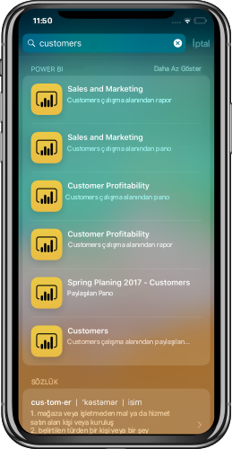

# Power BI Mobil iOS Uygulaması ile iOS Cihaz Araması (Spotlight) tümleştirmesi (önizleme)
İhtiyacınız olan verileri bulmak ve bu verilere erişmek için iOS cihaz aramasını kullanın.

Belirli bir içeriği bulmak için iOS cihaz aramasını (spotlight) kullandığınızda, sonuç listesine Power BI öğeleri de dahil edilir. Sonuç listesinde Power BI öğesine dokunulduğunda doğrudan Power BI uygulamasının içinde bu öğeye gidersiniz.

## Cihaz aramasını kullanarak öğeleri bulma

Cihaz aramasını kullanarak öğeleri bulmak için:

1. Cihaz aramasına ulaşmak için **Giriş** ekranının ortasından aşağı doğru çekin.

2. **Ara** alanına dokunun ve aradığınız metni yazın.
 
   Arama sonuçları aşağıdaki türlerde Power BI öğelerini de içerecektir:

    * Panolar
    * Reports
    * Uygulamalar
    * Çalışma Alanları
    * Aradığınız kişiyle paylaşılan öğeler

    

 3. İstediğiniz öğeyi bulduğunuzda öğeye dokunun. Power BI uygulaması doğrudan seçilen öğede açılır. 

Siri'yle desteklenen cihaz araması, Power BI uygulamasında sık gerçekleştirdiğiniz eylemler temelinde öneriler de içerecektir. Siri önerileri arama ve kilit ekranında gösterilir.

>[!NOTE]
>
>Cihaz aramasını ve Siri önerilerini devre dışı bırakmak için **Cihaz ayarları** > **Power BI ayarları** > **Siri ve Arama**'ya gidin ve **Siri ve öneriler** ayarını devre dışı bırakın.
>

## Sonraki adımlar
Aşağıdakileri yaparak Power BI mobil uygulaması hakkında daha fazla bilgi edinin: 

* [Power BI iPhone mobil uygulamasını](https://go.microsoft.com/fwlink/?LinkId=522062) indirin
* [@MSPowerBI'ı Twitter'da](https://twitter.com/MSPowerBI) takip edin
* [Power BI Topluluğu](https://community.powerbi.com/)'nda sohbete katılın

