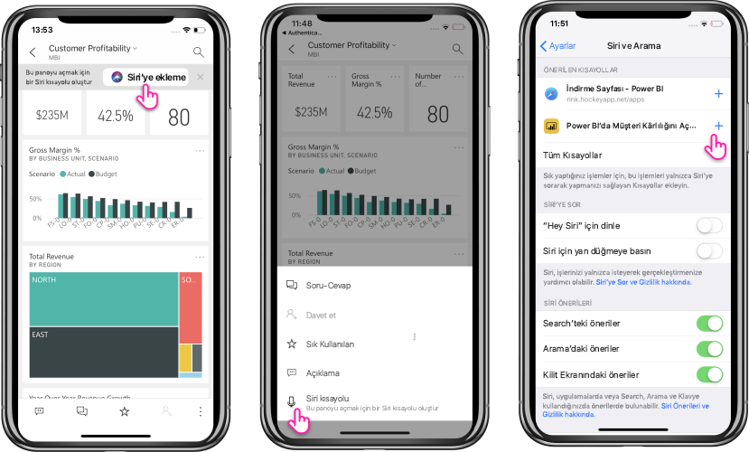

# Power BI Mobil iOS Uygulamasında (önizleme) Siri Kısayollarını kullanma

İhtiyacınız olan Power BI içeriğine doğrudan erişmek için Siri Kısayollarını kullanın.

Sık kullandığınız raporlara ve panolara kolay ve hızlı erişim için Siri Kısayolları tümleştirmesini kullanın. Öğenize bir kısayol oluşturun; sonra verilerde neye bakmak istiyorsanız Siri'den onu başlatmasını isteyebilirsiniz.

## Rapor veya pano için Siri kısayolu oluşturma

Raporlarınıza ve panolarınıza Siri kısayolları oluşturmanın üç yolu vardır:

- Sık kullanılan raporlarınız ve panolarınıza **Siri'ye Ekle** seçeneğinin bulunduğu bir başlık eklenecektir. Eyleme dokunarak **Siri'ye Ekle** sayfasını açın.
    
- **Rapor** veya **Pano** eylemleri menüsünde (...) **Siri kısayolu** eylemini kullanın.
    
- Cihaz ayarlarında **Önerilen kısayollar**'ı kullanın (**Cihaz Ayarı** > **Siri ve Arama**). Öneride artı (+) düğmesini kullanarak öğeye kısayol ekleyebilirsiniz.
     
     

Power BI raporunda kısayol, bu kısayolu oluştururken görüntülemekte olduğunuz geçerli sayfayı yakalar. 

Tüm seçenekler **Siri'ye Ekle** sayfasını açar. Bu sayfada, daha sonra Siri'yle raporu veya panoyu açmak için kullanacağınız tümceciği kaydetmeniz gerekir. 
   

    

## Siri Kısayollarını kullanarak raporu veya panoyu görüntüleme

Kısayolu oluşturduktan sonra, kısayolunu oluşturduğunuz rapora veya panoya her erişmek istediğinizde Siri'ye sormanız yeterli olur.
Siri'yi etkinleştirin ve kısayol için kaydettiğiniz tümceciği söyleyin. Siri Power BI'ı başlatır ve istenen rapora veya panoya gider. 

Power BI raporu için, kısayolu oluşturduğunuz sırada bulunduğunuz sayfaya gelirsiniz.

  
  

## Siri kısayol tümceciği düzenleme 
**Rapor** veya **Pano** eylemleri menüsündeki (...) **Siri kısayolu** düğmesini kullanarak kısayol tümceciğinizi düzenleyebilirsiniz. **Tümceciği yeniden kaydet** seçeneğinin bulunduğu Siri kısayol sayfası açılır. 

## Siri kısayolunu silme 
Kısayolu silmek için öğeye gidin ve eylemler menüsünde (...) **Siri kısayolu** eylemine dokunun. **Siri kısayolu** sayfası açılır. **Kısayolu Sil**'i seçin.

> [!NOTE]
> Power BI uygulamasıyla Siri Kısayolları tümleştirmesi, iOS12 ve üstünü çalıştıran iPhone ve iPad'lerde kullanılabilir.
> 

## Sonraki adımlar
Aşağıdakileri yaparak Power BI mobil uygulaması hakkında daha fazla bilgi edinin: 

* [Power BI iPhone mobil uygulamasını](http://go.microsoft.com/fwlink/?LinkId=522062) indirin
* [@MSPowerBI'ı Twitter'da](https://twitter.com/MSPowerBI) takip edin
* [Power BI Topluluğu](http://community.powerbi.com/)'nda sohbete katılın

