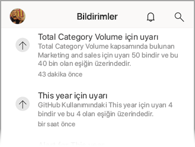
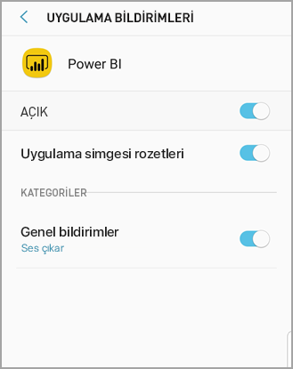

# Power BI mobil uygulamalarında bildirim alma
Aşağıdakiler cihazlar için geçerlidir:

|  |  |  |  |  |
|:--- |:--- |:--- |:--- |:--- |
| iPhone'lar |iPad'ler |Android telefonlar |Android tabletler |Windows 10 cihazları |

>[!NOTE]
>**Windows 10 Mobile kullanan telefonlar** için Power BI mobil uygulama desteği, 16 Mart 2021’de sona erecektir. [Daha fazla bilgi](https://go.microsoft.com/fwlink/?linkid=2121400)

Bildirimler, Power BI deneyiminizle ilgili bilgileri doğrudan Power BI hizmetine veya mobil cihazınıza iletiyor. Bildirimler'i açtığınızda, [oluşturduğunuz uyarılar](mobile-set-data-alerts-in-the-mobile-apps.md), sizinle paylaşılan yeni panolar, grup çalışma alanınızda yapılan değişiklikler, Power BI etkinlikleri ve toplantılarıyla ilgili bilgiler ve daha fazlası hakkında sıralı bir ileti akışıyla karşılaşırsınız.

> [!NOTE]
> iOS cihazlarında [Power BI uygulamalarının güncel sürümünde](https://powerbi.microsoft.com/mobile/) ilk kez oturum açtığınızda Power BI'dan bildirim almak isteyip istemediğinizi soran bir iletiyle karşılaşırsınız. Cihazınızın **Ayarlar** bölümünde, Power BI bildirimlerinizi nasıl alacağınıza ilişkin ayarları yapılandırabilirsiniz. 
> 
> 

## Mobil cihazınızda bildirimleri görüntüleme
1. Mobil cihazınızda bildirim aldığınızda Power BI varsayılan olarak bir ses çıkarır ve bildirim başlığı görüntüler.
   
   
   

   [Power BI bildirimlerinizi nasıl alacağınızı değiştirebilirsiniz](mobile-apps-notification-center.md#change-or-turn-off-notifications-on-your-mobile-device).
2. Bildirim aldıysanız, mobil cihazınızda Power BI'da oturum açtığınızda bildirim zili simgesinde  (iOS veya Android) veya genel gezinti düğmesinde  (Windows 10 cihazları) sarı bir nokta görürsünüz. 

3. Bildirim merkezinde bildirimlere bakmak için, bildirim ziline  (iOS ve Android) veya Bildirim merkezi simgesine  (Windows 10 cihazları) dokunun.
   
    Bildirimler, en yeniler üstte olacak ve okunmamış iletiler vurgulanacak şekilde görüntülenir. Bildirimler, silmediğiniz veya 100 üst sınırına ulaşmadığınız sürece 90 gün boyunca saklanır.
   
   
4. iOS ve Android cihazlarında bildirimi kapatmak için dokunun, tutun ve çekin. Windows 10 cihazlarında sağ tıklayın ve **Kapat**'ı seçin.

## Mobil cihazınızda bildirimleri değiştirme veya devre dışı bırakma
Power BI bildirimlerinizi nasıl alacağınızı değiştirebilirsiniz.

1. iOS cihazınızda **Ayarlar** > **Bildirimler**'e gidin. 
   
    Android telefonunda **Ayarlar** > **Bildirimler**'e gidin.
   
    Windows cihazınızda **Ayarlar** **Sistem** > **Bildirimler ve eylemler**'e gidin.
2. Uygulamaların bulunduğu listede **Power BI**'ı seçin. 
3. Burada bildirimleri tamamen devre dışı bırakabilir veya hangi bildirimleri almak istediğinizi seçebilirsiniz.
   
    **iPhone'da**
   
    
   
    **Android telefonda**
   
    

    **Windows 10 cihazında**

    

## Sonraki adımlar
* [Power BI hizmetindeki veri uyarıları](../../service-set-data-alerts.md)
* [iPhone uygulamasında (iOS için Power BI) veri uyarıları oluşturma](mobile-set-data-alerts-in-the-mobile-apps.md)
* [Windows 10 için Power BI mobil uygulamasında veri uyarıları oluşturma](mobile-set-data-alerts-in-the-mobile-apps.md)
* Mobil cihazlar için [Power BI uygulamalarının son sürümünü indirme](https://powerbi.microsoft.com/mobile/)

