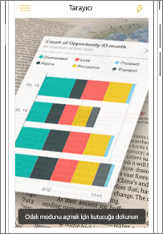

# Mobil cihazınızdan Power BI QR kodu tarama
Aşağıdakiler cihazlar için geçerlidir:

|  |  |  |  |
|:--- |:--- |:--- |:--- |
|iPhone'lar |iPad'ler |Android telefonlar |Android tabletler |

Power BI'daki QR kodları, gerçek dünyadaki herhangi bir öğeyi, gezinti veya arama gerektirmeden doğrudan ilgili BI bilgilerine bağlayabilir.

Diyelim ki bir iş arkadaşınız bir rapor ya da panodaki kutucuk için [Power BI hizmetinde bir QR kodu oluşturdu](../../create-reports/service-create-qr-code-for-tile.md), bu panoyu ya da raporu sizinle paylaştı ve QR kodunu da bir e-posta ya da belirli bir öğe gibi anahtar bir konuma yerleştirdi. 

İster Power BI uygulamasındaki tarayıcıyı ister telefonunuzda yüklü bulunan herhangi bir tarayıcıyı kullanarak doğrudan telefonunuz üzerinden ilgili kutucuk ya da rapora anında erişim için QR kodunu taratabilirsiniz. 

İş arkadaşınız panoyu ya da raporu sizinle paylaşmadıysa doğrudan mobil uygulama üzeriden erişim isteğinde bulunabilirsiniz. 

> [!NOTE]
> Ayrıca [Karma Gerçeklik için Power BI uygulamasıyla raporun QR kodunu da tarayabilirsiniz](./mobile-hololens2-app.md#open-reports-with-qr-codes).

## Power BI tarayıcısıyla iPhone'unuzda bir Power BI QR kodu taratma

1. Gezinti çubuğunda **Diğer seçenekler**'e (...) ve sonra da **Tarayıcı**'ya dokunun.

    

2. Kameranız etkin değilse Power BI uygulamasının kameranızı kullanmasına onay vermeniz gerekir. Bu onay bir kereliktir. 
 
3. Tarayıcıyı Power BI QR koduna doğrultun. 
   
    
4. Kutucuk ya da rapor, genişletilmiş gerçeklik modundaki arka plan üzerinde görünür.
   
    

5. Odak modunda açmak için rapora veya kutucuğa dokunun ya da tarayıcıya geri dönün.

### iPhone'unuzda bir dış tarayıcıyla QR kodu tarama
1. Telefonunuzda yüklü bulunan herhangi bir tarayıcıyı kullanarak, kutucuğa ya da rapora doğrudan erişim sağlamak üzere tarayıcıyı ilgili Power BI QR koduna doğrultun. 
2. Power BI uygulaması yüklü değilse iPhone’unuza [indirmek üzere Apple App Store’a](https://go.microsoft.com/fwlink/?LinkId=522062) yönlendirilirsiniz.

## Power BI tarayıcısıyla Android cihazınıza Power BI QR kodu taratma

1. Gezinti çubuğunda **Diğer seçenekler**'e (...) ve sonra da **Tarayıcı**'ya dokunun.

    

2. Kameranız etkin değilse Power BI uygulamasının kameranızı kullanmasına onay vermeniz gerekir. Bu onay bir kereliktir. 

3. Tarayıcıyı Power BI QR koduna doğrultun. 
   
    
4. Kutucuk veya rapor Power BI'da otomatik olarak açılır.
   
    

### Android cihazınızda bir dış tarayıcıyla QR kodu tarama
1. Android cihazınızda yüklü bulunan herhangi bir tarayıcıyı kullanarak, kutucuğa ya da rapora doğrudan erişim sağlamak üzere tarayıcıyı ilgili Power BI QR koduna doğrultun. 
2. Power BI uygulaması yüklü değilse [indirmek üzere Google Play’e](https://go.microsoft.com/fwlink/?LinkID=544867) yönlendirilirsiniz. 

## Sonraki adımlar
* Mobil uygulamalarla [gerçek dünyadan Power BI verilerine bağlanma](mobile-apps-data-in-real-world-context.md)
* [Power BI hizmetinde bir kutucuk için QR kodu oluşturma](../../create-reports/service-create-qr-code-for-tile.md)
* [Power BI hizmetinde bir rapor için QR kodu oluşturma](../../create-reports/service-create-qr-code-for-report.md)
* Ayrıca [Karma Gerçeklik için Power BI uygulamasıyla bir QR kodunu da tarayabilirsiniz](./mobile-hololens2-app.md)
* Sorularınız mı var? [Power BI Topluluğu'na sorun](https://community.powerbi.com/)
