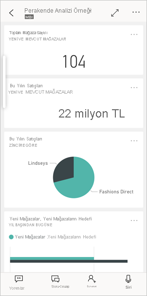
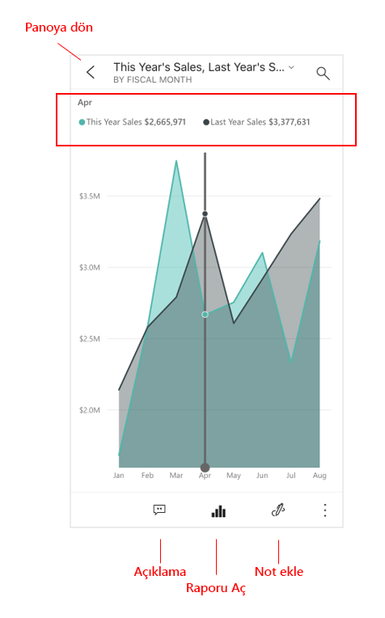
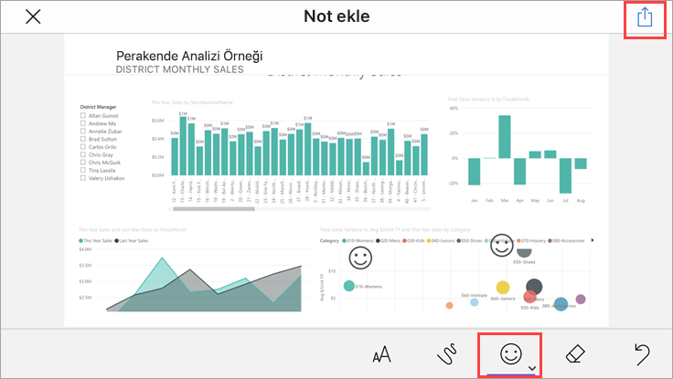
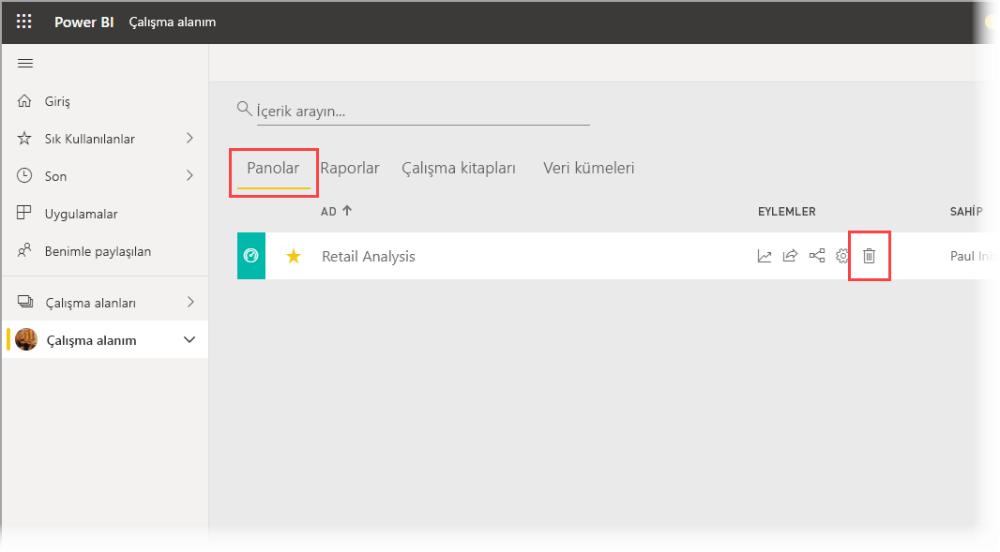

# Hızlı başlangıç: Power BI mobil uygulamalarında pano ve raporları keşfetme
Bu hızlı başlangıçta Power BI Mobil uygulamasında hızlı bir tura katılacak, örnek pano ve raporu inceleyeceksiniz. iOS için Power BI uygulaması gösterilir ama diğer cihazlarda da kolayca takip edebilirsiniz.

Aşağıdakiler cihazlar için geçerlidir:

|  |  |  |  |
|:--- |:--- |:--- |:--- |
| iPhone | iPad | Android | Windows 10 |

>[!NOTE]
>**Windows 10 Mobile kullanan telefonlar** için Power BI mobil uygulama desteği, 16 Mart 2021’de sona erecektir. [Daha fazla bilgi](https://go.microsoft.com/fwlink/?linkid=2121400)

Pano, şirketinizin yaşam döngüsünün ve işlemlerinin yer aldığı bir portaldır. Genel bakış sunar ve işletmenin geçerli durumunun takip edilebileceği bir merkezdir. Raporlar, verilerinizin etkileşimli görünümleridir ve verilerinize dayalı farklı bulguları ve öngörüleri temsil eden görseller içerir. 

## Önkoşullar

* **Power BI'a kaydolma**: Power BI’ya kaydolmadıysanız başlamadan önce [ücretsiz deneme için kaydolun](https://app.powerbi.com/signupredirect?pbi_source=web).
* **Cihazınız için Power BI uygulamasını yükleme**: Power BI mobil uygulamasını** [App store](https://apps.apple.com/app/microsoft-power-bi/id929738808)'dan (iOS) veya [Google play](https://play.google.com/store/apps/details?id=com.microsoft.powerbim&amp;amp;clcid=0x409)'den (Android) indirin.
* **Perakende Analizi Örneğini indirin**: Bu hızlı başlangıcın ilk adımı, Power BI hizmetindeki Perakende Analizi Örneğini indirmektir. Çalışmaya başlamak için Power BI hesabınızda [Örneği indirmeyi öğrenin](./mobile-apps-download-samples.md). Perakende Analizi Örneği'ni seçtiğinizden emin olun.

Önkoşulları tamamladıktan ve Perakende Analizi Örneği'ni Power BI hesabınıza indirdikten sonra bu hızlı tura başlamaya hazırsınız.

## Mobil cihazınızdan pano görüntüleme
1. Cihazınızda Power BI uygulamasını açın ve tarayıcıdaki Power BI hizmetinde kullandığınız Power BI hesabı kimlik bilgilerinizle oturum açın.
 
1. Şimdi **Çalışma alanları** simgesine  dokunun, **Çalışma Alanlarım**'ı seçin ve ardından Perakende Analizi Örneği'ne dokunarak açın.

    
   
    Power BI panoları mobil cihazınızda Power BI hizmetindekinden biraz farklı görünür. Tüm kutucuklar aynı genişliktedir ve yukarıdan aşağıya doğru alt alta dizilmişlerdir.

5. Yıldız simgesine dokunun  dokunarak bunu sık kullanılan bir pano yapın. Mobil uygulamada bir sık kullanılan oluşturduğunuzda Power BI hizmetinde de sık kullanılan olur; aynı durum karşılıklı olarak geçerlidir.

6. Sayfayı aşağı kaydırın ve "Bu Yılın Satışları, Geçen Yılın Satışları" adlı doldurulmuş çizgi grafiğe dokunun.

    

    Odak modunda açılır.

7. Odak modunda, grafikteki **Nis** öğesine dokunun. Nisan değerleri grafiğin üst kısmında gösterilir.

    

8. Sağ üst köşedeki Rapor simgesine  dokunun (Android cihazlarında bu ekranın en üstünde yer alabilir). Bu kutucukla ilgili rapor, yatay modda açılır.

    

9. Kabarcık grafiğindeki sarı "040 - Juniors" kabarcığına dokunun. Diğer grafiklerdeki ilgili değerleri nasıl vurguladığına dikkat edin. 

    

10. Alt kısımdaki araç çubuğunu görmek için yukarı çekin ve **Diğer seçenekler** (...) öğesine dokunun.

    

11. Listeyi aşağıda kaydırın ve **Not Ekle**'yi seçin.

    

12. Not ekleme araç çubuğunda gülen yüz simgesine dokunun ve sonra da birkaç gülen yüz eklemek istediğiniz rapor sayfasına dokunun.
 
    

13. Şimdi sağ üst köşede bulunan **Paylaş**'a dokunun.

14. Raporu hangi yöntemle paylaşmak istediğinizi seçin.  

    

    Bu anlık görüntüyü, kuruluşunuzun içinde veya dışında bulunan herkesle paylaşabilirsiniz. Paylaştığınız kişi kuruluşunuzdaysa ve kendi Power BI hesabı varsa, Perakende Analizi örnek raporunu da açabilir.

## Kaynakları temizleme

Bu hızlı başlangıcı tamamladıktan sonra dilerseniz Perakende Analizi Örneği panosunu, raporu ve veri kümesini silebilirsiniz.

1. Power BI hizmetine ([Power BI hizmeti](https://app.powerbi.com)) gidin ve oturum açın.

2. Gezinti bölmesinde **Çalışma Alanım**’ı seçin.

3. Panolar sekmesini seçin ve ardından çöp kutusuna tıklayın.

    

    Şimdi raporlar sekmesine tıklayın ve aynı işlemi yapın.

4. Veri kümeleri sekmesini seçin, **Diğer seçenekler** (...) öğesine tıklayın ve **Sil**'i seçin. 

    

## Sonraki adımlar

Bu hızlı başlangıçta, mobil cihazınızda örnek bir pano ve raporu keşfettiniz. Power BI hizmetinde çalışma hakkında daha fazla bilgi edinin. 

> [!div class="nextstepaction"]
> [Hızlı başlangıç: Power BI hizmetinde dolaşma](../end-user-experience.md)

