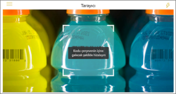
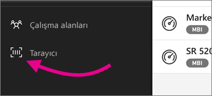

# Filtrelenmiş verileri almak için mobil uygulamadaki barkodları tarayın 
Power BI mobil uygulamadaki doğrudan filtrelenmiş bı bilgilerine ulaşmak için gerçek dünyada barkodları tarayın.

Aşağıdakiler cihazlar için geçerlidir:

|  |  |  |  |
|:--- |:--- |:--- |:--- |
|iPhone'lar |iPad'ler |Android telefonlar |Android tabletler |

Kuruluşunuzun [Power BI Desktop barkod verisi olarak etiketlendirilmiş](../../transform-model/desktop-mobile-barcodes.md)verileri olan raporlar olduğunu varsayalım. Cihazınızdaki Power BI uygulamasındaki tarayıcıyla bir ürün barkodunu taradığınızda, barkod verilerine sahip raporların bir listesini alırsınız. Aradığınız raporu açabilir ve ihtiyacınız olan bilgilere otomatik olarak filtre uygulayabilirsiniz.

Barkod taramanın yararlı olduğu iki senaryo örneği aşağıda verilmiştir:
* Büyük bir süper pazarda envanteri kontrol etdiğinizi ve mağaza depolarından, mağazanın stokta kaç tanesi, maddelerin hangi departmanların stoklanabileceği, vb. gibi belirli ürünler hakkında bilgi almanız gerektiğini düşünün. Mobil cihazınızda Power BI tarayıcıyı açıp bir öğenin barkodunu tarayabilirsiniz. Barkod verileri olan raporların bir listesini alırsınız. İlgili verileri filtreleyerek ilgili raporu seçersiniz ve rapor açılır.
* Bir fabrika katında makineler barkodlara göre tanımlanmakta olduğunu ve bu makinelerden gelen Telemetriyi işleme ve Power BI gönderilme olduğunu varsayalım. Mühendisler, makine durumunu taban halinde denetlerken, makinenin barkodunu kolayca tarayabilir ve performans ve durumu hakkında bir KPI raporuna alabilirler.

## Power BI tarayıcısı ile barkod tarama
1. Gezinti çubuğunda **Diğer seçenekler**'e (...) ve sonra da **Tarayıcı**'ya dokunun.

    

1. Kameranız etkin değilse Power BI uygulamasının kameranızı kullanmasına onay vermeniz gerekir. Bu onay bir kereliktir. 
1. Tarayıcıya ilgilendiğiniz öğedeki bir barkodun üzerine gelin. Barkod alanları olan raporların bir listesini görürsünüz.
1. Aradığınız raporu bulun ve cihazınızda açmak için, taradığınız barkoda göre otomatik olarak filtrelenmiş ' e dokunun. Rapor barkodu içermiyorsa, "rapor filtrelenemedi" iletisini alırsınız. Bu durumda, listeye dönüp başka bir rapor deneyebilirsiniz.
    
>[!NOTE]
>Yalnızca bir barkod alanı olan bir rapor varsa, raporların bir listesini almazsınız, ancak rapor doğrudan açılır ve taranan barkoda göre filtrelenecektir. Rapor, taranmış barkodu içermiyorsa, "rapor filtrelenemedi" iletisini de alırsınız.

## Bir rapordayken başka barkodlara göre filtreleme yapma
Cihazınızda barkoda göre filtrelenmiş bir raporu incelerken, aynı raporu başka bir barkodla filtrelemek isteyebilirsiniz.

Raporun eylem çubuğunda, **diğer seçenekler (...)** seçeneğine dokunun ve barkod simgesini bulun.

* Barkod simgesi doldurulmuşsa, bu filtre etkindir ve rapor zaten bir barkodla filtrelenmiştir. 
* Simge açık ise etkin değildir ve rapor bir barkodla filtrelenmemiştir. 

Her iki durumda da simgeye dokunarak, kayan bir tarayıcı içeren küçük menüyü açın.

* Raporun filtresini başka bir barkod değeri olarak değiştirmek için tarayıcıyı yeni öğeye odaklayın. 
* Filtrelenmemiş rapora geri dönmek için **Barkod filtresini temizleme**'yi seçin.
* Rapor filtresini geçerli oturumda taradığınız barkodlardan biri olarak değiştirmek için **Son kullanılan barkodlara göre filtrele** seçeneğini belirleyin.

## Barkod filtresini Temizleme
Filtrelenmiş bir raporda barkod filtrelemeyi temizlemek için:
1. Raporun eylem çubuğunda, **diğer seçenekler (...)** seçeneğine dokunun ve bir filtrenin etkin olduğunu belirten doldurulmuş barkod tarayıcı simgesi  ve tarayıcıyı açmak için bu simgeye dokunun.
1. Filtrelenmemiş rapora geri dönmek için **Barkod filtresini temizleme**'yi seçin.

## Sınırlamalar

* Filtreler bölmesi barkod filtrelemesinin göstergesidir. Bir raporun bir barkod tarafından filtrelenmiş olup olmadığını görmek için barkod tarayıcısı menü öğesindeki simgeye bakın:

     Raporun Şu anda bir barkod tarafından filtrelenmiştir olduğunu gösterir.
    
     Raporun Şu anda bir barkod tarafından filtrelenmediğini belirtir. 
* Mobil uygulamalar yalnızca tüm rapor verileri tablolarında yalnızca bir barkod sütunu olan raporlar için barkod filtrelemeyi destekler. Birden fazla barkod sütununa sahip bir rapor için bir barkod tarıyorsanız, filtreleme yapılmaz.

## Barkod taramada karşılaşılan sorunlar
Bir öğe üzerinde barkod taradığınızda karşılaşabileceğiniz bazı sorunlar aşağıda verilmiştir.

* Bir ileti **filtrelenemedi. Bu barkod rapor verilerinde yok gibi görünüyor**: Bu, taranan barkodun değerinin filtrelemeyi seçtiğiniz raporun DataModel bölümünde görünmeyeceği anlamına gelir. Bu durum örneğin, barkodu taranan ürünün rapora dahil olmaması durumunda olabilir. Farklı bir ürünü tarayabilir, farklı bir rapor seçebilir (birden fazla rapor mevcutsa) veya raporu filtrelenmemiş olarak görüntüleyebilirsiniz.

* **Barkodlara göre filtrelenebilecek bir raporunuz yok gibi** bir ileti alırsınız: Bu, barkod etkin herhangi bir raporunuz olmadığı anlamına gelir. Barkod tarayıcısıyla yalnızca **Barkod** olarak işaretlenmiş bir sütuna sahip olan raporlar filtrelenebilir. Rapor sahibinin (veya sizin) Power BI Desktop'ta bir sütunu **Barkod** olarak etiketlediğinden emin olun. [Power BI Desktop'ta bir barkod alanı etiketleme](../../transform-model/desktop-mobile-barcodes.md) hakkında daha fazla bilgi edinin

* Filtreleme boş bir durum döndürüyor. Bu, taranan barkod değerinin modelinizde varolduğu, ancak raporunuzdaki görsellerin tümünün veya bazılarının bu değeri içermediği anlamına gelebilir. Bu durumda, diğer rapor sayfalarına bakmaya veya bu değeri içerecek şekilde Power BI Desktop raporlarınızı düzenlemeye çalışın 

## Sonraki adımlar
* [Power BI Desktop'ta bir barkod alanı etiketleme](../../transform-model/desktop-mobile-barcodes.md)
* [Power BI'daki pano kutucukları](../end-user-tiles.md)
* [Power BI'daki panolar](../end-user-dashboards.md)