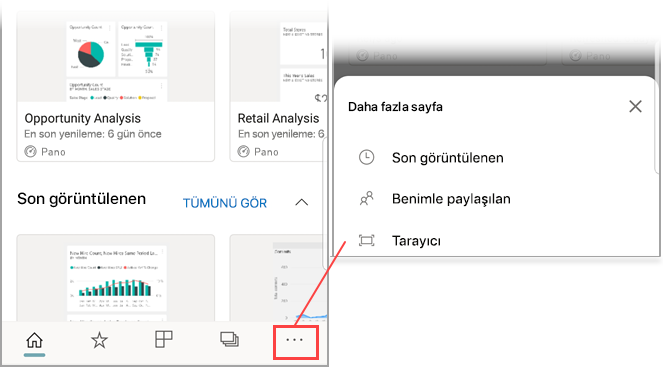

# Cihazınızla Power BI mobil uygulamasında barkod tarama
Gerçek dünyada barkodlar tarayarak Power BI mobil uygulamasında filtrelenmiş BI bilgilerine doğrudan ulaşın.

Aşağıdakiler cihazlar için geçerlidir:

|  |  |  |  |
|:--- |:--- |:--- |:--- |
|iPhone'lar |iPad'ler |Android telefonlar |Android tabletler |

Diyelim ki bir iş arkadaşınız [Power BI Desktop raporunda bir barkod alanı etiketledi](../../transform-model/desktop-mobile-barcodes.md) ve raporu sizinle paylaştı. 

Cihazınızdaki Power BI uygulamasında bulunan tarayıcı ile bir ürün barkodunu taradığınızda söz konusu barkodu içeren raporu (veya rapor listesini) görürsünüz. Bu barkodla filtrelenmiş raporu açabilirsiniz.

## Power BI tarayıcısı ile barkod tarama
1. Gezinti çubuğunda **Diğer seçenekler**'e (...) ve sonra da **Tarayıcı**'ya dokunun.

    

2. Kameranız etkin değilse Power BI uygulamasının kameranızı kullanmasına onay vermeniz gerekir. Bu onay bir kereliktir. 
4. Tarayıcıyı bir üründeki barkoda doğru tutun. Bu barkodla ilişkili bir rapor listesini görürsünüz.
5. Rapor adına dokunarak söz konusu barkoda göre otomatik olarak filtrelenmiş raporu cihazınızda açın.

## Bir rapordayken başka barkodlara göre filtreleme yapma
Cihazınızda barkoda göre filtrelenmiş bir raporu incelerken, aynı raporu başka bir barkodla filtrelemek isteyebilirsiniz.

* Barkod simgesinde bir filtre bulunuyorsa bu filtre etkindir ve rapor zaten bir barkodla filtrelenmiştir. 
* Simgede bir filtre bulunmuyorsa etkin değildir ve rapor bir barkodla filtrelenmemiştir. 

Her iki durumda da simgeye dokunarak, kayan bir tarayıcı içeren küçük menüyü açın.

* Raporun filtresini başka bir barkod değeri olarak değiştirmek için tarayıcıyı yeni öğeye odaklayın. 
* Filtrelenmemiş rapora geri dönmek için **Barkod filtresini temizleme**'yi seçin.
* Rapor filtresini geçerli oturumda taradığınız barkodlardan biri olarak değiştirmek için **Son kullanılan barkodlara göre filtrele** seçeneğini belirleyin.

## Barkod taramada karşılaşılan sorunlar
Bir üründeki barkodu tararken aşağıdaki gibi iletilerle karşılaşabilirsiniz:

### “Rapor filtrelenemedi...”
Filtrelemeyi seçtiğiniz rapor, bu barkod değerini içermeyen bir veri modelini temel alıyor. Örneğin, "maden suyu" ürünü raporda yer almıyor.  

### Rapordaki görselleştirmelerden hiçbiri/bazıları değer içermiyor
Taradığınız barkod değeri modelinizde bulunuyor ancak raporunuzdaki görselleştirmelerden hiçbiri/bazıları bu değeri içermiyor ve bu nedenle, filtreleme işlemi boş bir durum döndürüyor. Başka rapor sayfalarına göz atmayı deneyin veya Power BI Desktop'ta raporlarınızı bu değeri içerecek şekilde düzenleyin 

### “Barkodlarla filtrelenebilecek herhangi bir raporunuzun olmadığı görülüyor.”
Bu, etkin barkodu bulunan herhangi bir raporunuz olmadığı anlamına gelir. Barkod tarayıcısıyla yalnızca **Barkod** olarak işaretlenmiş bir sütuna sahip olan raporlar filtrelenebilir.  

Rapor sahibinin (veya sizin) Power BI Desktop'ta bir sütunu **Barkod** olarak etiketlediğinden emin olun. [Power BI Desktop'ta bir barkod alanı etiketleme](../../transform-model/desktop-mobile-barcodes.md) hakkında daha fazla bilgi edinin

### “Rapor filtrelenemedi - Bu barkodun, rapor verilerinde mevcut olmadığı görülüyor.”
Filtrelemeyi seçtiğiniz rapor bu barkod değerini içermeyen bir veri modelini temel alıyor. Örneğin, "maden suyu" ürünü raporda yer almıyor. Farklı bir ürünü tarayabilir, farklı bir rapor seçebilir (birden fazla rapor mevcutsa) veya raporu filtrelenmemiş olarak görüntüleyebilirsiniz. 

## Sonraki adımlar
* [Power BI Desktop'ta bir barkod alanı etiketleme](../../transform-model/desktop-mobile-barcodes.md)
* [Power BI'daki pano kutucukları](../end-user-tiles.md)
* [Power BI'daki panolar](../end-user-dashboards.md)
