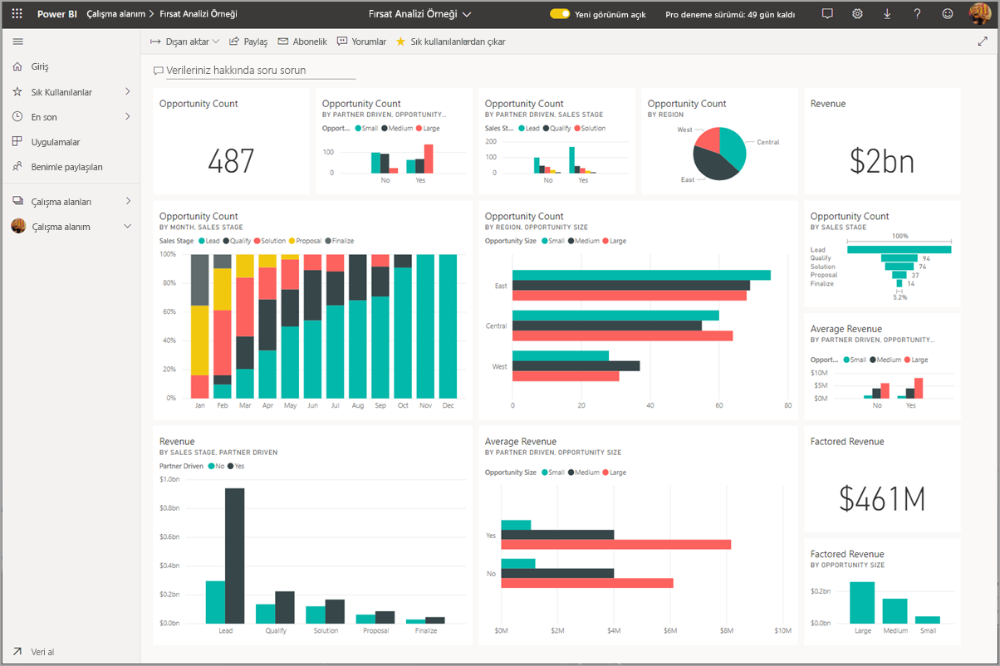
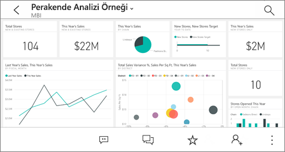

# Power BI mobil uygulamalarında pano ve raporları görüntüleme
Aşağıdakiler cihazlar için geçerlidir:

|  |  |  |  | 
|:--- |:--- |:--- |:--- |:--- |
| [iPhone'lar](mobile-apps-view-dashboard.md#view-dashboards-on-your-iphone) |[iPad'ler](mobile-apps-view-dashboard.md#view-dashboards-on-your-ipad) |[Android telefonlar](mobile-apps-view-dashboard.md#view-dashboards-on-your-android-phone) |[Android tabletler](mobile-apps-view-dashboard.md#view-dashboards-on-your-android-tablet) |

Panolar, şirketinizin yaşam döngüsünün ve işlemlerinin yer aldığı portallardır. Genel bakış sunan panolar, işletmenin geçerli durumunun takip edilebileceği merkezlerdir.

## Power BI hizmetinde panolar oluşturma (https://powerbi.com)
**Panolar mobil uygulamalarda oluşturulmaz.** 

Panoları ve raporları mobil cihazınızda görüntüleyebilmek için bir Web tarayıcısı ile oluşturmanız veya bir Web tarayıcısındaki panolarla bağlantı kurmanız gerekir. 

1. Power BI hizmetine ([https://www.powerbi.com](https://www.powerbi.com)) gidin ve [bir hesaba kaydolun](../../service-self-service-signup-for-power-bi.md).
2. [Kendi Power BI panolarınızı ve raporunuzu oluşturun](../../service-get-started.md) veya [Microsoft Dynamics CRM](../../service-connect-to-microsoft-dynamics-crm.md) gibi çeşitli hizmetler için mevcut [Power BI uygulamalarına](../../service-connect-to-services.md) bağlanın.

Power BI hizmetinde Power BI panoları şu şekilde görünür:

## Panoları iPhone'unuzda görüntüleme
1. iPhone'unuzda Power BI uygulamasını açıp oturum açın.
   
   Apple App Store'dan [iPhone uygulamasını indirmeniz](https://go.microsoft.com/fwlink/?LinkId=522062) mi gerekiyor?
2. Açmak istediğiniz panoya dokunun.  
   
    
   
   * Sarı yıldızlar  sık kullanılan panoları gösterir. 
   * Her pano adının altındaki gösterim (bu örnekte "MBI")  panolardaki verilerin nasıl sınıflandırıldığını gösterir. [Power BI'daki veri sınıflandırması](../../service-data-classification.md) hakkında daha fazla bilgi edinin.
   
   Power BI panoları iPhone'unuzda varsayılan olarak biraz farklı görünür. Tüm kutucuklar aynı boyuttadır ve yukarıdan aşağıya doğru alt alta dizilmiştir.
   
    
   
   > [!TIP]
   > Panonun sahibi sizseniz Power BI hizmetinde dikey modda [telefonlara özel bir pano görünümü oluşturabilirsiniz](../../service-create-dashboard-mobile-phone-view.md). 
   > 
   > 
   
    İsterseniz telefonunuzu yan çevirerek panoyu telefonunuzda yatay modda görüntüleyebilirsiniz.
   
    
3. Panodaki tüm kutucukları görmek için ekranı yukarı ve aşağı kaydırın. Seçenekleriniz şunlardır:
   
   * [Bir kutucuğa dokunarak](mobile-tiles-in-the-mobile-apps.md) odak modunda açabilir ve kutucukla etkileşim kurabilirsiniz.
   * Yıldıza  dokunarak [sık kullanılanlara ekleyebilirsiniz](mobile-apps-favorites.md).
   * **Davet et**'e  dokunarak panoyu görüntülemek üzere bir [iş arkadaşınızı davet edebilirsiniz](mobile-share-dashboard-from-the-mobile-apps.md).
   * [Panoyu Apple Watch cihazınızla eşitleyebilirsiniz](mobile-apple-watch.md).
4. Pano listesine dönmek için pano başlığının yanındaki oka ve ardından **Çalışma Alanım**'a dokunun.
   
   

### Panoları iPhone'unuzda yatay modda görüntüleme
Panoları yatay modda görüntülemek için telefonunuzu yan çevirmeniz yeterlidir. Pano düzeni kutucuk dizisinden tam kapsamlı pano görünümüne dönüşür. Bu sayede tüm pano kutucuklarını Power BI hizmetindeki gibi görüntüleyebilirsiniz.

"Sıkıştırma" hareketini kullanarak panonuzun farklı bölümlerini yakınlaştırıp uzaklaştırabilir, ekranı kaydırarak panoda gezinebilirsiniz. Bu modda da [bir kutucuğa dokunarak](mobile-tiles-in-the-mobile-apps.md) odak modunda açabilir ve verilerinizle etkileşim kurabilirsiniz.

## Panoları iPad'inizde görüntüleme
1. Power BI uygulamasını açın.
   
   Önce Apple App Store'dan [iPad uygulamasını indirmeniz](https://go.microsoft.com/fwlink/?LinkId=522062) mi gerekiyor?
2. Uygulamanın en üstünde yer alan **Panolar**'a dokunun.  
   
   
   
   * Sarı yıldızlar  sık kullanılan panoları gösterir. 
   * Her pano adının altındaki gösterim (bu örnekte "MBI")  panolardaki verilerin nasıl sınıflandırıldığını gösterir. [Power BI'daki veri sınıflandırması](../../service-data-classification.md) hakkında daha fazla bilgi edinin.
3. Çalışma alanınızdaki panoları paylaşabilirsiniz. Pano kutucuğunun sağ alt köşesindeki üç nokta ( **...** ) simgesine tıklayıp **Diğerlerini Davet Et**'e dokunun.
   
   
4. Dilerseniz herhangi bir panoya dokunarak açabilir ve panodaki kutucukları görüntüleyebilirsiniz. Açık panolarla etkileşimde bulunabilirsiniz:
   
   * Kutucukla [etkileşimde bulunmak için dokunun](mobile-tiles-in-the-mobile-apps.md).
   * Kutucukların arkasındaki [raporları açın](mobile-reports-in-the-mobile-apps.md).
   * [Diğerlerini panoyu görüntülemeleri için davet edin](mobile-share-dashboard-from-the-mobile-apps.md).
   * Kutucuğun [ekran görüntüsüne not ekleyin ve paylaşın](mobile-annotate-and-share-a-tile-from-the-mobile-apps.md).
5. Çalışma Alanım sayfasına geri dönmek için sol üst köşede bulunan pano adına dokunup **Çalışma Alanım**'ı seçin.
   
   

## Panoları Android telefonunuzda görüntüleme
1. Android telefonunuzda Power BI uygulamasını açıp oturum açın.
   
   Önce [Android uygulamasını indirmeniz](https://go.microsoft.com/fwlink/?LinkID=544867) mi gerekiyor?
2. Açmak istediğiniz panoya dokunun.   
   
   

    Sarı yıldızlar  sık kullanılan panoları gösterir. 

    Pano adının altındaki gösterim (bu örnekte "MBI")  panolardaki verilerin nasıl sınıflandırıldığını gösterir. [Power BI'daki veri sınıflandırması](../../service-data-classification.md) hakkında daha fazla bilgi edinin.

    Power BI panoları Android telefonunuzda varsayılan olarak biraz farklı görünür. Tüm kutucuklar aynı genişliktedir ve yukarıdan aşağıya doğru alt alta dizilmişlerdir.

    

    Panonun sahibi sizseniz Power BI hizmetinde dikey modda [telefonlara özel bir pano görünümü oluşturabilirsiniz](../../service-create-dashboard-mobile-phone-view.md). 

1. Pano adının yanındaki **Diğer seçenekler** (...) düğmesine dokunarak bir iş arkadaşınızı davet edebilir, panoyu yenileyebilir veya pano hakkında bilgi alabilirsiniz:
   
   
2. [Panodaki tüm kutucukları](mobile-tiles-in-the-mobile-apps.md) görmek için ekranı yukarı ve aşağı kaydırın. 
3. Pano giriş sayfasına geri dönmek için pano adına dokunarak içerik haritasını açın ve **Çalışma Alanım**'a dokunun.   

## Panoları Android tabletinizde görüntüleme
1. Android tabletinizde Power BI uygulamasını açıp oturum açın.
   
   Önce [Android uygulamasını indirmeniz](https://go.microsoft.com/fwlink/?LinkID=544867) mi gerekiyor?
2. Açmak istediğiniz panoya dokunun.   
   
   
   
   * Sarı yıldızlar  sık kullanılan panoları gösterir. 
   * Her pano adının altındaki gösterim (bu örnekte "MBI")  panolardaki verilerin nasıl sınıflandırıldığını gösterir. [Power BI'daki veri sınıflandırması](../../service-data-classification.md) hakkında daha fazla bilgi edinin.
3. Pano adının yanındaki **Diğer seçenekler** (...) düğmesine dokunarak bir iş arkadaşınızı davet edebilir, panoyu yenileyebilir veya pano hakkında bilgi alabilirsiniz:
   
   
4. [Panodaki tüm kutucukları](mobile-tiles-in-the-mobile-apps.md) görmek için ekranı yukarı ve aşağı kaydırın. 
   
   "Sıkıştırma" hareketini kullanarak panonuzun farklı bölümlerini yakınlaştırıp uzaklaştırabilir, ekranı kaydırarak panoda gezinebilirsiniz. Bu modda da [bir kutucuğa dokunarak](mobile-tiles-in-the-mobile-apps.md) odak modunda açabilir ve verilerinizle etkileşim kurabilirsiniz.
5. Pano giriş sayfasına geri dönmek için pano adına dokunarak içerik haritasını açın ve **Çalışma Alanım**'a dokunun:
   
    

    "Sıkıştırma" hareketini kullanarak panonuzun farklı bölümlerini yakınlaştırıp uzaklaştırabilir, ekranı kaydırarak panoda gezinebilirsiniz. Bu modda da [bir kutucuğa dokunarak](mobile-tiles-in-the-mobile-apps.md) odak modunda açabilir ve verilerinizle etkileşim kurabilirsiniz.

## Power BI hizmetinde panonun telefon görünümünü oluşturma
Panonun sahibi sizseniz *Power BI hizmetinde* dikey modda telefonlara özel bir pano görünümü oluşturabilirsiniz. 

[Bir panonun telefon görünümünü oluşturma](../../service-create-dashboard-mobile-phone-view.md) hakkında daha fazla bilgi alın.

## Sonraki adımlar
* Google Play'den [Android uygulamasını indirme](https://go.microsoft.com/fwlink/?LinkID=544867)  
* [Power BI Android uygulamasıyla çalışmaya başlama](mobile-android-app-get-started.md)  
* [Power BI nedir?](../../fundamentals/power-bi-overview.md)
* Sorularınız mı var? [Power BI Topluluğu'na sorun](https://community.powerbi.com/)

