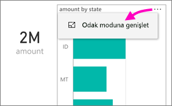

# Telefonunuz için en iyi duruma getirilmiş Power BI raporlarını görüntüleme

Aşağıdakiler cihazlar için geçerlidir:

|  |  |
|:--- |:--- |
| iPhone'lar |Android telefonlar |

Telefonunuzda bir Power BI raporu görüntülediğinizde, Power BI raporun telefonlar için iyileştirilip iyileştirilmediğini denetler. Rapor telefonlar için iyileştirilmişse, Power BI bunu otomatik olarak dikey görünümde açar.

Telefon için en iyi duruma getirilmiş rapor yoksa rapor en iyi duruma getirilmemiş, yatay görünümde açılır. Telefon için en iyi duruma getirilmiş raporlarda bile telefonunuzu yan çevirdiğinizde rapor özgün rapor düzeniyle, en iyi duruma getirilmemiş görünümde açılır. Sayfaların yalnızca bazıları en iyi duruma getirildiyse dikey görünümde raporun yatay görünümde kullanılabileceğini belirten bir ileti görürsünüz.

Telefon için en iyi duruma getirilmiş raporlarda diğer tüm Power BI rapor özellikleri çalışmaya devam eder. Aşağıdakilerle yapabilecekleriniz hakkında daha fazla bilgi edinin:

* [iPhone'larda raporlar](mobile-reports-in-the-mobile-apps.md). 
* [Android telefonlarda raporlar](mobile-reports-in-the-mobile-apps.md).

## Telefonda rapor sayfasını filtreleme
Telefon için en iyi duruma getirilmiş bir raporda tanımlı filtreler varsa, söz konusu raporu bir telefonda görüntülerken bu filtreleri kullanabilirsiniz. Rapor, web üzerindeki raporda filtrelenen değerlerle filtrelenmiş şekilde telefonunuzda açılır. Sayfada etkin filtreler olduğunu belirten bir ileti görürsünüz. Telefonunuzdaki filtreleri değiştirebilirsiniz.

1. Sayfanın en altında bulunan filtre simgesine  dokunun.

2. İlgilendiğiniz sonuçları görmek için temel veya gelişmiş filtreleme kullanın.
   
    

## Görsellerde çapraz vurgulama
Dikey görünümde görsellere çapraz vurgulama uygulama, Power BI hizmetinde olduğu gibi gerçekleştirilir ve telefonlarda yatay görünümde çalışır: Bir görseldeki verileri seçtiğinizde, aynı sayfada yer alan diğer görsellerin ilgili verilerini vurgular.

[Power BI'da filtreleme ve vurgulama](../../power-bi-reports-filters-and-highlighting.md) hakkında daha fazla bilgi edinin.

## Görsel seçme
Telefon raporlarında bir görsel seçtiğinizde ilgili görsele telefon raporunda vurgulama ve odaklama uygulanır, tuval hareketleri engellenir.

Görseli seçtiğinizde kaydırma gibi işlemler gerçekleştirebilirsiniz. Bir görselin seçimini kaldırmak için görsel alanı dışındaki bir yere dokunmanız yeterlidir.

## Görselleri odak modunda açma
Telefon raporları da bir odak modu sunar: Tek bir görselin daha büyük görünümünü elde eder ve daha kolayca araştırabilirsiniz.

* Telefon raporunda görselin sağ üst köşesindeki üç nokta ( **...** ) simgesine dokunduktan sonra **Odak moduna genişlet**'i seçin.
  
    

Odak modunda yaptığınız değişiklikler rapor tuvaline, rapor tuvalinde yaptıklarınız da odak moduna uygulanır. Örneğin, görseldeki bir değeri vurgulayıp raporun tamamına geri dönerseniz, rapor görselde vurguladığınız değere göre filtrelenmiş halde görüntülenir.

Bazı eylemler ekran boyutu kısıtlamaları nedeniyle yalnızca odak modunda gerçekleştirilebilir:

* Görselde görüntülenen bilgilerin **detayına gitme**. Telefon raporunda [detaya gitme](mobile-apps-view-phone-report.md#drill-down-in-a-visual) hakkında daha fazla bilgi için aşağıdaki bölümü inceleyin.
* Görseldeki değerleri **sıralama**.
* **Geri döndürme**: Görselde gerçekleştirdiğiniz keşfetme adımlarını silme ve tanım kümesini raporun oluşturulduğu zamandaki duruma döndürme.
  
    Bir görseldeki tüm araştırma düzeyini silmek için üç nokta simgesine ( **...** ) dokunup **Geri döndür**'ü seçin.
  
    
  
    Geri döndürme işlemi, tüm görsellerdeki araştırma işlemlerini silmek için rapor düzeyinde veya seçili görseldeki araştırma işlemini silmek için görsel düzeyinde kullanılabilir.   

## Bir görselde detaya gitme
Hiyerarşi düzeyleri tanımlanmış olan görsellerde bilgilerin detayına gidebilir, ardından normal görünüme dönebilirsiniz. [Görselde detaya gitme özelliğini](../end-user-drill.md) Power BI hizmetinde veya Power BI Desktop uygulamasında kullanabilirsiniz.

Birkaç farklı türde detaya gitme bulunur:

### Değerde detaya gitme
1. Bir görseldeki veri noktasına uzun süreyle dokunun (dokunun ve basılı tutun).
2. Araç ipucu görünür. Hiyerarşi tanımlıysa, araç ipucu alt bilgisinde detaya gitme ve detaydan çıkma seçenekleri gösterilir.
3. Detaya gitmek için aşağı oka dokunun

    
    
4. Detaydan çıkmak için yukarı oka dokunun.

### Sonraki düzeyde detaya gitme
1. Telefondaki raporda sağ üst köşedeki üç nokta ( **...** ) simgesine dokunduktan sonra **Odak moduna genişlet**'i seçin.
   
    
   
    Bu örnekte çubuklar, eyalet değerlerini göstermektedir.
2. Sol alt köşedeki araştır simgesine  dokunun.
   
    
3. **Sonraki düzeyi göster** veya **Bir sonraki düzeye genişlet**'e dokunun.
   
    
   
    Şimdi çubuklarda şehirlere ait değerler gösterilir.
   
    
4. Sol üst köşedeki ok simgesine dokunursanız telefon raporuna dönersiniz ve değerler alt düzeye genişletilmiş şekilde kalır.
   
    
5. Özgün düzeye dönmek için üç nokta simgesine ( **...** ) tekrar dokunup **Geri döndür**'ü seçin.
   
    

## Bir değerden detaylandırma
Detaylandırma, bir rapor sayfasındaki değerleri diğer rapor sayfalarına bağlar. Bir veri noktasından farklı bir rapor sayfasına detaylandırma yaptığınızda, detaylandırılan sayfayı filtrelemek için veri noktası değerleri kullanılır veya sayfa, seçilen verilerin bağlamında olur.
Rapor yazarları, raporu oluştururken [detaylandırmayı tanımlayabilir](https://docs.microsoft.com/power-bi/desktop-drillthrough).

1. Bir görseldeki veri noktasına uzun süreyle dokunun (dokunun ve basılı tutun).
2. Araç ipucu görünür. Detaylandırma tanımlıysa, araç ipucu alt bilgisinde detaylandırma oku gösterilir.
3. Detaylandırmak için oka dokunun

    

4. Detaylandıracağınız rapor sayfasını seçin

    

5. Uygulama üst bilgisinde bulunan Geri düğmesini kullanarak başladığınız sayfaya geri dönün.

## Sonraki adımlar
* [Power BI telefon uygulamaları için en iyi duruma getirilmiş raporlar oluşturma](../../desktop-create-phone-report.md)
* [Power BI'da bir panonun telefon görünümünü oluşturma](../../service-create-dashboard-mobile-phone-view.md)
* [Tüm boyutlar için en iyi duruma getirilmiş esnek görseller oluşturma](../../visuals/desktop-create-responsive-visuals.md)
* Başka bir sorunuz mu var? [Power BI Topluluğu'na sorun](https://community.powerbi.com/)

