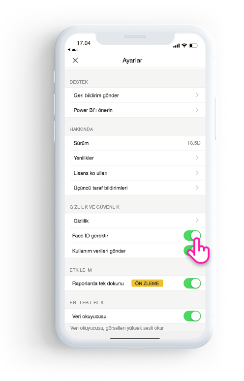

# Power BI uygulamasını Face ID, Touch ID veya geçiş koduyla koruma 

Birçok durumda Power BI'da yönetilen veriler gizlidir; bunların korunması ve yalnızca yetkili kullanıcıların bu verilere erişebilmesi gerekir. 

Power BI iOS uygulaması ek kimlik bilgileri yapılandırarak verilerinizi korumanıza olanak sağlar. Uygulamayı her başlattığınızda veya arka plandan ön plana getirdiğinizde Face ID, Touch ID veya geçiş kodu sağlamanız gerekir.

|  |  |
|:--- |:--- |
| iPhone'lar |iPad'ler |

## Uygulama ayarında Face ID, Touch ID veya geçiş kodunu açma

Power BI'da ek kimlik bilgileri kullanmak için **Gizlilik ve Güvenlik**'in altındaki uygulama ayarına gidin. Cihazınızın özelliklerine bağlı olarak Face ID, Touch ID veya geçiş kodunu açma seçeneğini görürsünüz.

Bu ayar açıldıktan sonra, Power BI'ı her başlattığınızda veya arka plandan ön plana getirdiğinizde uygulamaya erişebilmek için kimliğinizi sağlamanız istenir. 

Face ID, Touch ID veya geçiş kodu isteme kararı, cihazın özelliklerine bağlı olarak iOS tarafından verilir. Cihazınız Face ID'yi destekliyorsa Face ID kullanmanız gerekir. Touch ID'yi destekliyorsa Touch ID kullanmanız gerekir. İkisi de desteklenmiyorsa geçiş kodunu sağlamanız gerekir.

## Face ID, Touch ID veya geçiş kodunu zorunlu tutmak için MDM kullanma

Bazı kuruluşların güvenlik ilkeleri ve uyumluluk gereksinimleri gizli iş verilerine erişebilmeniz için ek kimlik bilgileri girmenizi zorunlu tutar. 

Power BI mobil iOS uygulaması yöneticilerin Microsoft Intune'dan ve diğer mobil cihaz yönetimi (MDM) çözümlerinden uygulama yapılandırma ayarlarını göndererek bu ayarı denetlemelerine olanak tanır. Yöneticiler uygulama koruma ilkesini kullanarak bu ayarı tüm kullanıcılar için veya bir grup kullanıcı için açabilir.

|Anahtar  |Tür  |Açıklama  |
|---------|---------|---------|
| com.microsoft.powerbi.mobile.ForceDeviceAuthentication | Boole | Varsayılan değerdir False’tur.  True olarak ayarlandığında, uygulama kullanıcıları uygulamada Power BI verilerini görüntüleyebilmek için önce Face ID, Touch ID veya geçiş koduyla kendilerini tanıtmaya zorlar. Cihazlarında Face ID, Touch ID veya geçiş kodu yapılandırılmamış olan kullanıcıların, Power BI'a erişebilmek için bunu yapılandırmaları gerekir.  |

## Sonraki adımlar

[MDM kullanarak Power BI iOS uygulamasını uzaktan yapılandırma](mobile-app-configuration.md)
