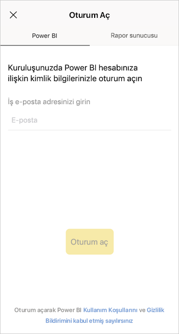
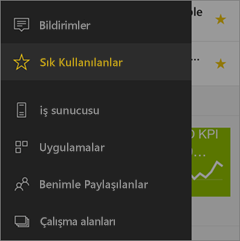

# iOS cihazlarında Power BI mobil uygulaması ile çalışmaya başlama
iPhone, iPad veya iPod touch'taki iOS için Microsoft Power BI; Power BI, Power BI Rapor Sunucusu ve Reporting Services için mobil BI deneyimi sunar. Nerede olursanız olun, gerçek zamanlı ve dokunmatik kullanıma uygun mobil erişimle şirket içindeki ve buluttaki şirket panolarınızı görüntüleyin ve bunlarla etkileşime geçin. Panolardaki verileri araştırın ve e-posta veya kısa mesaj yoluyla iş arkadaşlarınızla paylaşın. Üstelik [Apple Watch](mobile-apple-watch.md)'unuzda en güncel verilerinize erişerek her şeyden haberdar olun.  

Power BI Desktop'ta Power BI raporları oluşturur ve bunları yayımlarsınız:

* [Raporlarınızı Power BI hizmetinde yayımlayın](../../service-get-started.md) ve panolar oluşturun.
* [Raporlarınızı Power BI Rapor Sunucusu’nda yayımlayarak şirket içinde paylaşın](../../report-server/quickstart-create-powerbi-report.md).

Daha sonra iOS için Power BI mobil uygulamasında, şirket içinde veya bulutta olmaları fark etmeksizin panolarınızla ve raporlarınızla etkileşime geçin.

[Power BI mobil uygulamalarındaki yenilikleri](mobile-whats-new-in-the-mobile-apps.md) öğrenin.

## Uygulamayı indirme
App Store'a giderek iPhone, iPad veya iPod touch'ınıza [iOS uygulamasını indirin](http://go.microsoft.com/fwlink/?LinkId=522062 "iOS uygulamasını indirin").

iOS için Power BI uygulamasını, iOS 10 veya sonraki bir sürümün yüklü olduğu iPhone 5 ve sonraki modellerde çalıştırabilirsiniz. Uygulamayı iOS 10 veya sonraki bir sürümün yüklü olduğu iPad veya iPod Touch'ta da çalıştırabilirsiniz. 

## Power BI hizmetine kaydolma
Henüz kaydolmadıysanız, [powerbi.com](https://powerbi.microsoft.com/get-started/) adresine gidip **Power BI - Bulut işbirliği ve paylaşımı** bölümünde **Ücretsiz olarak deneyin**’i seçin.

## Power BI uygulaması ile çalışmaya başlama
1. iOS cihazınızda Power BI uygulamasını açın.
2. Power BI panolarınızı görüntülemek için **Power BI** seçeneğine dokunun.  
   Reporting Services mobil raporlarınızı ve KPI'lerinizi görüntülemek içinse **SQL Server Reporting Services** seçeneğine dokunun.
   
   
   
   Uygulamadayken, bu ikisi arasında geçiş yapmak için sol üst köşedeki genel gezinti düğmesine  dokunmanız yeterlidir. 

## Power BI ve Reporting Services örneklerini deneme
Kaydolmadan bile Power BI ve Reporting Services örnekleriyle deneme yapabilirsiniz. Uygulamayı indirdikten sonra örnekleri görüntüleyebilir veya çalışmaya başlayabilirsiniz. Dilediğiniz zaman genel gezinti düğmesini kullanarak örneklere geri dönebilirsiniz.

### Power BI örnekleri
Power BI pano örneklerini görüntüleyebilir ve bunlarla etkileşime geçebilirsiniz ancak örneklerle gerçekleştiremediğiniz birkaç şey bulunur. Panolarla bağlantılı raporlar açamaz, örnekleri başkalarıyla paylaşamaz veya sık kullanılanlara ekleyemezsiniz.

1. Sol üst köşede bulunan genel gezinti düğmesine  dokunun.
2. Sol üst taraftaki dişli simgesine  ve ardından **Power BI örnekleri** seçeneğine dokunun.
3. Bir rol seçin ve bu role yönelik örnek panoyu araştırın.  
   
   
   
   > [!NOTE]
   > Örneklerde tüm özellikler kullanılamaz. Örneğin, panolarla bağlantılı örnek raporları görüntüleyemezsiniz. 
   > 
   > 

### Reporting Services mobil rapor örnekleri
1. Sol üst köşede bulunan genel gezinti düğmesine  dokunun.
2. Sağ üstteki dişli simgesine  ve ardından **Reporting Services örnekleri** seçeneğine dokunun.
3. Retail Reports veya Sales Reports klasörünü açarak ilgili KPI'leri ve mobil raporları araştırın.
   
   

## Power BI mobil uygulamalarında içeriklerinizi bulma
Panolarınız ve raporlarınız kaynaklarına bağlı olarak Power BI mobil uygulamalarında farklı konumlarda depolanır. [Mobil uygulamalarda içeriklerinizi bulma](mobile-apps-quickstart-view-dashboard-report.md) hakkında bilgi edinin. Ayrıca, Power BI mobil uygulamalarında sahip olduğunuz her şeyi dilediğiniz zaman arayabilirsiniz. 

[Mobil uygulamalarda içeriklerinizi bulma](mobile-apps-quickstart-view-dashboard-report.md) hakkında daha fazla bilgi edinin.

## Sık kullandığınız panoları, KPI'leri ve raporları görüntüleme
Mobil uygulamalardaki Sık Kullanılanlar sayfasında, Power BI Rapor Sunucusu ve Reporting Services KPI'lerinin ve raporlarının yanı sıra sık kullandığınız Power BI panolarının tümünü görebilirsiniz. Power BI mobil uygulamasında bir panoyu *sık kullanılan* olarak eklediğinizde, söz konusu panoya, tarayıcınızdan eriştiğiniz Power BI hizmeti de dahil olmak üzere tüm cihazlarınızdan erişebilirsiniz. 

* **Sık Kullanılanlar**'a dokunun.
  
   
  
   Sık kullanılanlarınızın tümünü şu sayfada görürsünüz:
  
   
  
  1. Power BI hizmetindeki panolar
  2. Power BI Rapor Sunucusu'ndaki KPI'ler
  3. Power BI Rapor Sunucusu'ndaki Power BI raporları

[Power BI mobil uygulamalarındaki sık kullanılanlar](mobile-apps-favorites.md) hakkında daha fazla bilgi edinin.

## Power BI mobil uygulamaları için kurumsal destek
Kuruluşlar, Android ve iOS için Power BI mobil uygulamaları da dahil olmak üzere cihazları ve uygulamaları yönetmek için Microsoft Intune'u kullanabilir.

Microsoft Intune, kuruluşların; bir erişim PIN'i gerektirme, verilerin uygulama tarafından nasıl işlendiğini denetleme ve hatta uygulama kullanılmadığı sırada uygulama verilerini şifreleme gibi işlemler gerçekleştirerek öğeleri denetlemesine olanak sağlar.

> [!NOTE]
> iOS cihazınızda Power BI mobil uygulamasını kullanıyorsanız ve kuruluşunuzda Microsoft Intune MAM yapılandırıldıysa arka planda veri yenileme devre dışıdır. Uygulamaya bir sonraki girişinizde Power BI, web üzerindeki Power BI hizmetinden verileri yeniler.
> 

[Microsoft Intune ile Power BI mobil uygulamalarını yapılandırma](../../service-admin-mobile-intune.md) hakkında daha fazla bilgi edinin. 

## Sonraki adımlar

* [Power BI nedir?](../../power-bi-overview.md)
* Sorularınız mı var? [Power BI Topluluğu'na sorun](http://community.powerbi.com/)

