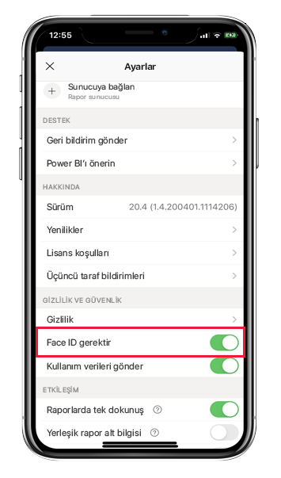
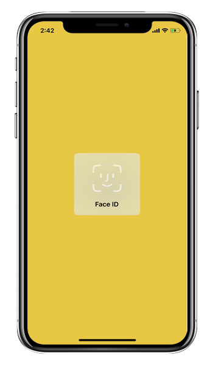
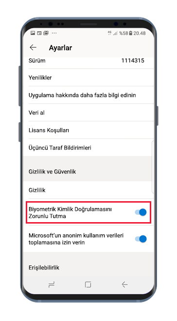
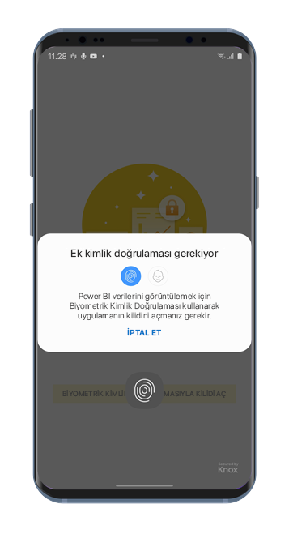

# Power BI uygulamasını Face ID, Touch ID, geçiş kodu veya biyometrik verilerle koruma 

Birçok durumda Power BI'da yönetilen veriler gizlidir; bunların korunması ve yalnızca yetkili kullanıcıların bu verilere erişebilmesi gerekir. 

iOS ve Android için Power BI uygulaması ek kimlik bilgileri yapılandırarak verilerinizi korumanıza olanak sağlar. Ardından uygulama her başlatıldığında veya ön plana getirildiğinde, kimlik doğrulaması yapmak gerekecektir. iOS’ta bu Face ID, Touch ID veya geçiş kodu sağlamak anlamına gelir. Android’de ise biyometrik veriler (Parmak İzi Kimliği) sağlamak anlamına gelir.

Aşağıdakiler için geçerlidir:

|  |  |  |  |
|:--- |:--- |:--- |:--- |
|iPhone'lar |iPad'ler |Android telefonlar |Android tabletler |

## iOS’ta Face ID, Touch ID veya geçiş kodunu açma

iOS için Power BI mobil uygulamasında ek kimlik bilgileri kullanmak için **Gizlilik ve Güvenlik**’in altındaki uygulama ayarına gidin. Face ID, Touch ID veya geçiş kodunu açma seçeneğini görürsünüz. Gördüğünüz seçenekler, cihazınızın özelliklerine bağlıdır.

Bu ayar açıldıktan sonra, uygulamayı her başlattığınızda veya ön plana getirdiğinizde uygulamaya erişebilmek için kimliğinizi sağlamanız istenir.

Sağlamanız istenilen kimlik türü, cihazınızın özelliklerine bağlıdır. Cihazınız Face ID'yi destekliyorsa Face ID kullanmanız gerekir. Touch ID'yi destekliyorsa Touch ID kullanmanız gerekir. İkisi de desteklenmiyorsa geçiş kodunu sağlamanız gerekir. Aşağıdaki resimde Yüz Kimliği kimlik doğrulaması ekranı gösterilir.

## Android üzerinde biyometrik verileri (Parmak İzi Kimliği) açma

Android için Power BI mobil uygulamasında ek kimlik bilgileri kullanmak için **Gizlilik ve Güvenlik**’in altındaki uygulama ayarına gidin. Biyometrik verileri açma seçeneğini görürsünüz.

Bu ayar açıldıktan sonra, uygulamayı her başlattığınızda veya ön plana getirdiğinizde uygulamaya erişebilmek için biyometrik verilerinizi (Parmak İzi Kimliği) sağlamanız istenir.

Aşağıdaki resimde parmak izi kimlik doğrulaması ekranı gösterilir.

>[!NOTE]
>Mobil uygulamanın “Biyometrik Kimlik Doğrulaması Gerektir” ayarını kullanabilmek için önce Android cihazınızda biyometrik verileri ayarlamanız gerekir. Cihazınız biyometrik verileri desteklemiyorsa bu mobil uygulama ayarını kullanarak Power BI verilerinize yönelik erişimin güvenliğini sağlayamazsınız.
>
>Yöneticiniz, mobil uygulama için [güvenli erişimi uzaktan açtıysa](#mdm-enforcement-of-secure-access-to-your-power-bi-mobile-app) uygulamaya erişmek için, henüz yapmadıysanız cihazınızda biyometrik verileri ayarlamanız gerekir. Cihazınız biyometrik verileri desteklemiyorsa uzak ayar sizi etkilemez. Mobil uygulamanıza erişim, güvenli olmayan bir şekilde kalır.

## Power BI mobil uygulamanıza güvenli erişim için MDM’yi zorunlu kılma.

Bazı kuruluşların güvenlik ilkeleri ve uyumluluk gereksinimleri gizli iş verilerine erişebilmeniz için ek kimlik bilgileri girmenizi zorunlu tutar.

Bunu desteklemek için, Power BI mobil uygulaması yöneticilerin Microsoft Intune’dan ve diğer mobil cihaz yönetimi (MDM) çözümlerinden uygulama yapılandırma ayarlarını göndererek mobil uygulama güvenli erişim ayarını denetlemelerine olanak tanır. Yöneticiler uygulama koruma ilkesini kullanarak bu ayarı tüm kullanıcılar için veya bir grup kullanıcı için açabilir. Ayrıntılar için bkz. [Power BI mobil uygulamasını uzaktan yapılandırmak için MDM’yi kullanma](mobile-app-configuration.md#data-protection-settings-ios-and-android).

## Sonraki adımlar
* [MDM kullanarak Power BI mobil uygulamasını uzaktan yapılandırma](mobile-app-configuration.md)
