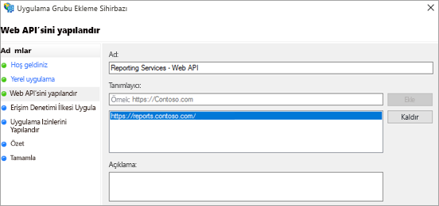
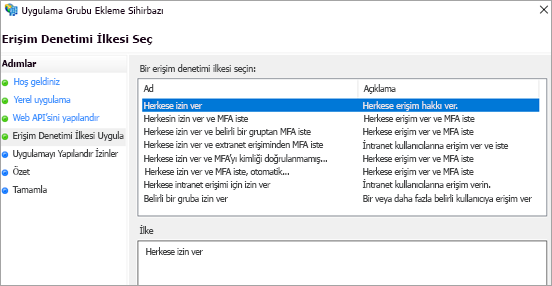
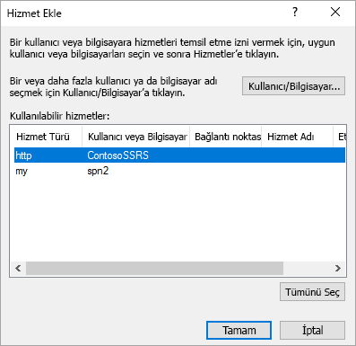

# <a name="using-oauth-to-connect-to-power-bi-report-server-and-ssrs"></a>OAuth kullanarak Power BI Rapor Sunucusu ve SSRS’e bağlanma

Mobil raporları veya KPI’leri görüntülemek için, OAuth kullanarak Power BI Rapor Sunucusu ve Reporting Services’e bağlanabilirsiniz. Power BI Rapor Sunucusu ve SQL Server Reporting Services 2016 veya sonraki bir sürüme bağlanmak için ortamınızı Power BI mobil uygulaması ile OAuth kimlik doğrulamasını destekleyecek şekilde yapılandırmayı öğrenin.

Adam’ın OAuth kullanarak Power BI Mobil’i SSRS’ye bağlamasını izleyin:


<iframe width="560" height="350" src="https://www.youtube.com/embed/okzPAI2uUek" frameborder="0" allowfullscreen></iframe>


> [!NOTE]
> WAP kullanarak Power BI Rapor Sunucusu'nda barındırılan Power BI Raporlarını görüntüleme işlemi artık iOS ve Android uygulamalarında desteklenmektedir.

## <a name="requirements"></a>Gereksinimler

Web Uygulaması Ara Sunucusu (WAP) ve Active Directory Federasyon Hizmetleri (ADFS) sunucuları için Windows Server 2016 gerekir. Windows 2016 işlev düzeyi etki alanına sahip olmanız gerekmez.

## <a name="domain-name-services-dns-configuration"></a>Etki Alanı Hizmetleri (DNS) yapılandırması

Power BI mobil uygulamasının bağlanacağı ortak URL. Örneğin, URL aşağıdakine benzer olabilir.

```https
https://reports.contoso.com
```

**Raporlar** için DNS kaydınızı Web Uygulaması Ara Sunucusu'nun (WAP) genel IP adresine yönlendirme. Ayrıca, ADFS sunucunuz için bir genel DNS kaydı yapılandırmanız gerekir. Örneğin, ADFS sunucusunu şu URL ile yapılandırmış olabilirsiniz.

```https
https://fs.contoso.com
```

WAP uygulamasının bir parçası olarak yayımlanacağından **fs** için DNS kaydınızı Web Uygulaması Ara Sunucusu'nun (WAP) genel IP adresine yönlendirme.

## <a name="certificates"></a>Sertifikalar

Hem WAP uygulaması hem de ADFS sunucusu için sertifikalar yapılandırmanız gerekir. Her iki sertifika da mobil cihazlarınız tarafından tanınan geçerli bir sertifikanın parçası olmalıdır.

## <a name="reporting-services-configuration"></a>Reporting Services yapılandırması

Reporting Services tarafında yapılandırılacak çok fazla ayar yoktur. Sadece doğru Kerberos kimlik doğrulamasının gerçekleştirilebilmesi için geçerli bir Hizmet Asıl Adı'na (SPN) sahip olduğumuzdan ve Reporting Services sunucusunun, anlaşma kimlik doğrulaması için etkinleştirildiğinden emin olmamız gerekir.

### <a name="service-principal-name-spn"></a>Hizmet Asıl Adı (SPN)

SPN, Kerberos kimlik doğrulaması kullanan bir hizmet için benzersiz bir tanımlayıcıdır. Rapor sunucunuz için doğru bir HTTP SPN'sine sahip olduğunuzdan emin olmanız gerekir.

Rapor sunucunuz için doğru Hizmet Asıl Adı'nı (SPN) yapılandırma hakkında bilgi almak isterseniz bkz. [Register a Service Principal Name (SPN) for a Report Server (Rapor Sunucusu için bir Hizmet Asıl Adı (SPN) kaydı yapma)](https://msdn.microsoft.com/library/cc281382.aspx).

### <a name="enabling-negotiate-authentication"></a>Anlaşma kimlik doğrulamasını etkinleştirme

Kerberos kimlik doğrulamasını kullanmak üzere bir rapor sunucusunu etkinleştirmek için rapor sunucusunun Kimlik Doğrulaması Türü'nü RSWindowsNegotiate olacak şekilde yapılandırmanız gerekir. Bu işlemi rsreportserver.config dosyasında yapabilirsiniz.

```xml
<AuthenticationTypes>  
    <RSWindowsNegotiate />  
    <RSWindowsKerberos />  
    <RSWindowsNTLM />  
</AuthenticationTypes>
```

Daha fazla bilgi için bkz. [Modify a Reporting Services Configuration File (Bir Reporting Services Yapılandırma Dosyasını değiştirme)](https://msdn.microsoft.com/library/bb630448.aspx) ve [Configure Windows Authentication on a Report Server (Bir Rapor Sunucusunda Windows Kimlik Doğrulamasını yapılandırma)](https://msdn.microsoft.com/library/cc281253.aspx).

## <a name="active-directory-federation-services-adfs-configuration"></a>Active Directory Federasyon Hizmetleri (ADFS) Yapılandırması

ADFS'yi ortamınızda bir Windows 2016 sunucusunda yapılandırmanız gerekir. Bu yapılandırma, Sunucu Yöneticisi aracılığıyla ve Yönet bölümündeki Rol ve Özellik Ekle seçeneği belirlenerek gerçekleştirilebilir. Daha fazla bilgi için bkz. [Active Directory Federasyon Hizmetleri](https://technet.microsoft.com/windows-server-docs/identity/active-directory-federation-services).

### <a name="create-an-application-group"></a>Bir uygulama grubu oluşturma

AD FS Yönetimi ekranında, Reporting Services için Power BI Mobil uygulamalarına yönelik bilgiler içeren bir uygulama grubu oluşturmak istiyorsunuz.

Uygulama grubunu, aşağıdaki adımları uygulayarak oluşturabilirsiniz.

1. AD FS Yönetimi uygulamasında **Uygulama Grupları**'na sağ tıklayın ve **Uygulama Grubu ekle…** seçeneğini belirleyin.

   

2. Uygulama Grubu Sihirbazı Ekle penceresinde, uygulama grubu için bir **ad** belirtin ve **Bir Web API'sine erişen yerel uygulama**'yı seçin.

   

3. **İleri**’yi seçin.

4. Eklediğiniz uygulama için bir **ad** girin. 

5. **İstemci Kimliği** sizin için otomatik olarak oluşturulacak olsa da hem iOS hem de Android için *484d54fc-b481-4eee-9505-0258a1913020* girin.

6. Aşağıdaki **Yeniden Yönlendirme URL'lerini** ekleyebilirsiniz:

   **Power BI Mobil – iOS için girişler:**  
   msauth://code/mspbi-adal://com.microsoft.powerbimobile  
   msauth://code/mspbi-adalms://com.microsoft.powerbimobilems  
   mspbi-adal://com.microsoft.powerbimobile  
   mspbi-adalms://com.microsoft.powerbimobilems

   **Android Uygulamaları için yalnızca aşağıdaki adımlar gerekir:**  
   urn:ietf:wg:oauth:2.0:oob

   
7. **İleri**’yi seçin.

8. Rapor Sunucunuzun URL'sini sağlayın. URL, Web Uygulaması Ara Sunucunuza yönelik dış URL'dir. Aşağıdaki biçimde olmalıdır.

   > [!NOTE]
   > URL büyük/küçük harfe duyarlıdır!

   *https://< rapor sunucusu url’si >/*

   
9. **İleri**’yi seçin.

10. Kuruluşunuzun gereksinimlerine uyan **Erişim Denetimi İlkesi**'ni seçin.

    

11. **İleri**’yi seçin.

12. **Sonraki** seçeneğini belirleyin.

13. **İleri**’yi seçin.

14. **Kapat**'ı seçin.

Tamamlandığında, aşağıda gösterilen şekilde uygulama grubunuzun özelliklerini görürsünüz.


## <a name="web-application-proxy-wap-configuration"></a>Web Uygulaması Ara Sunucusu (WAP) Yapılandırması

Ortamınızdaki bir sunucuda Web Uygulaması Ara Sunucusu (Rol) Windows Rolünü etkinleştirmeniz gerekir. Bir Windows 2016 sunucusu üzerinde olmalıdır. Daha fazla bilgi için bkz. [Web Application Proxy in Windows Server 2016 (Windows Server 2016'daki Web Uygulaması Ara Sunucusu)](https://technet.microsoft.com/windows-server-docs/identity/web-application-proxy/web-application-proxy-windows-server) ve [Publishing Applications using AD FS Preauthentication (AD FS Ön Kimlik Doğrulaması ile Uygulama Yayımlama)](https://technet.microsoft.com/windows-server-docs/identity/web-application-proxy/publishing-applications-using-ad-fs-preauthentication#a-namebkmk14apublish-an-application-that-uses-oauth2-such-as-a-windows-store-app).

### <a name="constrained-delegation-configuration"></a>Kısıtlanmış temsil yapılandırması

OAuth kimlik doğrulamasından Windows kimlik doğrulamasına geçmek için protokol geçişi ile kısıtlanmış temsil kullanmamız gerekir. Bu, Kerberos yapılandırmasının bir parçasıdır. Reporting Services SPN'sini Reporting Services yapılandırmasında zaten tanımladık.

Active Directory'deki WAP Sunucusu makine hesabında kısıtlanmış temsil yapılandırması gerçekleştirmemiz gerekir. Active Directory'ye yönelik haklara sahip değilseniz bir etki alanı yöneticisiyle birlikte çalışmanız gerekebilir.

Kısıtlanmış temsil yapılandırması gerçekleştirmek için aşağıdaki adımları uygulamanız gerekir.

1. Active Directory araçlarının yüklü olduğu bir makinede **Active Directory Kullanıcıları ve Bilgisayarları**'nı başlatın.

2. WAP sunucunuzun makine hesabını bulun. Varsayılan olarak bu, bilgisayarlar kapsayıcısındadır.

3. WAP sunucusuna sağ tıklayıp **Özellikler** seçeneğine gidin.

4. **Temsilci Seçme** sekmesini seçin.

5. **Bu bilgisayara yalnızca belirtilen hizmetlere temsilci seçmek için güven** ve ardından **Herhangi bir kimlik doğrulama protokolünü kullan** seçeneklerini belirleyin.

   

   Bu işlem, bu WAP Sunucusu makine hesabı için kısıtlanmış temsili ayarlar. Ardından, bu makinenin temsilci olarak seçebileceği hizmetleri belirtmemiz gerekir.

6. Hizmetler kutusu altındaki **Ekle...** seçeneğini belirleyin.

   

7. **Kullanıcı/Bilgisayar...** seçeneğini belirleyin.

8. Reporting Services için kullandığınız hizmet hesabını girin. Bu hesap, Reporting Services yapılandırmasında SPN'yi eklediğiniz hesaptır.

9. Reporting Services SPN'sini seçip **Tamam** seçeneğini belirleyin.

   > [!NOTE]
   > Yalnızca NetBIOS SPN'sini görebilirsiniz. Varsa hem NetBIOS hem de FQDN SPN'si seçilir.

   

10. **Genişletilmiş** onay kutusu işaretli olduğunda sonuç aşağıdaki gibi görünür.

    

11. **Tamam**’ı seçin.

### <a name="add-wap-application"></a>WAP Uygulaması ekleme

Report Access Management Console'dan (Rapor Erişimi Yönetim Konsolu) uygulama yayımlayabiliyor olsanız da uygulamayı PowerShell aracılığıyla oluşturmak istiyoruz. Uygulama ekleme komutu aşağıdaki gibidir.

```powershell
Add-WebApplicationProxyApplication -Name "Contoso Reports" -ExternalPreauthentication ADFS -ExternalUrl https://reports.contoso.com/ -ExternalCertificateThumbprint "0ff79c75a725e6f67e3e2db55bdb103efc9acb12" -BackendServerUrl https://ContosoSSRS/ -ADFSRelyingPartyName "Reporting Services - Web API" -BackendServerAuthenticationSPN "http/ContosoSSRS.contoso.com" -UseOAuthAuthentication
```

| Parametre | Yorumlar |
| --- | --- |
| **ADFSRelyingPartyName** |ADFS'de Uygulama Grubu'nun parçası olarak oluşturduğunuz WEB API'si adı. |
| **ExternalCertificateThumbprint** |Dış kullanıcılar için kullanılacak sertifika. Sertifikanın mobil cihazlarda geçerli olması ve güvenilir bir sertifika yetkilisi tarafından verilmiş olması önemlidir. |
| **BackendServerUrl** |WAP sunucusundan Rapor Sunucusu'na bağlanılmasını sağlayan URL. WAP sunucusu bir DMZ ise bir tam etki alanı adı kullanmanız gerekebilir. Bu URL'yi WAP sunucusundaki web tarayıcısından açabileceğinizden emin olun. |
| **BackendServerAuthenticationSPN** |Bu, Reporting Services yapılandırmasının parçası olarak oluşturduğunuz SPN. |

### <a name="setting-integrated-authentication-for-the-wap-application"></a>WAP Uygulaması için Tümleşik Kimlik Doğrulaması ayarlama

WAP Uygulaması'nı ekledikten sonra BackendServerAuthenticationMode ayarını IntegratedWindowsAuthentication'ı kullanabilecek şekilde yapmanız gerekir. Bunu ayarlamak için WAP Uygulaması'ndan kimlik bilgisini edinmeniz gerekir.

```powershell
Get-WebApplicationProxyApplication “Contoso Reports” | fl
```


BackendServerAuthenticationMode'u ayarlamak için WAP Uygulaması Kimliği'ni kullanarak aşağıdaki komutu çalıştırın.

```powershell
Set-WebApplicationProxyApplication -id 30198C7F-DDE4-0D82-E654-D369A47B1EE5 -BackendServerAuthenticationMode IntegratedWindowsAuthentication
```


## <a name="connecting-with-the-power-bi-mobile-app"></a>Power BI Mobil Uygulaması ile bağlanma

Power BI mobil uygulamasında Reporting Services örneğinize bağlanmak istiyorsunuz. Bunun için WAP Uygulamanıza yönelik **Dış URL**'yi sağlayın.


**Bağlan**'ı seçtiğinizde ADFS oturum açma sayfasına yönlendirilirsiniz. Etki alanınız için geçerli olan kimlik bilgilerini girin.


**Oturum aç**'ı seçtikten sonra Reporting Services sunucunuzdaki öğeleri görürsünüz.

## <a name="multi-factor-authentication"></a>Çok faktörlü kimlik doğrulaması

Ortamınıza yönelik ek güvenlik sağlamak için çok faktörlü kimlik doğrulamasını etkinleştirebilirsiniz. Daha fazla bilgi için bkz. [Configure AD FS 2016 and Azure MFA (AD FS 2016 ve Azure MFA'yı yapılandırma)](https://technet.microsoft.com/windows-server-docs/identity/ad-fs/operations/configure-ad-fs-2016-and-azure-mfa).

## <a name="troubleshooting"></a>Sorun giderme

### <a name="you-receive-the-error-failed-to-login-to-ssrs-server"></a>"SSRS sunucusunda oturum açılamadı" hatasını alıyorsunuz


[Fiddler](https://www.telerik.com/fiddler)'i mobil cihazlarınız için bir ara sunucu görevi görecek şekilde ayarlayarak isteğin ne ölçüde başarılı olduğunu görebilirsiniz. Telefonunuz için bir Fiddler ara sunucusu etkinleştirmek üzere Fiddler çalıştıran makinede [iOS ve Android için CertMaker](https://www.telerik.com/fiddler/add-ons) kurulumunu yapmanız gerekir. Eklenti, Fiddler için Telerik tarafından sağlanır.

Fiddler kullandığınızda oturum açma işlemi başarılı olursa WAP uygulaması veya ADFS sunucusu ile ilgili bir sertifika sorununuz olabilir. 

## <a name="next-steps"></a>Sonraki adımlar

[Register a Service Principal Name (SPN) for a Report Server (Rapor Sunucusu için bir Hizmet Asıl Adı (SPN) kaydı yapma)](https://msdn.microsoft.com/library/cc281382.aspx)  
[Modify a Reporting Services Configuration File (Bir Reporting Services Yapılandırma Dosyasını değiştirme)](https://msdn.microsoft.com/library/bb630448.aspx)  
[Configure Windows Authentication on a Report Server (Bir Rapor Sunucusunda Windows Kimlik Doğrulamasını yapılandırma)](https://msdn.microsoft.com/library/cc281253.aspx)  
[Active Directory Federation Services (Active Directory Federasyon Hizmetleri)](https://technet.microsoft.com/windows-server-docs/identity/active-directory-federation-services)  
[Web Application Proxy in Windows Server 2016 (Windows Server 2016'daki Web Uygulaması Ara Sunucusu)](https://technet.microsoft.com/windows-server-docs/identity/web-application-proxy/web-application-proxy-windows-server)  
[Publishing Applications using AD FS Preauthentication (AD FS Ön Kimlik Doğrulaması ile Uygulama Yayımlama)](https://technet.microsoft.com/windows-server-docs/identity/web-application-proxy/publishing-applications-using-ad-fs-preauthentication#a-namebkmk14apublish-an-application-that-uses-oauth2-such-as-a-windows-store-app)  
[Configure AD FS 2016 and Azure MFA (AD FS 2016 ve Azure MFA'yı yapılandırma)](https://technet.microsoft.com/windows-server-docs/identity/ad-fs/operations/configure-ad-fs-2016-and-azure-mfa)  
Başka bir sorunuz mu var? [Power BI Topluluğu'na başvurun](https://community.powerbi.com/)
